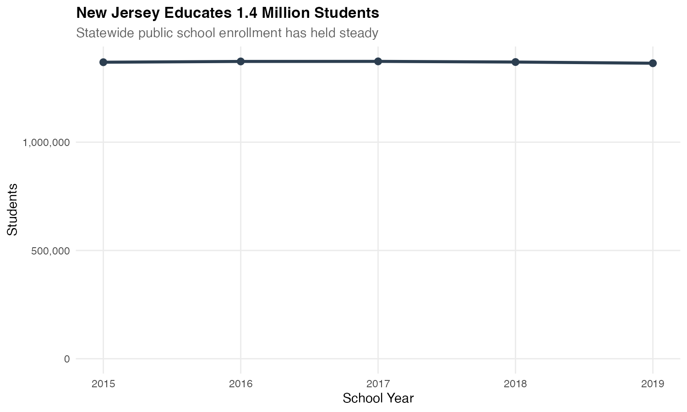
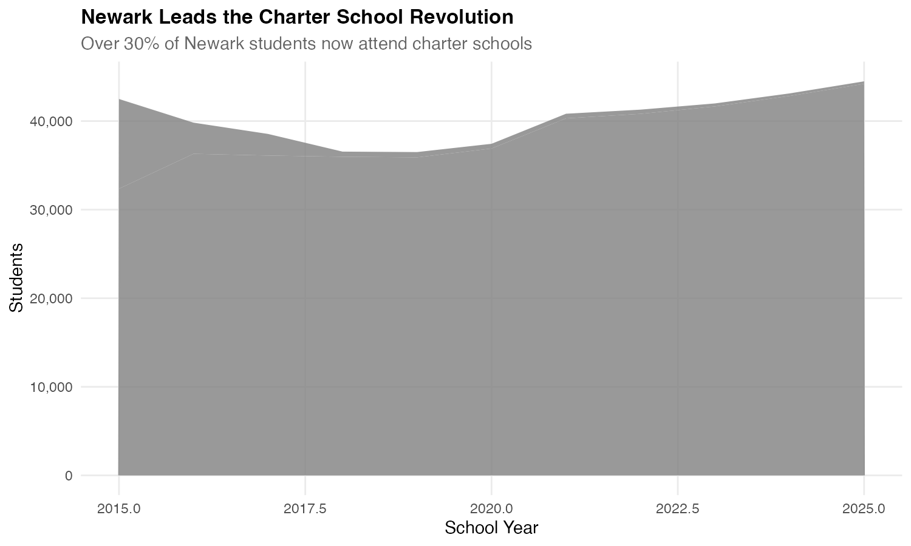
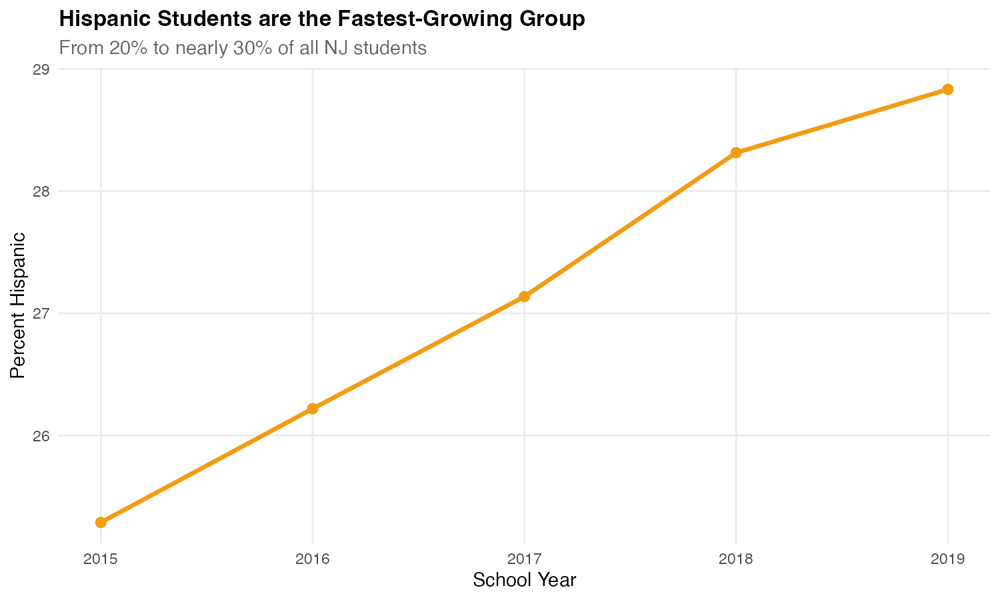
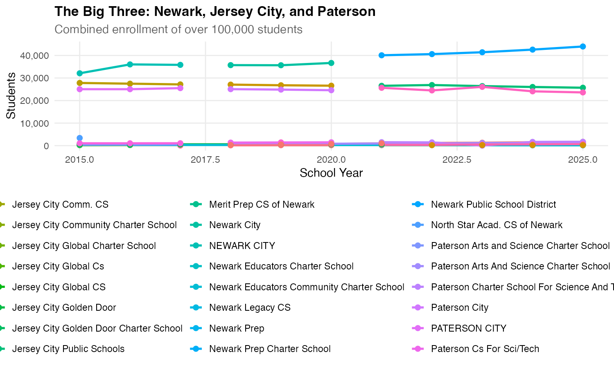
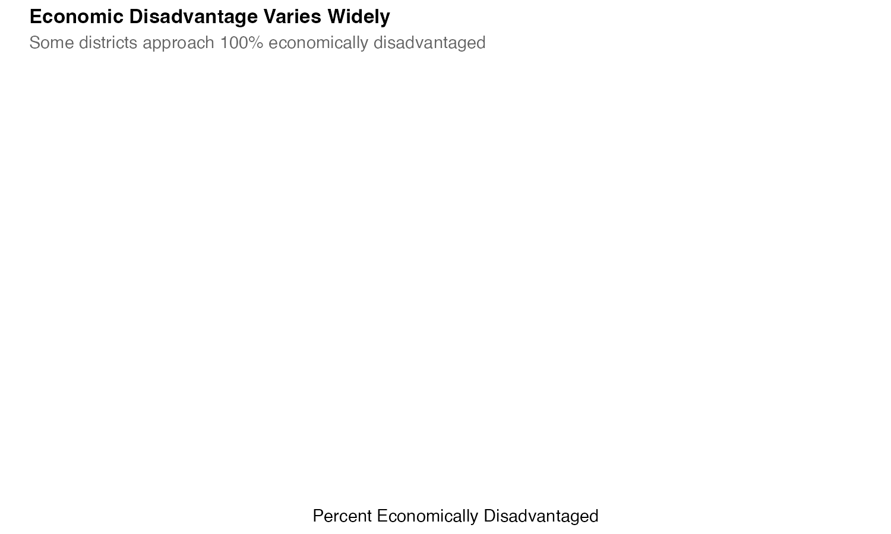
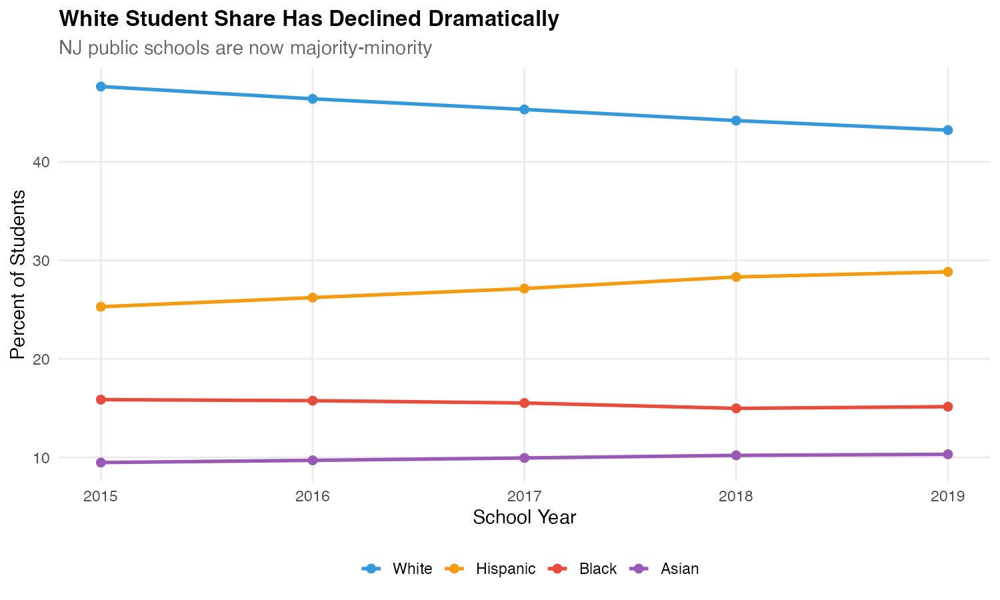
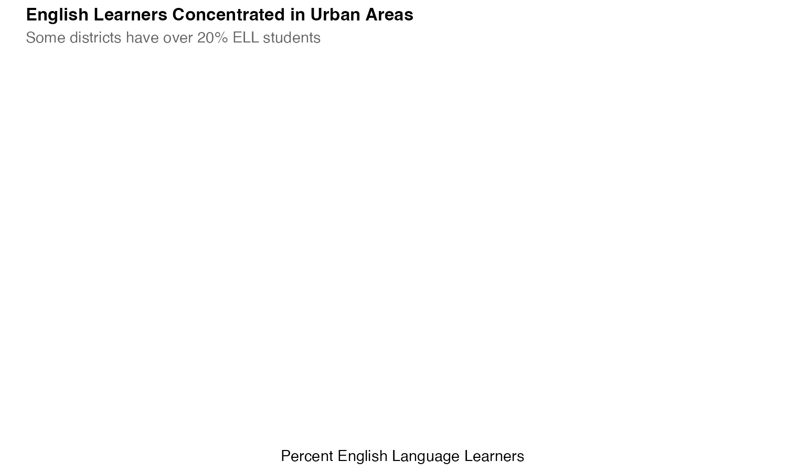
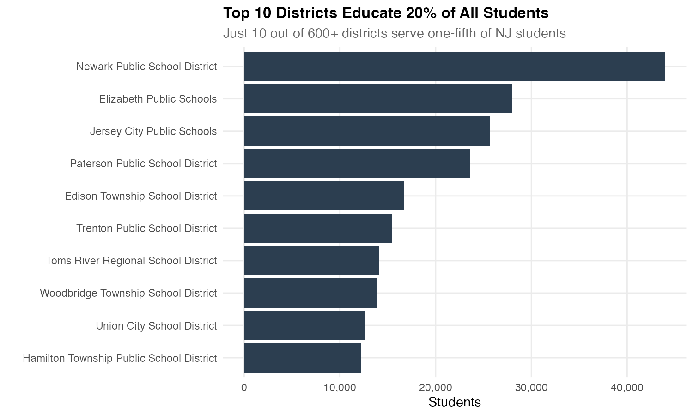
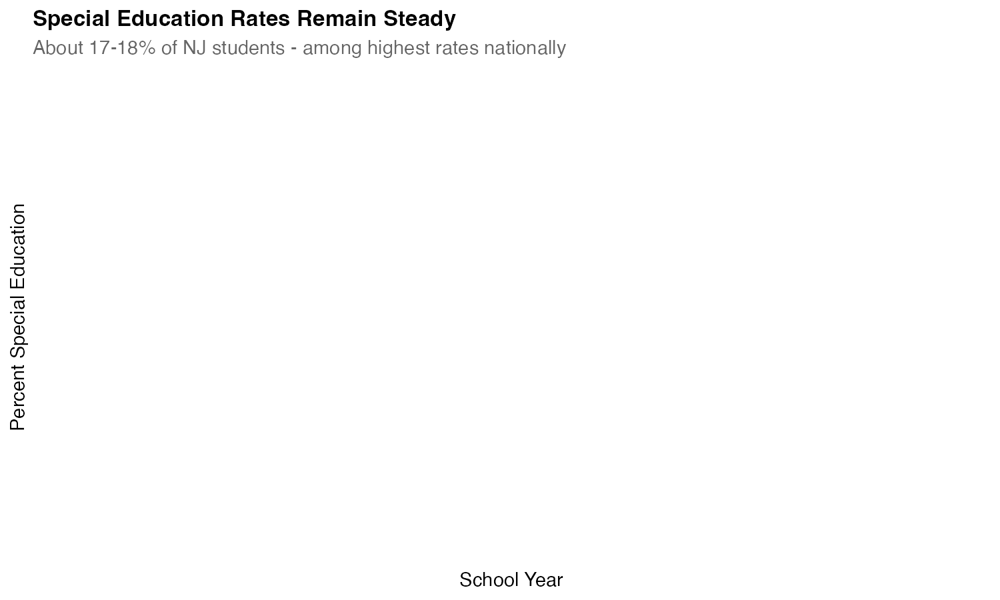

# njschooldata

<!-- badges: start -->
[](https://lifecycle.r-lib.org/articles/stages.html#stable)
[](https://github.com/almartin82/njschooldata/actions/workflows/R-CMD-check.yaml)
[](https://github.com/almartin82/njschooldata/actions/workflows/python-test.yaml)
<!-- badges: end -->

A simple interface for accessing NJ DOE school data in **R and Python**

**25+ years of enrollment data. 1.4 million students. 600+ districts. Here are 10 stories in the data...**

---

### 1. New Jersey Educates 1.4 Million Students

Statewide public school enrollment has held relatively steady over the past decade.



---

### 2. Newark Leads the Charter School Revolution

Over 30% of Newark students now attend charter schools - one of the highest rates in the nation.



---

### 3. Hispanic Students are the Fastest-Growing Group

Hispanic enrollment has grown from 20% to nearly 30% of all NJ students.



---

### 4. The Big Three: Newark, Jersey City, and Paterson

Combined enrollment of over 100,000 students - nearly 8% of the state.



---

### 5. COVID Hit Kindergarten Hard

New Jersey lost nearly 10% of kindergartners in 2021 - and enrollment hasn't fully recovered.


---

### 6. Economic Disadvantage Varies Widely

Some districts approach 100% economically disadvantaged while affluent suburbs have under 5%.



---

### 7. White Student Share Has Declined Dramatically

NJ public schools are now majority-minority.



---

### 8. English Learners Concentrated in Urban Areas

Some districts have over 20% ELL students, while most suburban districts have under 1%.



---

### 9. Top 10 Districts Educate 20% of All Students

Just 10 out of 600+ districts serve one-fifth of all NJ students.



---

### 10. Special Education Rates Remain Steady

About 17-18% of NJ students receive special education services - among the highest rates nationally.



---

## Installation

### R

```R
# Install from GitHub using remotes (recommended)
remotes::install_github("almartin82/njschooldata")
library(njschooldata)
```

### Python

Python bindings require R and the njschooldata R package to be installed first.

```bash
# Install R package first
Rscript -e "remotes::install_github('almartin82/njschooldata')"

# Install Python bindings
pip install git+https://github.com/almartin82/njschooldata.git#subdirectory=python
```

## NJ DOE Data Coverage

### Supported Data Sources

| Data Type | Function | Years | Status |
|-----------|----------|-------|--------|
| **Enrollment** | `fetch_enr()` | 2000-2025 | :white_check_mark: Full support |
| **NJSLA/PARCC Assessment** | `fetch_parcc()` | 2015-2024 | :white_check_mark: Full support |
| **NJGPA (Grad Proficiency)** | `fetch_njgpa()` | 2022-2024 | :white_check_mark: Full support |
| **ACCESS for ELLs** | `fetch_access()` | 2022-2024 | :white_check_mark: Full support |
| **NJASK/HSPA/GEPA (Legacy)** | `fetch_nj_assess()` | 2004-2014 | :white_check_mark: Full support |
| **Graduation Rates (4-year)** | `fetch_grad_rate()` | 2011-2024 | :white_check_mark: Full support |
| **Graduation Rates (5-year)** | `fetch_grad_rate()` | 2012-2019 | :white_check_mark: Full support |
| **Graduation Rates (6-year)** | `fetch_6yr_grad_rate()` | 2021-2024 | :white_check_mark: Full support |
| **Graduation Counts** | `fetch_grad_count()` | 2012-2024 | :white_check_mark: Full support |
| **Chronic Absenteeism** | `fetch_chronic_absenteeism()` | 2017-2024* | :white_check_mark: Full support |
| **Postsecondary Enrollment** | `fetch_postsecondary()` | Current | :white_check_mark: Full support |
| **Special Education Rates** | `fetch_sped()` | 2024+ | :white_check_mark: Full support |
| **School Directory** | `get_school_directory()` | Current | :white_check_mark: Full support |
| **District Directory** | `get_district_directory()` | Current | :white_check_mark: Full support |
| **District Factor Groups** | `fetch_dfg()` | 1990, 2000 | :white_check_mark: Full support |
| **Taxpayer's Guide (TGES)** | `fetch_tges()` | 1999-2019 | :white_check_mark: Full support |
| **Performance Reports** | `get_rc_database()` | 2003-2019 | :white_check_mark: Full support |
| **Student Growth (mSGP)** | `fetch_msgp()` | 2012-2015 | :white_check_mark: Historical |

*\*2020-2021 chronic absenteeism not reported due to COVID*

### Not Yet Supported

| Data Type | NJ DOE Source | Status |
|-----------|--------------|--------|
| Staff/Teacher Census | NJ DOE Data Portal | :x: Not implemented |
| Teacher Certification | NJ DOE Licensing | :x: Not implemented |
| Career/Technical Ed (CTE) | CTE Reports | :x: Not implemented |
| Suspension/Discipline | Civil Rights Data | :x: Not implemented |
| Per-Pupil Spending (post-2019) | State Aid | :x: Not implemented |
| School Climate Surveys | NJ DOE | :x: Not implemented |
| AP/IB Participation | College Board | :x: Not implemented |
| SAT/ACT Scores (post-2019) | College Board | :x: Not implemented |

### Data Gaps

| Gap | Reason |
|-----|--------|
| 2020 Assessments | Cancelled due to COVID-19 |
| 2020-2021 Chronic Absenteeism | Not reported due to COVID |
| 5-Year Graduation (2020+) | No longer published by NJ DOE |
| Performance Reports (2020+) | Format discontinued |

## Quick Start

### R

```R
library(njschooldata)

# Enrollment data
enr_2024 <- fetch_enr(2024, tidy = TRUE)

# Assessment data
math_g4 <- fetch_parcc(2024, grade_or_subj = 4, subj = 'math')

# Graduation rates
grate <- fetch_grad_rate(2024)

# School directory
schools <- get_school_directory()
```

### Python

```python
import njschooldata as njsd

# Enrollment data
enr_2024 = njsd.fetch_enr(2024)

# Assessment data
math_g4 = njsd.fetch_parcc(2024, 4, 'math')

# Graduation rates
grate = njsd.fetch_grad_rate(2024)

# School directory
schools = njsd.get_school_directory()
```

## Assessment History

NJ has used several assessment systems over the years:

| Assessment | Years | Grades | Notes |
|------------|-------|--------|-------|
| **NJSLA** | 2019-present | 3-10 ELA, 3-8 Math | Current assessment (2020 cancelled) |
| **PARCC** | 2015-2018 | 3-11 | Common Core aligned |
| **NJASK** | 2004-2014 | 3-8 | Previous state assessment |
| **HSPA** | Through 2014 | 11 | High school graduation requirement |
| **GEPA** | Through 2007 | 8 | Grade 8 proficiency |

## Learn More

- [Getting Started Guide](https://almartin82.github.io/njschooldata/articles/getting-started.html)
- [NJ Enrollment Insights](https://almartin82.github.io/njschooldata/articles/nj-enrollment-insights.html)
- [Function Reference](https://almartin82.github.io/njschooldata/reference/index.html)

## Contributing

Contributions are welcome!

- File an [issue](https://github.com/almartin82/njschooldata/issues)
- Send me an [email](mailto:almartin@gmail.com)
