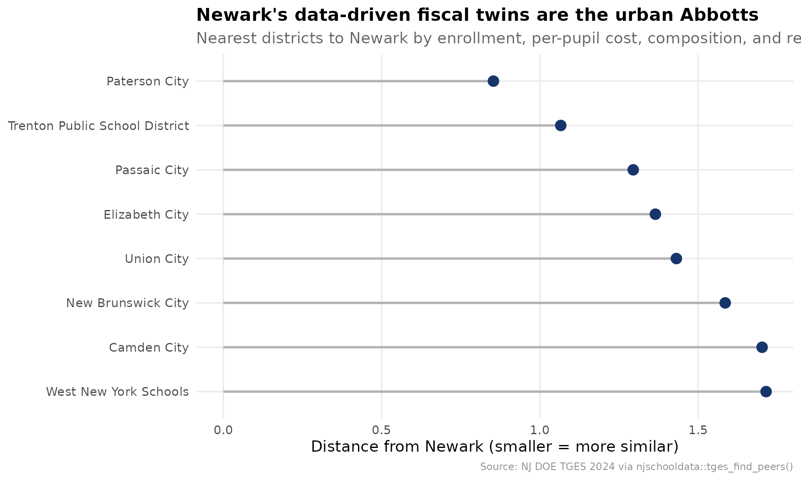
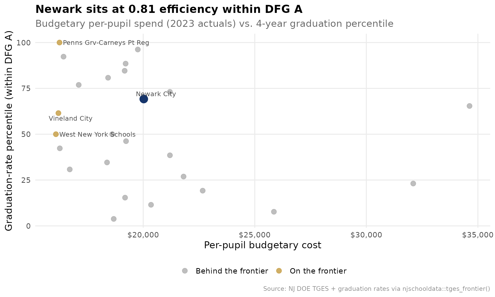
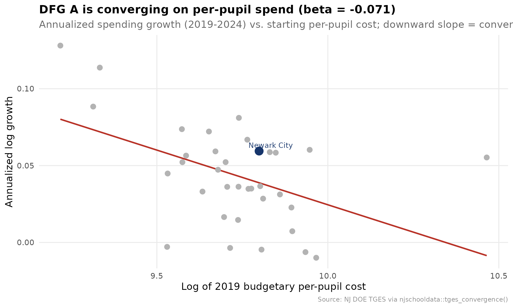
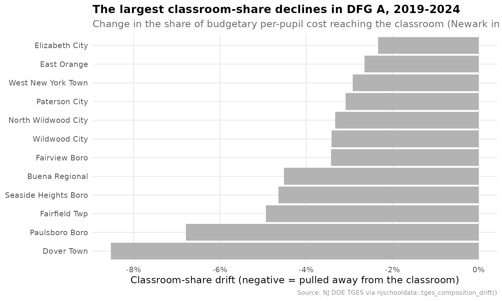
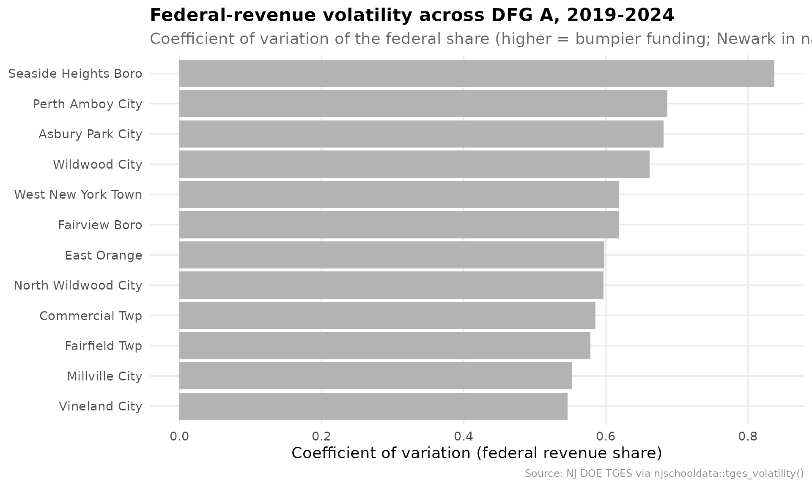
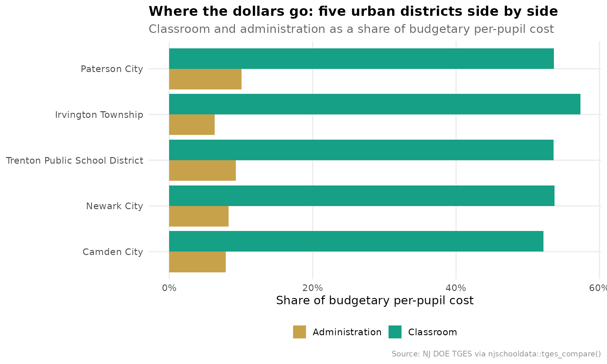

# Newark on the Efficiency Frontier: Do the Dollars Pay Off?

``` r

library(njschooldata)
library(ggplot2)
library(dplyr)
library(tidyr)
library(scales)

options(timeout = max(600, getOption("timeout")))
```

``` r

theme_nj <- function() {
  theme_minimal(base_size = 14) +
    theme(
      plot.title = element_text(face = "bold", size = 16),
      plot.subtitle = element_text(color = "gray40"),
      plot.caption = element_text(color = "gray55", size = 9),
      panel.grid.minor = element_blank(),
      legend.position = "bottom"
    )
}

nwk_navy <- "#16356B"
nwk_gold <- "#C8A14B"
nwk_teal <- "#16A085"
nwk_red  <- "#B83227"
peer_gray <- "gray70"

NEWARK <- "3570"
```

The companion brief, [*What Did Newark’s Gains
Cost?*](https://almartin82.github.io/njschooldata/articles/newark-fiscal-brief.md),
benchmarks Newark against District Factor Group A one indicator at a
time. This one asks the harder, cross-district question [MarGrady
Research](https://margrady.com/movingup/) left open: outcomes rose, but
were the dollars *efficient*? Answering that needs tools that reason
across districts at once, not one rank at a time. This brief uses the
comparative layer of `njschooldata` built for exactly that:

- [`tges_find_peers()`](https://almartin82.github.io/njschooldata/reference/tges_find_peers.md)
  builds Newark’s *data-driven* peer set instead of assuming DFG.
- [`tges_frontier()`](https://almartin82.github.io/njschooldata/reference/tges_frontier.md)
  scores every district against the spend-versus-outcome efficiency
  frontier.
- [`tges_gap_cost()`](https://almartin82.github.io/njschooldata/reference/tges_gap_cost.md)
  turns a peer gap into real dollars.
- [`tges_convergence()`](https://almartin82.github.io/njschooldata/reference/tges_convergence.md)
  asks whether DFG A spending is converging.
- [`tges_composition_drift()`](https://almartin82.github.io/njschooldata/reference/tges_composition_drift.md)
  tracks where the budget moved.
- [`tges_volatility()`](https://almartin82.github.io/njschooldata/reference/tges_volatility.md)
  flags fragile funding.
- [`tges_compare()`](https://almartin82.github.io/njschooldata/reference/tges_compare.md)
  lines the big cities up side by side.

Everything rides on the [Taxpayers’ Guide to Educational
Spending](https://www.nj.gov/education/guide/) (TGES) joined to NJ DOE
graduation outcomes. TGES is district-level, so this is a screen that
says where to look, not a verdict.

``` r

# One multi-year object drives the brief; the 2024 guide is the latest snapshot.
tgm  <- fetch_many_tges(2019:2024)
#> [1] 2019
#> [1] 2020
#> [1] 2021
#> [1] 2022
#> [1] 2023
#> [1] 2024
tg24 <- tgm[["2024"]]

# Graduation outcomes for the efficiency frontier: 4-year rate, district level,
# total cohort, ranked within DFG A. district_id is the 4-digit code TGES uses.
grate23 <- fetch_grad_rate(2023, methodology = "4 year") %>%
  add_dfg() %>%
  filter(dfg == "A", is_district, subgroup == "total") %>%
  grate_percentile_rank(peer_type = "dfg")
```

## 1. Who are Newark’s real peers?

DFG A is a 1990s census construct of 37 districts. But which ones are
*structurally* like Newark today, on enrollment, spending, and how the
budget is funded?
[`tges_find_peers()`](https://almartin82.github.io/njschooldata/reference/tges_find_peers.md)
standardizes those features and returns the nearest districts by
distance. The answer is not all 37 DFG A districts, it is the big urban
systems specifically.

``` r

peers <- tges_find_peers(tg24, NEWARK, n = 8)
stopifnot(nrow(peers) > 1)

peers %>%
  select(district_name, dfg, distance, ade, budgetary_pp, local_share)
#> # A tibble: 9 × 6
#>   district_name                  dfg   distance   ade budgetary_pp local_share
#>   <chr>                          <chr>    <dbl> <dbl>        <dbl>       <dbl>
#> 1 Newark City                    A        0     41540        24253       0.098
#> 2 Paterson City                  A        0.853 24858        20239       0.09 
#> 3 Trenton Public School District A        1.07  15053        21705       0.054
#> 4 Passaic City                   A        1.30  11845        24932       0.038
#> 5 Elizabeth City                 A        1.36  28494        21211       0.084
#> 6 Union City                     A        1.43  12879        21019       0.053
#> 7 New Brunswick City             A        1.59   9632        24312       0.132
#> 8 Camden City                    A        1.70   7076        28230       0.033
#> 9 West New York Schools          A        1.71   8506        19641       0.099
```

``` r

peer_plot <- peers %>%
  filter(!is_focal) %>%
  mutate(district_name = reorder(district_name, -distance))

ggplot(peer_plot, aes(x = distance, y = district_name)) +
  geom_segment(aes(xend = 0, yend = district_name), color = peer_gray, linewidth = 1) +
  geom_point(color = nwk_navy, size = 4) +
  labs(
    title = "Newark's data-driven fiscal twins are the urban Abbotts",
    subtitle = "Nearest districts to Newark by enrollment, per-pupil cost, composition, and revenue mix",
    x = "Distance from Newark (smaller = more similar)", y = NULL,
    caption = "Source: NJ DOE TGES 2024 via njschooldata::tges_find_peers()"
  ) +
  theme_nj()
```



Paterson, Trenton, Passaic, Elizabeth, and Union City sit closest, every
one a DFG A city. The peer set the data picks is exactly the set a
Newark analyst would defend by hand, which is the point: now it is
reproducible.

## 2. The efficiency frontier

Here is the question MarGrady could not answer.
[`tges_frontier()`](https://almartin82.github.io/njschooldata/reference/tges_frontier.md)
plots per-pupil spend against the graduation-rate percentile within DFG
A, then scores each district against the *free-disposal-hull frontier*:
the set of districts that hit at least a given outcome for the least
money. A score of 1.0 means a district is on the frontier; 0.81 means
another district reaches its outcome for 81% of its spend.

``` r

spend23 <- tg24$CSG1 %>% filter(calc_type == "Actuals", end_year == 2023)

frontier <- tges_frontier(spend23, grate23,
                          outcome_col = "grad_rate_percentile", peer = "dfg")
stopifnot(nrow(frontier) > 0)

frontier %>%
  arrange(efficiency_score) %>%
  select(district_name, spend, outcome, efficiency_score,
         reference_district_name, excess_spend) %>%
  head(8)
#> # A tibble: 8 × 6
#>   district_name      spend outcome efficiency_score reference_district_name 
#>   <chr>              <dbl>   <dbl>            <dbl> <chr>                   
#> 1 Perth Amboy City   34625    65.4            0.469 Penns Grv-Carneys Pt Reg
#> 2 Asbury Park City   32102    23.1            0.501 West New York Schools   
#> 3 Camden City        25858     7.7            0.622 West New York Schools   
#> 4 Passaic City       22666    19.2            0.710 West New York Schools   
#> 5 Wildwood City      21809    26.9            0.738 West New York Schools   
#> 6 Atlantic City      21198    38.5            0.759 West New York Schools   
#> 7 East Orange        21196    73.1            0.767 Penns Grv-Carneys Pt Reg
#> 8 New Brunswick City 20351    11.5            0.790 West New York Schools   
#> # ℹ 1 more variable: excess_spend <dbl>
```

``` r

fr_plot <- frontier %>%
  mutate(is_newark = district_id == NEWARK)

newark_row <- fr_plot %>% filter(is_newark)

ggplot(fr_plot, aes(x = spend, y = outcome)) +
  geom_point(aes(color = on_frontier), size = 3, alpha = 0.85) +
  geom_point(data = newark_row, color = nwk_navy, size = 5) +
  ggrepel::geom_text_repel(
    data = bind_rows(newark_row, filter(fr_plot, on_frontier)),
    aes(label = district_name), size = 3.4, color = "gray25", max.overlaps = 20
  ) +
  scale_color_manual(values = c(`TRUE` = nwk_gold, `FALSE` = peer_gray),
                     labels = c(`TRUE` = "On the frontier", `FALSE` = "Behind the frontier"),
                     name = NULL) +
  scale_x_continuous(labels = label_dollar()) +
  labs(
    title = sprintf("Newark sits at %.2f efficiency within DFG A",
                    newark_row$efficiency_score),
    subtitle = "Budgetary per-pupil spend (2023 actuals) vs. 4-year graduation percentile",
    x = "Per-pupil budgetary cost", y = "Graduation-rate percentile (within DFG A)",
    caption = "Source: NJ DOE TGES + graduation rates via njschooldata::tges_frontier()"
  ) +
  theme_nj()
```



Newark lands at 0.81: Penns Grv-Carneys Pt Reg reaches at least Newark’s
graduation percentile for \$3,776 per pupil less. Union City is the
standout, posting near the top of DFG A on graduation while spending
below the middle. The districts in the lower right, spending the most
for middling outcomes, are where a cost-effectiveness review would
start.

## 3. What would closing the classroom-spending gap cost?

Newark sends a smaller share of its budget to the classroom than the DFG
A median.
[`tges_gap_cost()`](https://almartin82.github.io/njschooldata/reference/tges_gap_cost.md)
translates that share gap into dollars, both per pupil and across
Newark’s enrollment.

``` r

gap <- tges_gap_cost(tg24, NEWARK, metric = "classroom_share",
                     target = "median", peer = "dfg")
stopifnot(nrow(gap) == 1)

gap %>%
  select(focal_value, target_value, gap, budgetary_pp,
         per_pupil_gap_dollars, ade, total_gap_dollars)
#> # A tibble: 1 × 7
#>   focal_value target_value    gap budgetary_pp per_pupil_gap_dollars   ade
#>         <dbl>        <dbl>  <dbl>        <dbl>                 <dbl> <dbl>
#> 1       0.537        0.566 0.0292        24253                   709 41540
#> # ℹ 1 more variable: total_gap_dollars <dbl>
```

Newark routes 53.7% of its budgetary per-pupil cost to the classroom
against a DFG A median of 56.6%. Reaching that median would take about
\$709 per pupil, or roughly \$29,460,231 district-wide at current
enrollment. That single number reframes the abstract share gap as a
budget line.

## 4. Is DFG A converging on spending?

Are the highest-need districts drifting toward a common per-pupil cost,
or are the gaps widening?
[`tges_convergence()`](https://almartin82.github.io/njschooldata/reference/tges_convergence.md)
regresses each district’s spending growth on its starting level. A
negative slope (beta) means the lower-spending districts grew faster,
i.e. the group is converging.

``` r

conv <- tges_convergence(tgm, peer = "dfg")
conv_a <- conv %>% filter(peer_group == "A")
stopifnot(nrow(conv_a) > 0)

conv %>%
  distinct(peer_group, beta, beta_pvalue, r_squared, converging, n_districts) %>%
  arrange(peer_group)
#> # A tibble: 9 × 6
#>   peer_group    beta  beta_pvalue r_squared converging n_districts
#>   <chr>        <dbl>        <dbl>     <dbl> <lgl>            <int>
#> 1 A          -0.0711 0.00412         0.224  TRUE                35
#> 2 B          -0.0725 0.000248        0.208  TRUE                60
#> 3 CD         -0.0609 0.00329         0.149  TRUE                56
#> 4 DE         -0.0536 0.000133        0.182  TRUE                75
#> 5 FG         -0.0696 0.0000000166    0.317  TRUE                86
#> 6 GH         -0.0723 0.000320        0.175  TRUE                70
#> 7 I          -0.0195 0.0480          0.0432 TRUE                91
#> 8 J          -0.0411 0.237           0.0767 FALSE               20
#> 9 NA         -0.0335 0.000172        0.175  TRUE                76
```

``` r

beta_a <- conv_a$beta[1]
conv_a <- conv_a %>% mutate(is_newark = district_id == NEWARK)

ggplot(conv_a, aes(x = log_start_value, y = growth)) +
  geom_smooth(method = "lm", se = FALSE, color = nwk_red, linewidth = 1) +
  geom_point(color = peer_gray, size = 3) +
  geom_point(data = filter(conv_a, is_newark), color = nwk_navy, size = 5) +
  ggrepel::geom_text_repel(
    data = filter(conv_a, is_newark), aes(label = district_name),
    color = nwk_navy, size = 3.6
  ) +
  labs(
    title = sprintf("DFG A is converging on per-pupil spend (beta = %.3f)", beta_a),
    subtitle = "Annualized spending growth (2019-2024) vs. starting per-pupil cost; downward slope = convergence",
    x = "Log of 2019 budgetary per-pupil cost", y = "Annualized log growth",
    caption = "Source: NJ DOE TGES via njschooldata::tges_convergence()"
  ) +
  theme_nj()
```



The slope is negative and significant: lower-spending DFG A districts
grew their per-pupil cost faster than the high-spenders, so the band is
compressing. Newark, already near the middle of DFG A spending, grew
about in line with where that trend puts it.

## 5. Where did Newark’s budget drift?

[`tges_composition_drift()`](https://almartin82.github.io/njschooldata/reference/tges_composition_drift.md)
measures how each spending share moved between two years and ranks the
move against peers. The classroom share is the one that matters most for
the efficiency story.

``` r

drift <- tges_composition_drift(tgm, peer = "dfg")
drift_a <- drift %>% filter(dfg == "A")
stopifnot(nrow(drift_a) > 0)

drift_a %>%
  arrange(classroom_share_drift) %>%
  select(district_name, classroom_share_start, classroom_share_end,
         classroom_share_drift, drift_percentile) %>%
  head(8)
#> # A tibble: 8 × 5
#>   district_name  classroom_share_start classroom_share_end classroom_share_drift
#>   <chr>                          <dbl>               <dbl>                 <dbl>
#> 1 Dover Town                     0.647               0.562               -0.0852
#> 2 Paulsboro Boro                 0.578               0.510               -0.0678
#> 3 Fairfield Twp                  0.678               0.629               -0.0493
#> 4 Seaside Heigh…                 0.618               0.572               -0.0464
#> 5 Buena Regional                 0.592               0.546               -0.0452
#> 6 Fairview Boro                  0.598               0.564               -0.0342
#> 7 Wildwood City                  0.594               0.560               -0.0341
#> 8 North Wildwoo…                 0.575               0.542               -0.0332
#> # ℹ 1 more variable: drift_percentile <dbl>
```

``` r

drift_plot <- drift_a %>%
  arrange(classroom_share_drift) %>%
  slice(1:12) %>%
  mutate(district_name = reorder(district_name, classroom_share_drift),
         is_newark = district_id == NEWARK)

ggplot(drift_plot, aes(x = classroom_share_drift, y = district_name, fill = is_newark)) +
  geom_col() +
  scale_fill_manual(values = c(`TRUE` = nwk_navy, `FALSE` = peer_gray), guide = "none") +
  scale_x_continuous(labels = label_percent(accuracy = 1)) +
  labs(
    title = "The largest classroom-share declines in DFG A, 2019-2024",
    subtitle = "Change in the share of budgetary per-pupil cost reaching the classroom (Newark in navy)",
    x = "Classroom-share drift (negative = pulled away from the classroom)", y = NULL,
    caption = "Source: NJ DOE TGES via njschooldata::tges_composition_drift()"
  ) +
  theme_nj()
```



## 6. How fragile is the funding?

A district that funded recurring costs on a one-time federal bump is
exposed when the money expires.
[`tges_volatility()`](https://almartin82.github.io/njschooldata/reference/tges_volatility.md)
ranks how much each district’s federal revenue share whipsawed across
the ESSER years.

``` r

vol <- tges_volatility(tgm, metric = "federal_share", peer = "dfg", min_years = 3)
vol_a <- vol %>% filter(dfg == "A")
stopifnot(nrow(vol_a) > 0)

vol_a %>%
  arrange(desc(vol_percentile)) %>%
  select(district_name, mean_value, cv, max_abs_yoy, vol_percentile) %>%
  head(8)
#> # A tibble: 8 × 5
#>   district_name        mean_value    cv max_abs_yoy vol_percentile
#>   <chr>                     <dbl> <dbl>       <dbl>          <dbl>
#> 1 Seaside Heights Boro     0.0955 0.837       NA             100  
#> 2 Perth Amboy City         0.0507 0.686        1.88           97.3
#> 3 Asbury Park City         0.0865 0.681        1.29           94.6
#> 4 Wildwood City            0.0968 0.662        1.80           91.9
#> 5 West New York Town       0.067  0.619        1.16           89.2
#> 6 Fairview Boro            0.066  0.618        1.79           86.5
#> 7 East Orange              0.0593 0.598        1.36           83.8
#> 8 North Wildwood City      0.0498 0.597        1.53           81.1
```

``` r

vol_plot <- vol_a %>%
  arrange(desc(cv)) %>%
  slice(1:12) %>%
  mutate(district_name = reorder(district_name, cv),
         is_newark = district_id == NEWARK)

ggplot(vol_plot, aes(x = cv, y = district_name, fill = is_newark)) +
  geom_col() +
  scale_fill_manual(values = c(`TRUE` = nwk_navy, `FALSE` = peer_gray), guide = "none") +
  labs(
    title = "Federal-revenue volatility across DFG A, 2019-2024",
    subtitle = "Coefficient of variation of the federal share (higher = bumpier funding; Newark in navy)",
    x = "Coefficient of variation (federal revenue share)", y = NULL,
    caption = "Source: NJ DOE TGES via njschooldata::tges_volatility()"
  ) +
  theme_nj()
```



## 7. The counterfactual cities

Finally,
[`tges_compare()`](https://almartin82.github.io/njschooldata/reference/tges_compare.md)
lines the big urban systems up on the headline fiscal metrics, so
different reform strategies sit next to each other.

``` r

cities <- c(NEWARK, "0680", "5210", "4010", "2330")  # Newark, Camden, Trenton, Paterson, Jersey City
scorecard <- tges_compare(tg24, district_codes = cities)
stopifnot(nrow(scorecard) >= 1)

scorecard %>%
  select(district_name, total_pp, classroom_share, local_share,
         federal_share, student_admin_ratio, excess_surplus_flag)
#> # A tibble: 5 × 7
#>   district_name               total_pp classroom_share local_share federal_share
#>   <chr>                          <dbl>           <dbl>       <dbl>         <dbl>
#> 1 Newark City                    33730           0.537       0.098         0.108
#> 2 Camden City                    45998           0.522       0.033         0.136
#> 3 Trenton Public School Dist…    30286           0.536       0.054         0.078
#> 4 Paterson City                  31014           0.536       0.09          0.101
#> 5 Irvington Township             32173           0.574       0.089         0.101
#> # ℹ 2 more variables: student_admin_ratio <dbl>, excess_surplus_flag <lgl>
```

``` r

sc_plot <- scorecard %>%
  select(district_name, classroom_share, administration_share) %>%
  pivot_longer(-district_name, names_to = "category", values_to = "share") %>%
  mutate(category = recode(category,
                           classroom_share = "Classroom",
                           administration_share = "Administration"))

ggplot(sc_plot, aes(x = share, y = reorder(district_name, share), fill = category)) +
  geom_col(position = "dodge") +
  scale_x_continuous(labels = label_percent(accuracy = 1)) +
  scale_fill_manual(values = c(Classroom = nwk_teal, Administration = nwk_gold), name = NULL) +
  labs(
    title = "Where the dollars go: five urban districts side by side",
    subtitle = "Classroom and administration as a share of budgetary per-pupil cost",
    x = "Share of budgetary per-pupil cost", y = NULL,
    caption = "Source: NJ DOE TGES via njschooldata::tges_compare()"
  ) +
  theme_nj()
```



The scorecard is the assembly point for the whole brief: per-pupil
totals, the classroom and administration shares, how much of each budget
is local property tax versus state aid, the administrative ratio, and
the surplus flag, one row per city. Different strategies, same peer
tier, one table.

``` r

sessionInfo()
#> R version 4.6.1 (2026-06-24)
#> Platform: x86_64-pc-linux-gnu
#> Running under: Ubuntu 24.04.4 LTS
#> 
#> Matrix products: default
#> BLAS:   /usr/lib/x86_64-linux-gnu/openblas-pthread/libblas.so.3 
#> LAPACK: /usr/lib/x86_64-linux-gnu/openblas-pthread/libopenblasp-r0.3.26.so;  LAPACK version 3.12.0
#> 
#> locale:
#>  [1] LC_CTYPE=C.UTF-8       LC_NUMERIC=C           LC_TIME=C.UTF-8       
#>  [4] LC_COLLATE=C.UTF-8     LC_MONETARY=C.UTF-8    LC_MESSAGES=C.UTF-8   
#>  [7] LC_PAPER=C.UTF-8       LC_NAME=C              LC_ADDRESS=C          
#> [10] LC_TELEPHONE=C         LC_MEASUREMENT=C.UTF-8 LC_IDENTIFICATION=C   
#> 
#> time zone: UTC
#> tzcode source: system (glibc)
#> 
#> attached base packages:
#> [1] stats     graphics  grDevices utils     datasets  methods   base     
#> 
#> other attached packages:
#> [1] scales_1.4.0        tidyr_1.3.2         dplyr_1.2.1        
#> [4] ggplot2_4.0.3       njschooldata_0.9.26
#> 
#> loaded via a namespace (and not attached):
#>  [1] gtable_0.3.6       xfun_0.59          bslib_0.11.0       ggrepel_0.9.8     
#>  [5] lattice_0.22-9     tzdb_0.5.0         vctrs_0.7.3        tools_4.6.1       
#>  [9] generics_0.1.4     curl_7.1.0         parallel_4.6.1     tibble_3.3.1      
#> [13] pkgconfig_2.0.3    Matrix_1.7-5       RColorBrewer_1.1-3 S7_0.2.2          
#> [17] desc_1.4.3         readxl_1.5.0       lifecycle_1.0.5    compiler_4.6.1    
#> [21] farver_2.1.2       stringr_1.6.0      textshaping_1.0.5  janitor_2.2.1     
#> [25] codetools_0.2-20   snakecase_0.11.1   htmltools_0.5.9    sass_0.4.10       
#> [29] yaml_2.3.12        pillar_1.11.1      pkgdown_2.2.1      crayon_1.5.3      
#> [33] jquerylib_0.1.4    cachem_1.1.0       nlme_3.1-169       tidyselect_1.2.1  
#> [37] digest_0.6.39      stringi_1.8.7      purrr_1.2.2        splines_4.6.1     
#> [41] labeling_0.4.3     fastmap_1.2.0      grid_4.6.1         cli_3.6.6         
#> [45] magrittr_2.0.5     utf8_1.2.6         readr_2.2.0        withr_3.0.3       
#> [49] bit64_4.8.2        lubridate_1.9.5    timechange_0.4.0   rmarkdown_2.31    
#> [53] httr_1.4.8         bit_4.6.0          otel_0.2.0         cellranger_1.1.0  
#> [57] ragg_1.5.2         hms_1.1.4          evaluate_1.0.5     knitr_1.51        
#> [61] mgcv_1.9-4         rlang_1.3.0        Rcpp_1.1.2         glue_1.8.1        
#> [65] downloader_0.4.1   vroom_1.7.1        jsonlite_2.0.0     R6_2.6.1          
#> [69] systemfonts_1.3.2  fs_2.1.0
```
