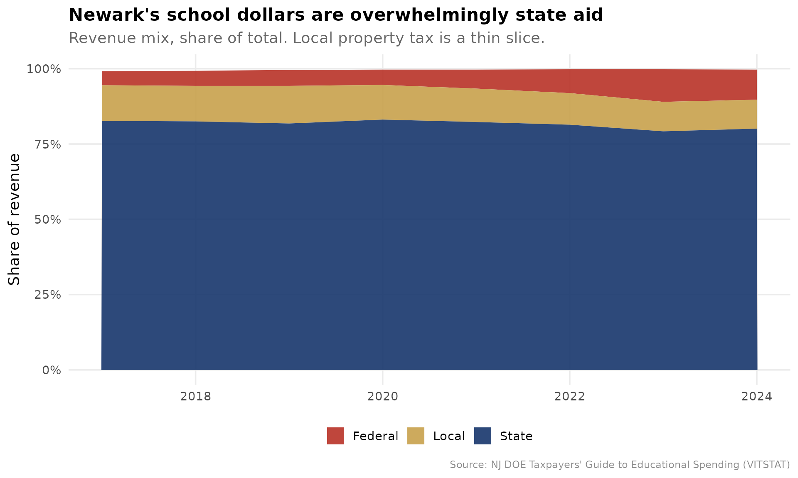
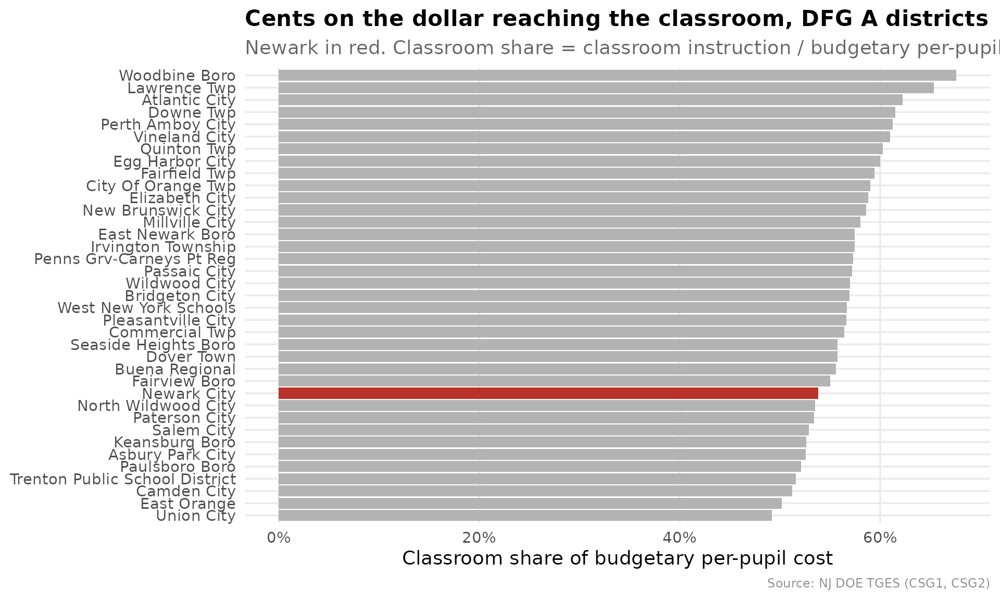
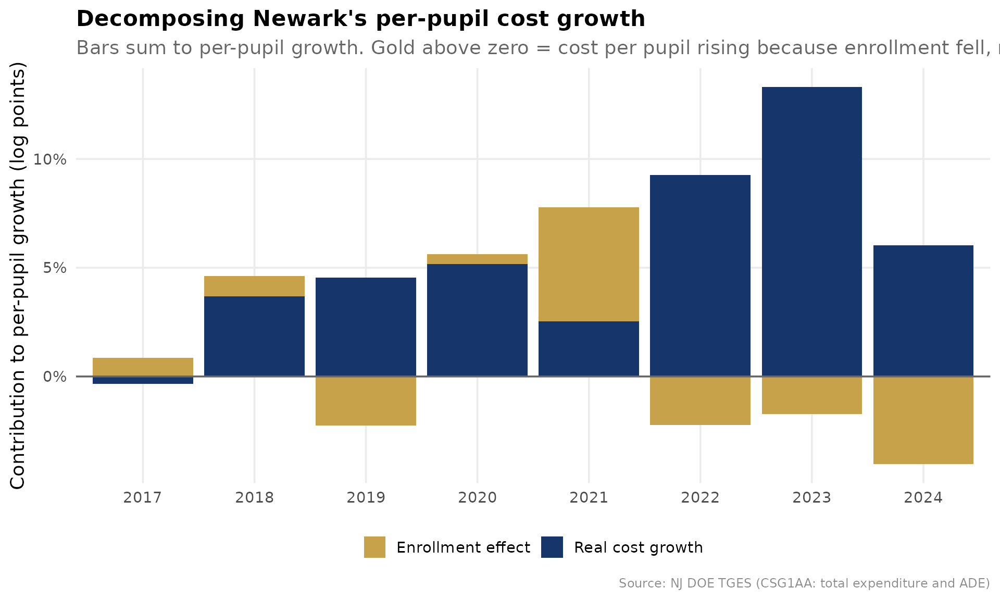
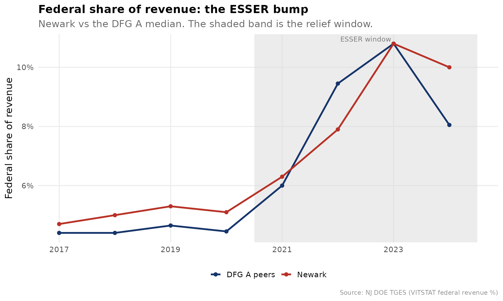
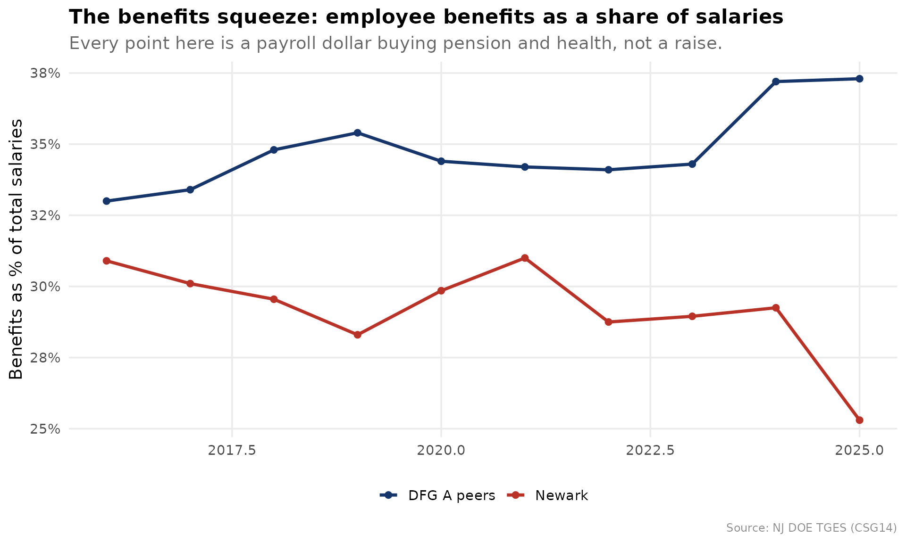
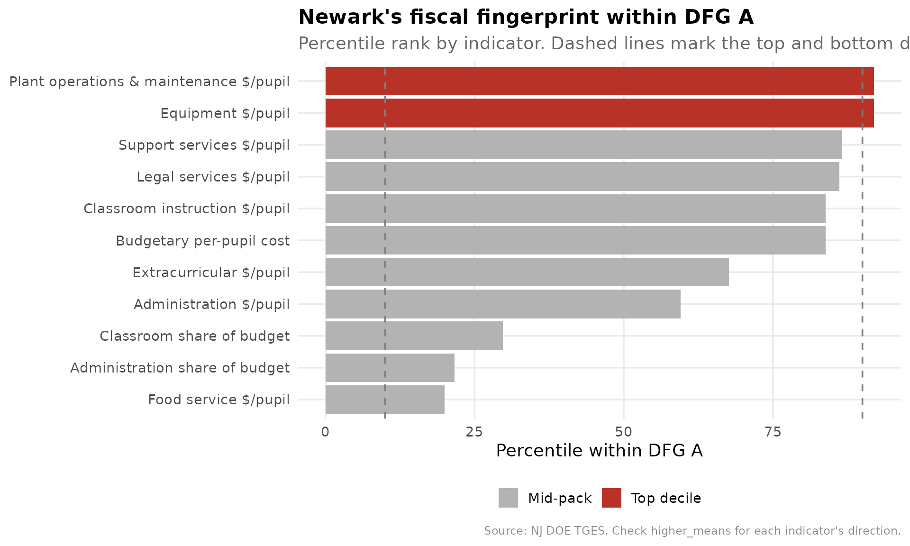

# What Did Newark's Gains Cost? A DFG A Fiscal Brief

``` r

library(njschooldata)
library(ggplot2)
library(dplyr)
library(tidyr)
library(scales)

options(timeout = max(600, getOption("timeout")))
```

``` r

theme_nj <- function() {
  theme_minimal(base_size = 14) +
    theme(
      plot.title = element_text(face = "bold", size = 16),
      plot.subtitle = element_text(color = "gray40"),
      plot.caption = element_text(color = "gray55", size = 9),
      panel.grid.minor = element_blank(),
      legend.position = "bottom"
    )
}

nwk_navy <- "#16356B"
nwk_gold <- "#C8A14B"
nwk_teal <- "#16A085"
nwk_red  <- "#B83227"
peer_gray <- "gray70"

NEWARK <- "3570"
```

[MarGrady Research’s Newark study](https://margrady.com/movingup/)
proved that Newark’s *outcomes* climbed against the right yardstick: not
the state as a whole, but District Factor Group A, the 37 highest-need
communities in New Jersey (Camden, Trenton, Paterson, and the like). Its
own list of open questions ends with the one it could not answer: *what
was the per-pupil spending trajectory, and was it cost-effective?*

This brief points the same peer-benchmarking machinery at dollars. Every
chart below compares Newark to its DFG A peers, using the
comparative-fiscal toolkit in `njschooldata`
([`tges_revenue_mix()`](https://almartin82.github.io/njschooldata/reference/tges_revenue_mix.md),
[`tges_composition()`](https://almartin82.github.io/njschooldata/reference/tges_composition.md),
[`tges_real_growth()`](https://almartin82.github.io/njschooldata/reference/tges_real_growth.md),
[`tges_federal_exposure()`](https://almartin82.github.io/njschooldata/reference/tges_federal_exposure.md),
[`tges_staffing()`](https://almartin82.github.io/njschooldata/reference/tges_staffing.md),
[`tges_red_flags()`](https://almartin82.github.io/njschooldata/reference/tges_red_flags.md)),
all built on the [Taxpayers’ Guide to Educational
Spending](https://www.nj.gov/education/guide/) (TGES). It is a
companion, not a verdict: TGES is district-level, and a screen that
flags where to look is not the same as a finding.

``` r

# One multi-year object drives the whole brief. fetch_many_tges() returns a
# named list of years, each a list of tidy indicator tables. 2018-2025 spans a
# pre-pandemic baseline, the ESSER window, and enough actuals for growth math.
tgm <- fetch_many_tges(2018:2025)
#> [1] 2018
#> [1] 2019
#> [1] 2020
#> [1] 2021
#> [1] 2022
#> [1] 2023
#> [1] 2024
#> [1] 2025
```

``` r

# Attach DFG to any TGES frame by its 4-digit district_id (the same join
# tges_percentile_rank(peer = "dfg") uses internally). DFG A = highest need.
dfg_lk <- fetch_dfg() %>%
  group_by(district_id) %>%
  summarise(dfg = first(dfg), .groups = "drop")

with_dfg <- function(df) left_join(df, dfg_lk, by = "district_id")
```

## 1. Whose money is it? Newark runs on state aid, not property tax

For a suburban homeowner the school budget is mostly their own property
tax. For Newark it is mostly Trenton’s.
[`tges_revenue_mix()`](https://almartin82.github.io/njschooldata/reference/tges_revenue_mix.md)
decomposes VITSTAT into both the revenue shares and the per-pupil
dollars each source buys.

``` r

rev <- tges_revenue_mix(tgm) %>% with_dfg()

# Newark's latest-year mix, in cents-on-the-dollar and per-pupil dollars
newark_rev_latest <- rev %>%
  filter(district_id == NEWARK, end_year == max(end_year)) %>%
  select(end_year, total_pp, local_share, state_share, federal_share,
         local_pp, state_pp, federal_pp)
stopifnot(nrow(newark_rev_latest) == 1)
newark_rev_latest
#> # A tibble: 1 × 8
#>   end_year total_pp local_share state_share federal_share local_pp state_pp
#>      <dbl>    <dbl>       <dbl>       <dbl>         <dbl>    <dbl>    <dbl>
#> 1     2024    34409       0.096       0.801           0.1     3303    27562
#> # ℹ 1 more variable: federal_pp <dbl>

# How does Newark's local (property-tax) share compare to DFG A peers?
dfg_a_local <- rev %>%
  filter(dfg == "A", end_year == max(end_year)) %>%
  summarise(
    n = n(),
    newark_local = local_share[district_id == NEWARK][1],
    dfg_a_median_local = median(local_share, na.rm = TRUE)
  )
dfg_a_local
#> # A tibble: 1 × 3
#>       n newark_local dfg_a_median_local
#>   <int>        <dbl>              <dbl>
#> 1    37        0.096              0.134
```

``` r

rev_long <- rev %>%
  filter(district_id == NEWARK) %>%
  select(end_year, Local = local_share, State = state_share,
         Federal = federal_share) %>%
  pivot_longer(-end_year, names_to = "source", values_to = "share")
stopifnot(nrow(rev_long) > 0)

ggplot(rev_long, aes(end_year, share, fill = source)) +
  geom_area(alpha = 0.9) +
  scale_y_continuous(labels = percent_format(accuracy = 1)) +
  scale_fill_manual(values = c(Local = nwk_gold, State = nwk_navy,
                               Federal = nwk_red)) +
  labs(
    title = "Newark's school dollars are overwhelmingly state aid",
    subtitle = "Revenue mix, share of total. Local property tax is a thin slice.",
    x = NULL, y = "Share of revenue", fill = NULL,
    caption = "Source: NJ DOE Taxpayers' Guide to Educational Spending (VITSTAT)"
  ) +
  theme_nj()
```



The headline a taxpayer understands instantly: of Newark’s roughly
\$34,409 per pupil, only \$3,303 comes from local property tax. The
local share sits far below even its high-need DFG A peers, which is the
whole logic of *Abbott v. Burke*: the state, not the city, writes the
checks.

## 2. Newark spends near the top of DFG A, but a low share reaches the classroom

The most-cited efficiency proxy in school finance is “dollars to the
classroom.”
[`tges_composition()`](https://almartin82.github.io/njschooldata/reference/tges_composition.md)
builds the classroom share;
[`tges_percentile_rank()`](https://almartin82.github.io/njschooldata/reference/tges_percentile_rank.md)
ranks it inside DFG A.

``` r

comp <- tges_composition(tgm, calc_type = "Budgeted")

# Rank classroom share within DFG A in the most recent budgeted year
latest_yr <- max(comp$end_year)
classroom_ranked <- comp %>%
  filter(end_year == latest_yr) %>%
  tges_percentile_rank("classroom_share", peer = "dfg") %>%
  filter(dfg == "A")
stopifnot(nrow(classroom_ranked) > 0)

newark_classroom <- classroom_ranked %>%
  filter(district_id == NEWARK) %>%
  select(end_year, classroom_share, peer_percentile, peer_n)
newark_classroom
#> # A tibble: 1 × 4
#>   end_year classroom_share peer_percentile peer_n
#>      <dbl>           <dbl>           <dbl>  <int>
#> 1     2025           0.538            29.7     37

# For contrast: where does Newark rank on total budgetary spend in DFG A?
spend_ranked <- tges_percentile_rank(
  comp %>% filter(end_year == latest_yr),
  "budgetary_pp", peer = "dfg"
) %>%
  filter(dfg == "A", district_id == NEWARK) %>%
  select(budgetary_pp, peer_percentile, peer_n)
spend_ranked
#> # A tibble: 1 × 3
#>   budgetary_pp peer_percentile peer_n
#>          <dbl>           <dbl>  <int>
#> 1        27050            83.8     37
```

``` r

plot_df <- classroom_ranked %>%
  mutate(is_newark = district_id == NEWARK) %>%
  arrange(classroom_share) %>%
  mutate(rank_order = row_number())
stopifnot(sum(plot_df$is_newark) == 1)

ggplot(plot_df, aes(reorder(district_name, classroom_share), classroom_share,
                    fill = is_newark)) +
  geom_col() +
  coord_flip() +
  scale_y_continuous(labels = percent_format(accuracy = 1)) +
  scale_fill_manual(values = c(`TRUE` = nwk_red, `FALSE` = peer_gray),
                    guide = "none") +
  labs(
    title = "Cents on the dollar reaching the classroom, DFG A districts",
    subtitle = paste0("Newark in red. Classroom share = classroom instruction / ",
                      "budgetary per-pupil cost, ", latest_yr, " budget."),
    x = NULL, y = "Classroom share of budgetary per-pupil cost",
    caption = "Source: NJ DOE TGES (CSG1, CSG2)"
  ) +
  theme_nj()
```



Newark spends at the 84th percentile of DFG A on total budgetary cost
per pupil, but only the 30th percentile of that dollar reaches a
classroom (53.8%). High spend, low classroom share is exactly the
pattern a board should be able to explain.

## 3. Is spending exploding, or is enrollment shrinking?

Per-pupil cost rises mechanically when enrollment falls, because fixed
costs spread over fewer students.
[`tges_real_growth()`](https://almartin82.github.io/njschooldata/reference/tges_real_growth.md)
splits each year’s per-pupil growth into a real-cost component and an
enrollment (denominator) component that sum to the total.

``` r

rg <- tges_real_growth(tgm) %>%
  filter(district_id == NEWARK) %>%
  arrange(end_year)
stopifnot(nrow(rg) > 1)

rg %>%
  select(end_year, per_pupil, per_pupil_growth,
         real_cost_component, enrollment_component, enrollment_effect_share)
#> # A tibble: 9 × 6
#>   end_year per_pupil per_pupil_growth real_cost_component enrollment_component
#>      <dbl>     <dbl>            <dbl>               <dbl>                <dbl>
#> 1     2016     22735         NA                  NA                   NA      
#> 2     2017     22857          0.00537            -0.00331              0.00864
#> 3     2018     23938          0.0473              0.0368               0.00939
#> 4     2019     24494          0.0232              0.0454              -0.0224 
#> 5     2020     25909          0.0578              0.0516               0.00453
#> 6     2021     28006          0.0809              0.0254               0.0524 
#> 7     2022     30044          0.0728              0.0925              -0.0222 
#> 8     2023     33730          0.123               0.133               -0.0173 
#> 9     2024     34409          0.0201              0.0603              -0.0404 
#> # ℹ 1 more variable: enrollment_effect_share <dbl>
```

``` r

growth_long <- rg %>%
  filter(is.finite(real_cost_component)) %>%
  select(end_year,
         `Real cost growth` = real_cost_component,
         `Enrollment effect` = enrollment_component) %>%
  pivot_longer(-end_year, names_to = "component", values_to = "log_change")
stopifnot(nrow(growth_long) > 0)

ggplot(growth_long, aes(factor(end_year), log_change, fill = component)) +
  geom_col() +
  geom_hline(yintercept = 0, color = "gray40") +
  scale_y_continuous(labels = percent_format(accuracy = 1)) +
  scale_fill_manual(values = c(`Real cost growth` = nwk_navy,
                               `Enrollment effect` = nwk_gold)) +
  labs(
    title = "Decomposing Newark's per-pupil cost growth",
    subtitle = paste0("Bars sum to per-pupil growth. Gold above zero = cost per ",
                      "pupil rising because enrollment fell, not because Newark ",
                      "spent more."),
    x = NULL, y = "Contribution to per-pupil growth (log points)", fill = NULL,
    caption = "Source: NJ DOE TGES (CSG1AA: total expenditure and ADE)"
  ) +
  theme_nj()
```



In the pandemic-enrollment years the gold bars are large: a meaningful
slice of Newark’s per-pupil increase is the denominator shrinking, not
the budget growing. Read per-pupil trends with enrollment in view,
always.

## 4. The ESSER cliff: did spending ride one-time federal money?

Federal revenue share spiked nationwide in 2021-2024 as ESSER relief
flowed in.
[`tges_federal_exposure()`](https://almartin82.github.io/njschooldata/reference/tges_federal_exposure.md)
compares each district’s pre-pandemic baseline federal share to its
ESSER-window peak, and flags districts whose per-pupil spending grew
during the surge, the structural set-up for a funding cliff.

``` r

fe <- tges_federal_exposure(tgm) %>% with_dfg()

fe %>%
  filter(district_id == NEWARK) %>%
  select(baseline_federal_share, peak_federal_share, federal_bump,
         pp_growth, cliff_exposure)
#> # A tibble: 1 × 5
#>   baseline_federal_share peak_federal_share federal_bump pp_growth
#>                    <dbl>              <dbl>        <dbl>     <dbl>
#> 1                 0.0503              0.108       0.0578     0.416
#> # ℹ 1 more variable: cliff_exposure <lgl>

# How many DFG A peers carry the same exposure?
fe %>%
  filter(dfg == "A") %>%
  summarise(n = n(), flagged = sum(cliff_exposure, na.rm = TRUE))
#> # A tibble: 1 × 2
#>       n flagged
#>   <int>   <int>
#> 1    40      36
```

``` r

fed_series <- rev %>%
  mutate(grp = case_when(
    district_id == NEWARK ~ "Newark",
    dfg == "A" ~ "DFG A peers",
    TRUE ~ NA_character_
  )) %>%
  filter(!is.na(grp)) %>%
  group_by(end_year, grp) %>%
  summarise(federal_share = median(federal_share, na.rm = TRUE), .groups = "drop")
stopifnot(nrow(fed_series) > 0)

ggplot(fed_series, aes(end_year, federal_share, color = grp)) +
  annotate("rect", xmin = 2020.5, xmax = 2024.5, ymin = -Inf, ymax = Inf,
           fill = "gray85", alpha = 0.5) +
  annotate("text", x = 2022.5, y = Inf, label = "ESSER window", vjust = 1.5,
           color = "gray45", size = 3.5) +
  geom_line(linewidth = 1.2) +
  geom_point(size = 2) +
  scale_y_continuous(labels = percent_format(accuracy = 1)) +
  scale_color_manual(values = c(Newark = nwk_red, `DFG A peers` = nwk_navy)) +
  labs(
    title = "Federal share of revenue: the ESSER bump",
    subtitle = "Newark vs the DFG A median. The shaded band is the relief window.",
    x = NULL, y = "Federal share of revenue", color = NULL,
    caption = "Source: NJ DOE TGES (VITSTAT federal revenue %)"
  ) +
  theme_nj()
```



## 5. The negotiation dashboard: ratios, salaries, and the benefits squeeze

Boards approve contracts against two numbers: are we competitive enough
to retain talent, and how much of every payroll dollar buys benefits
instead of instruction?
[`tges_staffing()`](https://almartin82.github.io/njschooldata/reference/tges_staffing.md)
puts both in one frame.

``` r

staff <- tges_staffing(tgm) %>% with_dfg()

# Newark's latest staffing line, ranked within DFG A on the bloat axis
staff_latest_yr <- max(staff$end_year[is.finite(staff$student_admin_ratio)])
newark_staff <- staff %>%
  filter(district_id == NEWARK, end_year == staff_latest_yr) %>%
  select(end_year, student_teacher_ratio, student_admin_ratio,
         faculty_admin_ratio, teacher_salary, admin_salary, benefits_pct_salary)
newark_staff
#> # A tibble: 1 × 7
#>   end_year student_teacher_ratio student_admin_ratio faculty_admin_ratio
#>      <dbl>                 <dbl>               <dbl>               <dbl>
#> 1     2025                  13.8                  80                 6.8
#> # ℹ 3 more variables: teacher_salary <dbl>, admin_salary <dbl>,
#> #   benefits_pct_salary <dbl>

# Higher students-per-administrator = leaner administration. Rank within DFG A.
admin_rank <- staff %>%
  filter(end_year == staff_latest_yr) %>%
  tges_percentile_rank("student_admin_ratio", peer = "dfg") %>%
  filter(dfg == "A", district_id == NEWARK) %>%
  select(student_admin_ratio, peer_percentile, peer_n)
admin_rank
#> # A tibble: 1 × 3
#>   student_admin_ratio peer_percentile peer_n
#>                 <dbl>           <dbl>  <int>
#> 1                  80            13.5     37
```

``` r

benefits_series <- staff %>%
  filter(is.finite(benefits_pct_salary)) %>%
  mutate(grp = case_when(
    district_id == NEWARK ~ "Newark",
    dfg == "A" ~ "DFG A peers",
    TRUE ~ NA_character_
  )) %>%
  filter(!is.na(grp)) %>%
  group_by(end_year, grp) %>%
  summarise(benefits = median(benefits_pct_salary, na.rm = TRUE), .groups = "drop")
stopifnot(nrow(benefits_series) > 0)

ggplot(benefits_series, aes(end_year, benefits, color = grp)) +
  geom_line(linewidth = 1.2) +
  geom_point(size = 2) +
  scale_y_continuous(labels = percent_format(accuracy = 1)) +
  scale_color_manual(values = c(Newark = nwk_red, `DFG A peers` = nwk_navy)) +
  labs(
    title = "The benefits squeeze: employee benefits as a share of salaries",
    subtitle = "Every point here is a payroll dollar buying pension and health, not a raise.",
    x = NULL, y = "Benefits as % of total salaries", color = NULL,
    caption = "Source: NJ DOE TGES (CSG14)"
  ) +
  theme_nj()
```



Newark holds roughly 80 students per administrator, ranking at the 14th
percentile of DFG A on that lean-vs-heavy axis, evidence a board can use
to rebut or confirm the “too many administrators” charge.

## 6. The pre-meeting red-flag scan

Finally, the product a board member actually wants before a budget vote.
[`tges_red_flags()`](https://almartin82.github.io/njschooldata/reference/tges_red_flags.md)
runs the peer rank across every major spending indicator and surfaces
where Newark lands in the top or bottom decile of DFG A.

``` r

flags <- tges_red_flags(tgm, district_id = NEWARK, peer = "dfg",
                        only_flagged = FALSE)
flags
#> # A tibble: 11 × 7
#>    indicator            value peer_percentile peer_n higher_means end_year flag 
#>    <chr>                <dbl>           <dbl>  <int> <chr>           <dbl> <chr>
#>  1 Plant operations … 4.82e+3            91.9     37 spends more…     2025 top …
#>  2 Equipment $/pupil  4.9 e+2            91.9     37 spends more…     2025 top …
#>  3 Support services … 5.00e+3            86.5     37 spends more…     2025 NA   
#>  4 Legal services $/… 9.8 e+1            86.1     36 spends more…     2025 NA   
#>  5 Budgetary per-pup… 2.70e+4            83.8     37 spends more…     2025 NA   
#>  6 Classroom instruc… 1.46e+4            83.8     37 spends more…     2025 NA   
#>  7 Extracurricular $… 2.73e+2            67.6     37 spends more…     2025 NA   
#>  8 Administration $/… 2.16e+3            59.5     37 spends more…     2025 NA   
#>  9 Classroom share o… 5.38e-1            29.7     37 more dollar…     2025 NA   
#> 10 Administration sh… 7.99e-2            21.6     37 more overhe…     2025 NA   
#> 11 Food service $/pu… 1.3 e+1            20        5 spends more…     2025 NA
```

``` r

flag_plot <- flags %>%
  mutate(
    band = case_when(
      flag == "top decile" ~ "Top decile",
      flag == "bottom decile" ~ "Bottom decile",
      TRUE ~ "Mid-pack"
    )
  )
stopifnot(nrow(flag_plot) > 0)

ggplot(flag_plot, aes(reorder(indicator, peer_percentile), peer_percentile,
                      fill = band)) +
  geom_col() +
  geom_hline(yintercept = c(10, 90), linetype = "dashed", color = "gray50") +
  coord_flip() +
  scale_fill_manual(values = c(`Top decile` = nwk_red, `Bottom decile` = nwk_teal,
                               `Mid-pack` = peer_gray)) +
  labs(
    title = "Newark's fiscal fingerprint within DFG A",
    subtitle = "Percentile rank by indicator. Dashed lines mark the top and bottom deciles.",
    x = NULL, y = "Percentile within DFG A", fill = NULL,
    caption = "Source: NJ DOE TGES. Check higher_means for each indicator's direction."
  ) +
  theme_nj()
```



The fingerprint reads in one glance: where Newark is top-decile on cost
(and whether that cost reaches a classroom or an administrative office),
and where it is bottom-decile. Pair this brief with the outcome
percentiles from the MarGrady study via
[`tges_efficiency()`](https://almartin82.github.io/njschooldata/reference/tges_efficiency.md)
to close the loop the original study left open: the gains were real, and
now the cost structure behind them is on the table too.

``` r

sessionInfo()
#> R version 4.6.0 (2026-04-24)
#> Platform: x86_64-pc-linux-gnu
#> Running under: Ubuntu 24.04.4 LTS
#> 
#> Matrix products: default
#> BLAS:   /usr/lib/x86_64-linux-gnu/openblas-pthread/libblas.so.3 
#> LAPACK: /usr/lib/x86_64-linux-gnu/openblas-pthread/libopenblasp-r0.3.26.so;  LAPACK version 3.12.0
#> 
#> locale:
#>  [1] LC_CTYPE=C.UTF-8       LC_NUMERIC=C           LC_TIME=C.UTF-8       
#>  [4] LC_COLLATE=C.UTF-8     LC_MONETARY=C.UTF-8    LC_MESSAGES=C.UTF-8   
#>  [7] LC_PAPER=C.UTF-8       LC_NAME=C              LC_ADDRESS=C          
#> [10] LC_TELEPHONE=C         LC_MEASUREMENT=C.UTF-8 LC_IDENTIFICATION=C   
#> 
#> time zone: UTC
#> tzcode source: system (glibc)
#> 
#> attached base packages:
#> [1] stats     graphics  grDevices utils     datasets  methods   base     
#> 
#> other attached packages:
#> [1] scales_1.4.0        tidyr_1.3.2         dplyr_1.2.1        
#> [4] ggplot2_4.0.3       njschooldata_0.9.13
#> 
#> loaded via a namespace (and not attached):
#>  [1] utf8_1.2.6         sass_0.4.10        generics_0.1.4     stringi_1.8.7     
#>  [5] hms_1.1.4          digest_0.6.39      magrittr_2.0.5     evaluate_1.0.5    
#>  [9] grid_4.6.0         timechange_0.4.0   RColorBrewer_1.1-3 fastmap_1.2.0     
#> [13] cellranger_1.1.0   jsonlite_2.0.0     purrr_1.2.2        codetools_0.2-20  
#> [17] textshaping_1.0.5  jquerylib_0.1.4    cli_3.6.6          crayon_1.5.3      
#> [21] rlang_1.2.0        bit64_4.8.2        withr_3.0.2        cachem_1.1.0      
#> [25] yaml_2.3.12        parallel_4.6.0     downloader_0.4.1   tools_4.6.0       
#> [29] tzdb_0.5.0         vctrs_0.7.3        R6_2.6.1           lifecycle_1.0.5   
#> [33] lubridate_1.9.5    snakecase_0.11.1   stringr_1.6.0      bit_4.6.0         
#> [37] fs_2.1.0           vroom_1.7.1        ragg_1.5.2         janitor_2.2.1     
#> [41] pkgconfig_2.0.3    desc_1.4.3         pkgdown_2.2.0      pillar_1.11.1     
#> [45] bslib_0.11.0       gtable_0.3.6       glue_1.8.1         systemfonts_1.3.2 
#> [49] xfun_0.57          tibble_3.3.1       tidyselect_1.2.1   knitr_1.51        
#> [53] farver_2.1.2       htmltools_0.5.9    labeling_0.4.3     rmarkdown_2.31    
#> [57] readr_2.2.0        compiler_4.6.0     S7_0.2.2           readxl_1.5.0
```
