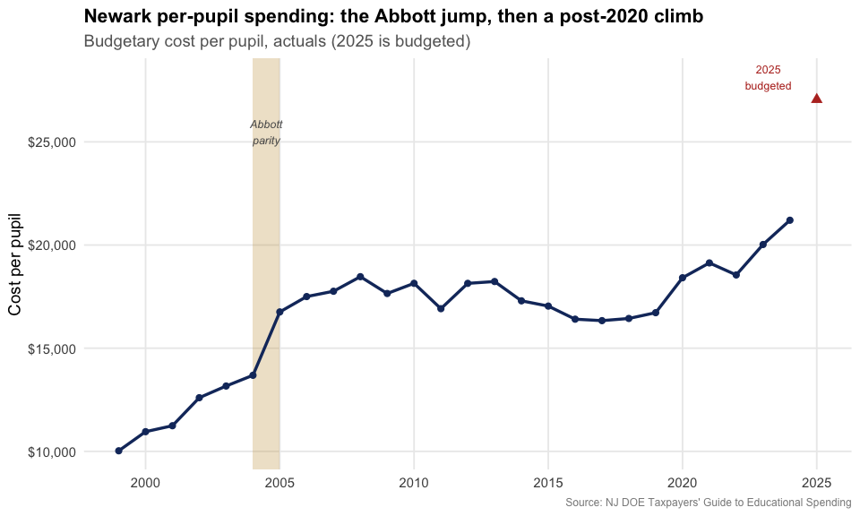
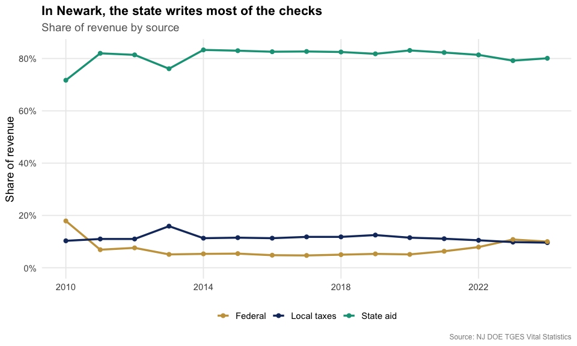
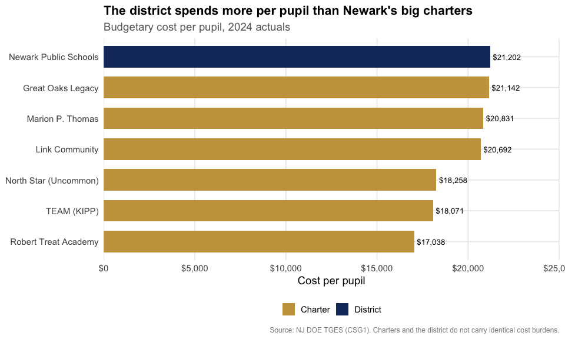
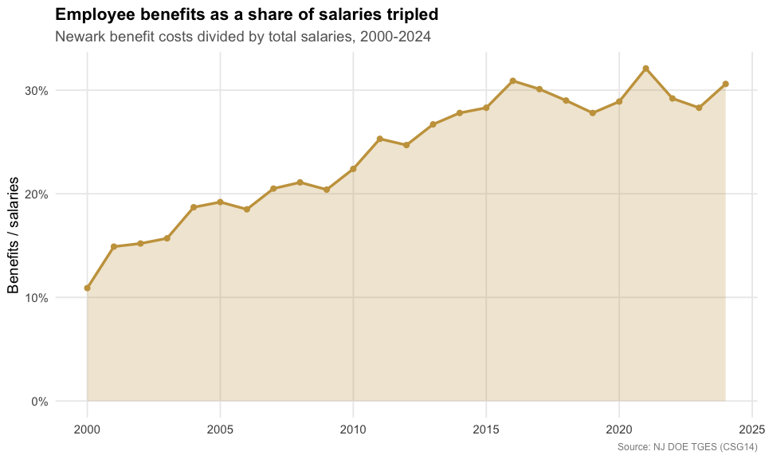
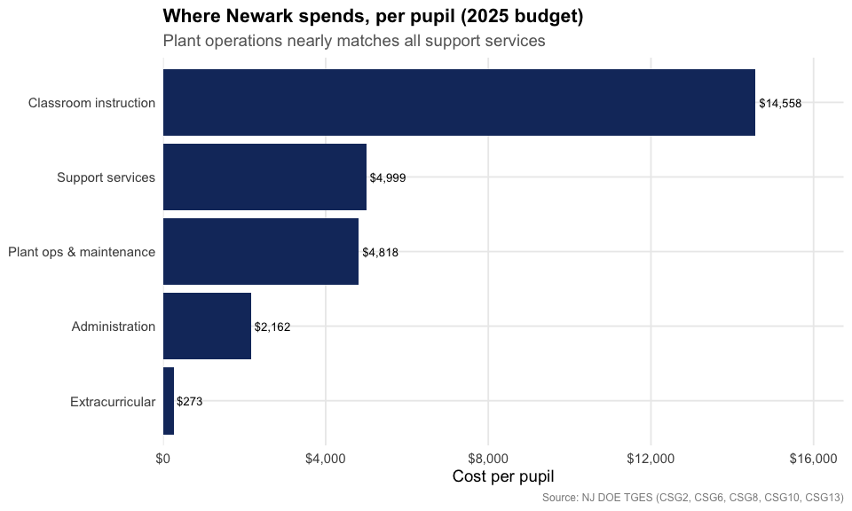
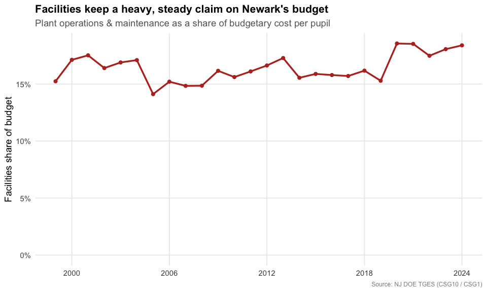
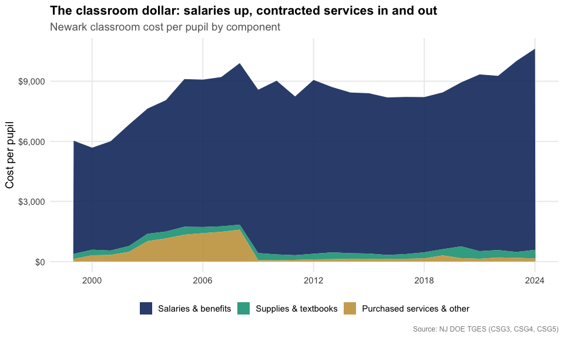
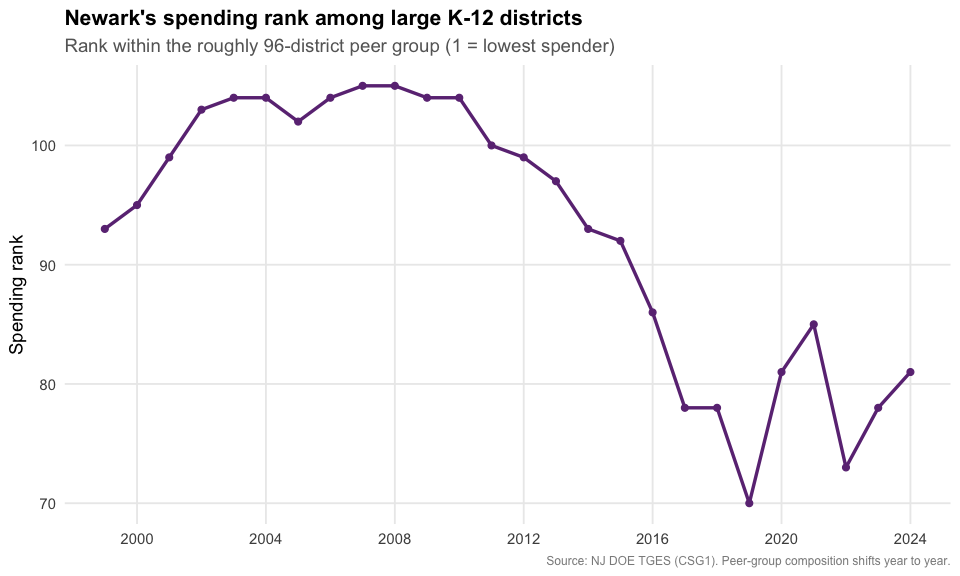
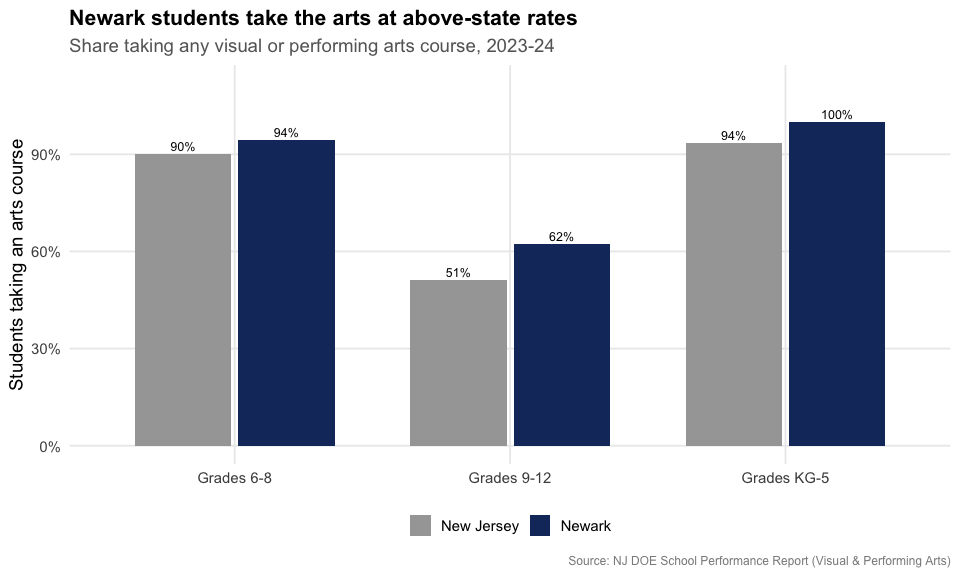
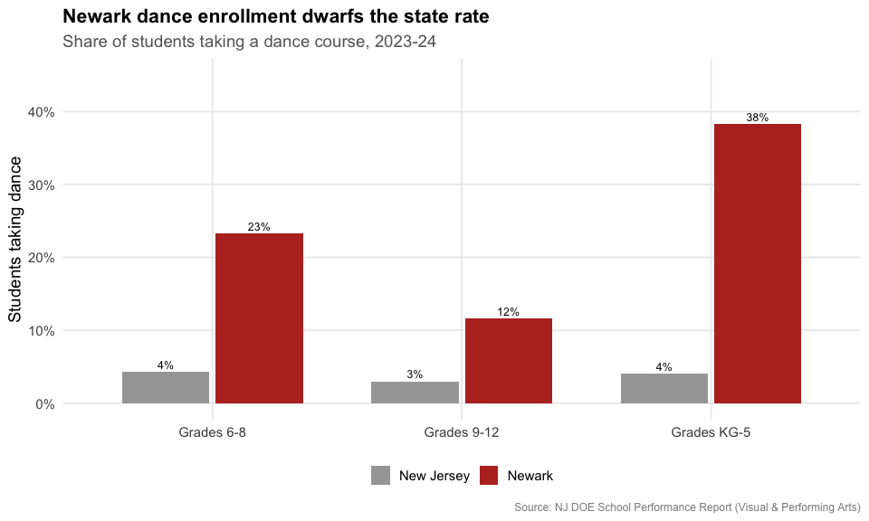

# Following the Money: 25 Years of Spending in Newark

``` r

library(njschooldata)
library(ggplot2)
library(dplyr)
library(scales)
library(purrr)
library(tibble)

# The arts section reads a School Performance Report workbook (~100 MB), so give
# the download more than R's stingy 60-second default.
options(timeout = max(600, getOption("timeout")))
```

``` r

theme_nj <- function() {
  theme_minimal(base_size = 14) +
    theme(
      plot.title = element_text(face = "bold", size = 16),
      plot.subtitle = element_text(color = "gray40"),
      plot.caption = element_text(color = "gray55", size = 9),
      panel.grid.minor = element_blank(),
      legend.position = "bottom"
    )
}

nwk_navy   <- "#16356B"
nwk_gold   <- "#C8A14B"
nwk_teal   <- "#16A085"
nwk_red    <- "#B83227"
nwk_purple <- "#6C3483"
```

The [Taxpayers’ Guide to Educational
Spending](https://www.nj.gov/education/guide/) (TGES) is the New Jersey
Department of Education’s annual report on what every district spends,
broken down per pupil into classroom instruction, support services,
administration, plant operations, and more. `njschooldata` pulls it
straight from the state for every year back to 2001 (the pre-2011
editions were branded the “Comparative Spending Guide”).

This article follows one district, **Newark**, over a quarter century.
Newark is the state’s largest school district, roughly 43,000 students
and a budget near \$1.5 billion. It is also one of the original *Abbott
v. Burke* districts, where a decades-long school-funding lawsuit forced
the state to pour money into New Jersey’s poorest cities, and it spent
more than 20 years under state control before local control returned in
2018. The result is a spending story almost the mirror image of a
wealthy suburb like [South
Orange-Maplewood](https://almartin82.github.io/njschooldata/articles/somsd-school-spending.md):
in Newark the *state*, not the local taxpayer, writes most of the
checks.

`fetch_tges(year)` returns one tidy data frame per spending indicator:

``` r

spending_2025 <- fetch_tges(2025)

# one tidy table per TGES indicator (CSG1 = total budgetary cost per pupil)
names(spending_2025)
#>  [1] "CSG1"              "CSG10"             "CSG11"            
#>  [4] "CSG12"             "CSG13"             "CSG14"            
#>  [7] "CSG15"             "CSG16"             "CSG17"            
#> [10] "CSG18"             "CSG19"             "CSG1AA_AVGS"      
#> [13] "CSG2"              "CSG20"             "CSG21"            
#> [16] "CSG3"              "CSG4"              "CSG5"             
#> [19] "CSG6"              "CSG7"              "CSG8"             
#> [22] "CSG8A"             "CSG9"              "SUMMARY"          
#> [25] "SUMYR3"            "SUMYR3C"           "SUMYR4"           
#> [28] "SUMYR4C"           "SUMYR5"            "SUMYR5C"          
#> [31] "VITSTAT_TOTAL"     "DETAIL_FY23"       "DETAIL_FY24"      
#> [34] "OCTOBER2024_DRTRS"
```

Each table is district-level and long, with a three-year window per
report: two finalized `Actuals` years plus the current `Budgeted` year.
Newark is district code `3570`.

``` r

spending_2025[["CSG1"]] %>%
  filter(district_id == "3570") %>%
  select(district_name, end_year, calc_type, `Per Pupil costs`, `District rank`)
#> # A tibble: 3 × 5
#>   district_name end_year calc_type `Per Pupil costs` `District rank`
#>   <chr>            <dbl> <chr>                 <dbl>           <int>
#> 1 Newark City       2023 Actuals               20026              78
#> 2 Newark City       2024 Actuals               21202              81
#> 3 Newark City       2025 Budgeted              27050              92
```

``` r

# Pull every published guide, 2001-2025. fetch_tges(2025) was already fetched
# above, so reuse it and download the rest. Drop (with a visible warning) any
# year that fails rather than letting one network hiccup kill the whole build.
reports <- list("2025" = spending_2025)
for (y in 2001:2024) {
  reports[[as.character(y)]] <- tryCatch(
    fetch_tges(y),
    error = function(e) {
      warning(paste("TGES", y, "failed:", conditionMessage(e)))
      NULL
    }
  )
}
reports <- reports[!vapply(reports, is.null, logical(1))]
reports <- reports[order(as.integer(names(reports)))]
```

``` r

NEWARK <- "3570"

# Pull one Newark value column across every report and keep one row per school
# year. Each actual recurs in consecutive guides; we keep the most recent
# (most finalized) report's figure. VITSTAT/CSG16 carry no calc_type, so the
# calc filter is skipped for them.
nwk_series <- function(table, value_col, calc = "Actuals") {
  map_dfr(names(reports), function(y) {
    d <- reports[[y]][[table]]
    if (is.null(d) || !value_col %in% names(d)) return(NULL)
    r <- filter(d, !is.na(district_id), district_id == NEWARK)
    if ("calc_type" %in% names(r)) r <- filter(r, calc_type == calc)
    if (nrow(r) == 0) return(NULL)
    tibble(report_year = as.integer(y), end_year = r$end_year, value = r[[value_col]])
  }) %>%
    group_by(end_year) %>%
    slice_max(report_year, n = 1, with_ties = FALSE) %>%
    ungroup() %>%
    arrange(end_year)
}
```

## 1. The Abbott surge, then a post-2020 climb

Newark’s actual budgetary cost per pupil sat near \$10,000 at the turn
of the century. Then it jumped: from \$13,687 (2004) to \$16,758 (2005),
a 22% rise in a single year. That surge lines up with the *Abbott v.
Burke* parity remedy, in which the state Supreme Court ordered New
Jersey to fund its poorest districts at the level of its wealthiest.
Spending then plateaued in the \$16,000-\$18,000 range for the entire
2010s before climbing again after 2020, to \$21,202 in 2024. The 2025
budget pushes it to **\$27,050**.

``` r

pp <- nwk_series("CSG1", "Per Pupil costs", "Actuals")
pp_budget_2025 <- nwk_series("CSG1", "Per Pupil costs", "Budgeted") %>%
  filter(end_year == 2025)

stopifnot(nrow(pp) > 0, nrow(pp_budget_2025) == 1)
pp
#> # A tibble: 26 × 3
#>    report_year end_year value
#>          <int>    <dbl> <dbl>
#>  1        2001     1999 10027
#>  2        2002     2000 10954
#>  3        2003     2001 11242
#>  4        2004     2002 12600
#>  5        2005     2003 13167
#>  6        2006     2004 13687
#>  7        2007     2005 16758
#>  8        2008     2006 17502
#>  9        2009     2007 17760
#> 10        2010     2008 18466
#> # ℹ 16 more rows
```

The comparative “budgetary cost per pupil” above is the figure TGES uses
to line districts up against each other; it excludes things like capital
construction and debt service. Newark’s *total* expenditures run far
higher, about \$1.49 billion in 2024, or roughly \$34,000 per pupil once
every fund is counted.

``` r

reports[["2025"]][["CSG1AA_AVGS"]] %>%
  filter(district_id == NEWARK, calc_type == "Actuals", end_year == 2024) %>%
  transmute(end_year,
            total_expenditures = `Total Expenditures, actual costs`,
            enrollment = `Average Daily Enrollment plus Sent Pupils`,
            per_pupil_all_funds = `Per Pupil Total Expenditures`)
#> # A tibble: 1 × 4
#>   end_year total_expenditures enrollment per_pupil_all_funds
#>      <dbl>              <dbl>      <dbl>               <dbl>
#> 1     2024         1488209111      43251               34409
```

``` r

ggplot(pp, aes(end_year, value)) +
  annotate("rect", xmin = 2004, xmax = 2005, ymin = -Inf, ymax = Inf,
           fill = nwk_gold, alpha = 0.30) +
  annotate("text", x = 2004.5, y = 25500, label = "Abbott\nparity",
           color = "gray35", fontface = "italic", size = 3.3) +
  geom_line(color = nwk_navy, linewidth = 1.2) +
  geom_point(color = nwk_navy, size = 2) +
  geom_point(data = pp_budget_2025, aes(end_year, value),
             color = nwk_red, size = 3, shape = 17) +
  annotate("text", x = 2023.2, y = pp_budget_2025$value + 1100,
           label = "2025\nbudgeted", color = nwk_red, size = 3.3) +
  scale_y_continuous(labels = dollar) +
  scale_x_continuous(breaks = seq(2000, 2025, 5)) +
  labs(title = "Newark per-pupil spending: the Abbott jump, then a post-2020 climb",
       subtitle = "Budgetary cost per pupil, actuals (2025 is budgeted)",
       x = NULL, y = "Cost per pupil",
       caption = "Source: NJ DOE Taxpayers' Guide to Educational Spending") +
  theme_nj()
```



## 2. The state pays the bill

This is the heart of Newark’s finances and the cleanest contrast with a
property-tax suburb. In South Orange-Maplewood, local taxpayers fund
about 70-85% of the budget. In Newark it is the reverse: **state aid
covers roughly 80%** and the local property-tax share has never topped
16%, drifting down to under 10% by 2024. The federal line spikes in a
crisis (the 2010 stimulus, the 2023 pandemic ESSER money) and recedes.

``` r

revenue <- bind_rows(
  nwk_series("VITSTAT_TOTAL", "Revenue: Local %")   %>% mutate(source = "Local taxes"),
  nwk_series("VITSTAT_TOTAL", "Revenue: State %")   %>% mutate(source = "State aid"),
  nwk_series("VITSTAT_TOTAL", "Revenue: Federal %") %>% mutate(source = "Federal")
)
stopifnot(nrow(revenue) > 0)

revenue %>%
  tidyr::pivot_wider(id_cols = end_year, names_from = source, values_from = value)
#> # A tibble: 15 × 4
#>    end_year `Local taxes` `State aid` Federal
#>       <dbl>         <dbl>       <dbl>   <dbl>
#>  1     2010         0.103       0.717   0.179
#>  2     2011         0.11        0.82    0.069
#>  3     2012         0.11        0.814   0.076
#>  4     2013         0.159       0.761   0.051
#>  5     2014         0.113       0.833   0.053
#>  6     2015         0.115       0.83    0.054
#>  7     2016         0.113       0.826   0.048
#>  8     2017         0.118       0.827   0.047
#>  9     2018         0.118       0.825   0.05 
#> 10     2019         0.125       0.818   0.053
#> 11     2020         0.115       0.831   0.051
#> 12     2021         0.111       0.823   0.063
#> 13     2022         0.105       0.814   0.079
#> 14     2023         0.098       0.792   0.108
#> 15     2024         0.096       0.801   0.1
```

``` r

ggplot(revenue, aes(end_year, value, color = source)) +
  geom_line(linewidth = 1.2) +
  geom_point(size = 2) +
  scale_color_manual(values = c("Local taxes" = nwk_navy,
                                "State aid" = nwk_teal,
                                "Federal" = nwk_gold)) +
  scale_y_continuous(labels = percent_format(accuracy = 1), limits = c(0, NA)) +
  scale_x_continuous(breaks = seq(2010, 2024, 4)) +
  labs(title = "In Newark, the state writes most of the checks",
       subtitle = "Share of revenue by source",
       x = NULL, y = "Share of revenue", color = NULL,
       caption = "Source: NJ DOE TGES Vital Statistics") +
  theme_nj()
```



## 3. Newark Public Schools outspends its charter rivals

Newark is one of the country’s most-watched charter battlegrounds, the
city of Mark Zuckerberg’s \$100 million gift and Dale Russakoff’s book
*The Prize*. About a third of Newark’s public-school students now attend
charters. TGES reports those charters as their own districts, so we can
line them up against the district. The two largest networks, **North
Star Academy** (Uncommon Schools) and **TEAM Academy** (KIPP), each
spend close to \$18,000 per pupil, below the district’s \$21,202.

A caveat: the district and the charters do not carry identical cost
burdens. Newark Public Schools provides district-wide transportation and
absorbs many of the highest-cost special-education placements, expenses
that never appear on a charter’s per-pupil line. The comparison is real,
but it is not apples to apples.

``` r

# major Newark charter networks, selected by district code so the comparison is
# explicit and reproducible
nwk_charters <- tribble(
  ~code,   ~name,
  "7320",  "North Star (Uncommon)",
  "7325",  "TEAM (KIPP)",
  "6053",  "Great Oaks Legacy",
  "7210",  "Marion P. Thomas",
  "6099",  "Link Community",
  "7730",  "Robert Treat Academy"
)

csg1_2024 <- reports[["2025"]][["CSG1"]] %>%
  filter(calc_type == "Actuals", end_year == 2024)

charter_cmp <- bind_rows(
  csg1_2024 %>% filter(district_id == NEWARK) %>%
    transmute(name = "Newark Public Schools", per_pupil = `Per Pupil costs`,
              kind = "District"),
  csg1_2024 %>% filter(district_id %in% nwk_charters$code) %>%
    left_join(nwk_charters, by = c("district_id" = "code")) %>%
    transmute(name, per_pupil = `Per Pupil costs`, kind = "Charter")
)
stopifnot(nrow(charter_cmp) > 0, all(!is.na(charter_cmp$per_pupil)))
charter_cmp %>% arrange(desc(per_pupil))
#> # A tibble: 7 × 3
#>   name                  per_pupil kind    
#>   <chr>                     <dbl> <chr>   
#> 1 Newark Public Schools     21202 District
#> 2 Great Oaks Legacy         21142 Charter 
#> 3 Marion P. Thomas          20831 Charter 
#> 4 Link Community            20692 Charter 
#> 5 North Star (Uncommon)     18258 Charter 
#> 6 TEAM (KIPP)               18071 Charter 
#> 7 Robert Treat Academy      17038 Charter
```

``` r

ggplot(charter_cmp, aes(reorder(name, per_pupil), per_pupil, fill = kind)) +
  geom_col(width = 0.7) +
  geom_text(aes(label = dollar(per_pupil)), hjust = -0.1, size = 3.5) +
  coord_flip() +
  scale_fill_manual(values = c("District" = nwk_navy, "Charter" = nwk_gold)) +
  scale_y_continuous(labels = dollar, expand = expansion(mult = c(0, 0.18))) +
  labs(title = "The district spends more per pupil than Newark's big charters",
       subtitle = "Budgetary cost per pupil, 2024 actuals",
       x = NULL, y = "Cost per pupil", fill = NULL,
       caption = "Source: NJ DOE TGES (CSG1). Charters and the district do not carry identical cost burdens.") +
  theme_nj()
```



## 4. Benefits ate the salary line

Here is the trend that drives every contentious school budget meeting:
employee benefits as a share of salaries. In Newark it **roughly
tripled**, from 10.9% in 2000 to 30.6% in 2024. Health-plan premiums are
the main driver, and they keep climbing faster than pay, the same
pressure squeezing districts statewide.

``` r

# the 1999 figure is a known decimal artifact in the early files; start at 2000
benefits <- nwk_series("CSG14", "% of Total Salaries", "Actuals") %>%
  filter(end_year >= 2000)
stopifnot(nrow(benefits) > 0)
benefits
#> # A tibble: 25 × 3
#>    report_year end_year value
#>          <int>    <dbl> <dbl>
#>  1        2002     2000 0.109
#>  2        2003     2001 0.149
#>  3        2004     2002 0.152
#>  4        2005     2003 0.157
#>  5        2006     2004 0.187
#>  6        2007     2005 0.192
#>  7        2008     2006 0.185
#>  8        2009     2007 0.205
#>  9        2010     2008 0.211
#> 10        2011     2009 0.204
#> # ℹ 15 more rows
```

``` r

ggplot(benefits, aes(end_year, value)) +
  geom_area(fill = nwk_gold, alpha = 0.25) +
  geom_line(color = nwk_gold, linewidth = 1.2) +
  geom_point(color = nwk_gold, size = 2) +
  scale_y_continuous(labels = percent_format(accuracy = 1),
                     limits = c(0, NA)) +
  scale_x_continuous(breaks = seq(2000, 2025, 5)) +
  labs(title = "Employee benefits as a share of salaries tripled",
       subtitle = "Newark benefit costs divided by total salaries, 2000-2024",
       x = NULL, y = "Benefits / salaries",
       caption = "Source: NJ DOE TGES (CSG14)") +
  theme_nj()
```



## 5. Where each dollar goes

TGES breaks the budgetary cost per pupil into its components. In the
2025 budget, classroom instruction is the biggest slice, but the
striking number is plant operations: Newark budgets nearly as much to
run and maintain its buildings (\$4,818 per pupil) as it spends on all
support services combined (\$4,999), a footprint you rarely see in a
younger suburban district.

``` r

category_tables <- tribble(
  ~category,                  ~table,
  "Classroom instruction",    "CSG2",
  "Support services",         "CSG6",
  "Plant ops & maintenance",  "CSG10",
  "Administration",           "CSG8",
  "Extracurricular",          "CSG13"
)

categories <- map_dfr(seq_len(nrow(category_tables)), function(i) {
  d <- reports[["2025"]][[category_tables$table[i]]]
  r <- filter(d, district_id == NEWARK, end_year == 2025)
  tibble(category = category_tables$category[i],
         per_pupil = r[["Per Pupil costs"]][1])
})

stopifnot(nrow(categories) > 0, all(!is.na(categories$per_pupil)))
categories %>% arrange(desc(per_pupil))
#> # A tibble: 5 × 2
#>   category                per_pupil
#>   <chr>                       <dbl>
#> 1 Classroom instruction       14558
#> 2 Support services             4999
#> 3 Plant ops & maintenance      4818
#> 4 Administration               2162
#> 5 Extracurricular               273
```

``` r

ggplot(categories, aes(reorder(category, per_pupil), per_pupil)) +
  geom_col(fill = nwk_navy) +
  geom_text(aes(label = dollar(per_pupil)), hjust = -0.1, size = 3.5) +
  coord_flip() +
  scale_y_continuous(labels = dollar, expand = expansion(mult = c(0, 0.15))) +
  labs(title = "Where Newark spends, per pupil (2025 budget)",
       subtitle = "Plant operations nearly matches all support services",
       x = NULL, y = "Cost per pupil",
       caption = "Source: NJ DOE TGES (CSG2, CSG6, CSG8, CSG10, CSG13)") +
  theme_nj()
```



## 6. Facilities: a heavy, growing line on aging buildings

In the wealthy suburbs, plant operations are a frozen line whose share
of the budget *shrinks* over time. Newark is the opposite. Heating,
cleaning, and repairing some of the oldest school buildings in the state
cost \$1,528 per pupil in 1999 and **\$3,899 by 2024**, and the
facilities share of the budget held between 15% and 19% the whole time,
drifting *up* after 2020. (TGES tracks operating cost only; the separate
state-funded SDA capital program that rebuilds Abbott-district schools
is not in these numbers.)

``` r

facilities <- nwk_series("CSG10", "Per Pupil costs") %>%
  select(end_year, facilities = value) %>%
  inner_join(nwk_series("CSG1", "Per Pupil costs") %>% select(end_year, total = value),
             by = "end_year") %>%
  mutate(share = facilities / total)
stopifnot(nrow(facilities) > 0)
facilities
#> # A tibble: 26 × 4
#>    end_year facilities total share
#>       <dbl>      <dbl> <dbl> <dbl>
#>  1     1999       1528 10027 0.152
#>  2     2000       1875 10954 0.171
#>  3     2001       1969 11242 0.175
#>  4     2002       2066 12600 0.164
#>  5     2003       2224 13167 0.169
#>  6     2004       2340 13687 0.171
#>  7     2005       2365 16758 0.141
#>  8     2006       2661 17502 0.152
#>  9     2007       2635 17760 0.148
#> 10     2008       2743 18466 0.149
#> # ℹ 16 more rows
```

``` r

ggplot(facilities, aes(end_year, share)) +
  geom_line(color = nwk_red, linewidth = 1.2) +
  geom_point(color = nwk_red, size = 2) +
  scale_y_continuous(labels = percent_format(accuracy = 1), limits = c(0, NA)) +
  scale_x_continuous(breaks = seq(2000, 2024, 6)) +
  labs(title = "Facilities keep a heavy, steady claim on Newark's budget",
       subtitle = "Plant operations & maintenance as a share of budgetary cost per pupil",
       x = NULL, y = "Facilities share of budget",
       caption = "Source: NJ DOE TGES (CSG10 / CSG1)") +
  theme_nj()
```



## 7. A closer look at the classroom dollar

TGES splits classroom instruction into three pieces: salaries and
benefits, supplies and textbooks, and “purchased services and other.”
Salaries and benefits dominate and nearly doubled, from \$5,095 per
pupil in 2000 to \$10,038 in 2024. Supplies and textbooks stayed frozen
near \$200-\$400 the entire period, a deep real-terms cut. And purchased
services, contracted and out-of-district instruction, tell the reverse
of the suburban story: they ballooned to \$1,589 per pupil in 2008, then
collapsed back to \$154 by 2024 as Newark brought services back
in-house.

``` r

classroom_parts <- bind_rows(
  nwk_series("CSG3", "Per Pupil costs") %>% mutate(part = "Salaries & benefits"),
  nwk_series("CSG4", "Per Pupil costs") %>% mutate(part = "Supplies & textbooks"),
  nwk_series("CSG5", "Per Pupil costs") %>% mutate(part = "Purchased services & other")
) %>%
  mutate(part = factor(part, levels = c("Salaries & benefits",
                                        "Supplies & textbooks",
                                        "Purchased services & other")))
stopifnot(nrow(classroom_parts) > 0)

classroom_parts %>%
  filter(end_year %in% c(2000, 2008, 2016, 2024)) %>%
  select(end_year, part, value) %>%
  arrange(end_year, part)
#> # A tibble: 12 × 3
#>    end_year part                       value
#>       <dbl> <fct>                      <dbl>
#>  1     2000 Salaries & benefits         5095
#>  2     2000 Supplies & textbooks         277
#>  3     2000 Purchased services & other   312
#>  4     2008 Salaries & benefits         8065
#>  5     2008 Supplies & textbooks         250
#>  6     2008 Purchased services & other  1589
#>  7     2016 Salaries & benefits         7864
#>  8     2016 Supplies & textbooks         191
#>  9     2016 Purchased services & other   137
#> 10     2024 Salaries & benefits        10038
#> 11     2024 Supplies & textbooks         430
#> 12     2024 Purchased services & other   154
```

``` r

ggplot(classroom_parts, aes(end_year, value, fill = part)) +
  geom_area(alpha = 0.9) +
  scale_fill_manual(values = c("Salaries & benefits" = nwk_navy,
                               "Supplies & textbooks" = nwk_teal,
                               "Purchased services & other" = nwk_gold)) +
  scale_y_continuous(labels = dollar) +
  scale_x_continuous(breaks = seq(2000, 2024, 6)) +
  labs(title = "The classroom dollar: salaries up, contracted services in and out",
       subtitle = "Newark classroom cost per pupil by component",
       x = NULL, y = "Cost per pupil", fill = NULL,
       caption = "Source: NJ DOE TGES (CSG3, CSG4, CSG5)") +
  theme_nj()
```



## 8. From the top of the pack toward the middle

TGES ranks each district against its peer group. Newark sits with the
large K-12 districts (3,500+ students). In this ranking, **1 = the
lowest spender**, so a higher number means spending more than peers.
Through the Abbott years Newark was ranked 104th or 105th out of about
105 districts, essentially the highest-spending big district in the
state. It has since slid toward the top quartile (rank in the 70s and
80s out of about 95) as its budget flattened in the recession years
while other districts caught up and the 2018 funding formula
redistributed aid.

``` r

rank <- nwk_series("CSG1", "District rank", "Actuals")
stopifnot(nrow(rank) > 0)

# size of the peer group in the most recent guide, for context
n_peers <- reports[["2025"]][["CSG1"]] %>%
  filter(group == "G. K-12 / 3501 +", end_year == 2024,
         !is.na(district_id), district_id != "00NA") %>%
  distinct(district_id) %>%
  nrow()
n_peers
#> [1] 97

rank
#> # A tibble: 26 × 3
#>    report_year end_year value
#>          <int>    <dbl> <int>
#>  1        2001     1999    93
#>  2        2002     2000    95
#>  3        2003     2001    99
#>  4        2004     2002   103
#>  5        2005     2003   104
#>  6        2006     2004   104
#>  7        2007     2005   102
#>  8        2008     2006   104
#>  9        2009     2007   105
#> 10        2010     2008   105
#> # ℹ 16 more rows
```

``` r

ggplot(rank, aes(end_year, value)) +
  geom_line(color = nwk_purple, linewidth = 1.2) +
  geom_point(color = nwk_purple, size = 2) +
  scale_x_continuous(breaks = seq(2000, 2024, 4)) +
  labs(title = "Newark's spending rank among large K-12 districts",
       subtitle = paste0("Rank within the roughly ", n_peers,
                          "-district peer group (1 = lowest spender)"),
       x = NULL, y = "Spending rank",
       caption = "Source: NJ DOE TGES (CSG1). Peer-group composition shifts year to year.") +
  theme_nj()
```



## 9. What the spending buys: the arts

TGES tells you what a district spends; the School Performance Report
tells you what students actually take. Newark has a deep arts-education
tradition, home to the nation’s first public arts high school (Arts High
School, founded 1931) and the New Jersey Performing Arts Center.
[`fetch_arts_enrollment()`](https://almartin82.github.io/njschooldata/reference/fetch_arts_enrollment.md)
pulls visual and performing arts participation, and Newark runs ahead of
the state at every grade band: arts enrollment is effectively universal
in its elementary schools.

``` r

arts_raw <- fetch_arts_enrollment(2024, level = "district") %>%
  filter(district_id == "3570")
stopifnot(nrow(arts_raw) > 0)
```

``` r

arts_any <- arts_raw %>%
  transmute(grades,
            Newark = as.numeric(any_visual_perf_art_district),
            `New Jersey` = as.numeric(any_visual_perf_art_state)) %>%
  tidyr::pivot_longer(c(Newark, `New Jersey`), names_to = "geo", values_to = "pct")
stopifnot(nrow(arts_any) > 0)
arts_any
#> # A tibble: 6 × 3
#>   grades      geo          pct
#>   <chr>       <chr>      <dbl>
#> 1 Grades 6-8  Newark      94.4
#> 2 Grades 6-8  New Jersey  90  
#> 3 Grades 9-12 Newark      62.2
#> 4 Grades 9-12 New Jersey  51.3
#> 5 Grades KG-5 Newark     100  
#> 6 Grades KG-5 New Jersey  93.6
```

``` r

ggplot(arts_any, aes(grades, pct, fill = geo)) +
  geom_col(position = position_dodge(width = 0.75), width = 0.7) +
  geom_text(aes(label = paste0(round(pct), "%")),
            position = position_dodge(width = 0.75), vjust = -0.4, size = 3.3) +
  scale_fill_manual(values = c("Newark" = nwk_navy, "New Jersey" = "gray65")) +
  scale_y_continuous(labels = percent_format(scale = 1), limits = c(0, 112)) +
  labs(title = "Newark students take the arts at above-state rates",
       subtitle = "Share taking any visual or performing arts course, 2023-24",
       x = NULL, y = "Students taking an arts course", fill = NULL,
       caption = "Source: NJ DOE School Performance Report (Visual & Performing Arts)") +
  theme_nj()
```



The standout is dance. Across every grade band Newark enrolls students
in dance at many times the state rate, peaking at **38% of elementary
students against a statewide 4%**, a legacy of the city’s
performing-arts programs.

``` r

arts_dance <- arts_raw %>%
  transmute(grades,
            Newark = as.numeric(dance_district),
            `New Jersey` = as.numeric(dance_state)) %>%
  tidyr::pivot_longer(c(Newark, `New Jersey`), names_to = "geo", values_to = "pct")
stopifnot(nrow(arts_dance) > 0)
arts_dance
#> # A tibble: 6 × 3
#>   grades      geo          pct
#>   <chr>       <chr>      <dbl>
#> 1 Grades 6-8  Newark      23.3
#> 2 Grades 6-8  New Jersey   4.3
#> 3 Grades 9-12 Newark      11.6
#> 4 Grades 9-12 New Jersey   3  
#> 5 Grades KG-5 Newark      38.3
#> 6 Grades KG-5 New Jersey   4.1
```

``` r

ggplot(arts_dance, aes(grades, pct, fill = geo)) +
  geom_col(position = position_dodge(width = 0.75), width = 0.7) +
  geom_text(aes(label = paste0(round(pct), "%")),
            position = position_dodge(width = 0.75), vjust = -0.4, size = 3.3) +
  scale_fill_manual(values = c("Newark" = nwk_red, "New Jersey" = "gray65")) +
  scale_y_continuous(labels = percent_format(scale = 1), limits = c(0, 45)) +
  labs(title = "Newark dance enrollment dwarfs the state rate",
       subtitle = "Share of students taking a dance course, 2023-24",
       x = NULL, y = "Students taking dance", fill = NULL,
       caption = "Source: NJ DOE School Performance Report (Visual & Performing Arts)") +
  theme_nj()
```



## Reproduce this yourself

Every chart above comes from
[`fetch_tges()`](https://almartin82.github.io/njschooldata/reference/fetch_tges.md).
Once you have a year’s tables (`spending_2025 <- fetch_tges(2025)`),
pulling Newark’s revenue mix is two lines:

``` r

spending_2025[["VITSTAT_TOTAL"]] %>%
  filter(district_id == "3570") %>%
  select(district_name, end_year, `Revenue: State %`, `Revenue: Local %`, `Revenue: Federal %`)
#> # A tibble: 1 × 5
#>   district_name end_year `Revenue: State %` `Revenue: Local %`
#>   <chr>            <dbl>              <dbl>              <dbl>
#> 1 Newark City       2024              0.801              0.096
#> # ℹ 1 more variable: `Revenue: Federal %` <dbl>
```

Swap the district code for any NJ district, or loop
`fetch_many_tges(2001:2025)` for the full history.

``` r

sessionInfo()
#> R version 4.6.0 (2026-04-24)
#> Platform: x86_64-pc-linux-gnu
#> Running under: Ubuntu 24.04.4 LTS
#> 
#> Matrix products: default
#> BLAS:   /usr/lib/x86_64-linux-gnu/openblas-pthread/libblas.so.3 
#> LAPACK: /usr/lib/x86_64-linux-gnu/openblas-pthread/libopenblasp-r0.3.26.so;  LAPACK version 3.12.0
#> 
#> locale:
#>  [1] LC_CTYPE=C.UTF-8       LC_NUMERIC=C           LC_TIME=C.UTF-8       
#>  [4] LC_COLLATE=C.UTF-8     LC_MONETARY=C.UTF-8    LC_MESSAGES=C.UTF-8   
#>  [7] LC_PAPER=C.UTF-8       LC_NAME=C              LC_ADDRESS=C          
#> [10] LC_TELEPHONE=C         LC_MEASUREMENT=C.UTF-8 LC_IDENTIFICATION=C   
#> 
#> time zone: UTC
#> tzcode source: system (glibc)
#> 
#> attached base packages:
#> [1] stats     graphics  grDevices utils     datasets  methods   base     
#> 
#> other attached packages:
#> [1] tibble_3.3.1        purrr_1.2.2         scales_1.4.0       
#> [4] dplyr_1.2.1         ggplot2_4.0.3       njschooldata_0.9.16
#> 
#> loaded via a namespace (and not attached):
#>  [1] utf8_1.2.6         sass_0.4.10        generics_0.1.4     tidyr_1.3.2       
#>  [5] stringi_1.8.7      hms_1.1.4          digest_0.6.39      magrittr_2.0.5    
#>  [9] evaluate_1.0.5     grid_4.6.0         timechange_0.4.0   RColorBrewer_1.1-3
#> [13] fastmap_1.2.0      cellranger_1.1.0   jsonlite_2.0.0     codetools_0.2-20  
#> [17] textshaping_1.0.5  jquerylib_0.1.4    cli_3.6.6          crayon_1.5.3      
#> [21] rlang_1.2.0        bit64_4.8.2        withr_3.0.2        cachem_1.1.0      
#> [25] yaml_2.3.12        parallel_4.6.0     downloader_0.4.1   tools_4.6.0       
#> [29] tzdb_0.5.0         vctrs_0.7.3        R6_2.6.1           lifecycle_1.0.5   
#> [33] lubridate_1.9.5    snakecase_0.11.1   stringr_1.6.0      bit_4.6.0         
#> [37] fs_2.1.0           vroom_1.7.1        foreign_0.8-91     ragg_1.5.2        
#> [41] janitor_2.2.1      pkgconfig_2.0.3    desc_1.4.3         pkgdown_2.2.0     
#> [45] pillar_1.11.1      bslib_0.11.0       gtable_0.3.6       glue_1.8.1        
#> [49] systemfonts_1.3.2  xfun_0.57          tidyselect_1.2.1   knitr_1.51        
#> [53] farver_2.1.2       htmltools_0.5.9    labeling_0.4.3     rmarkdown_2.31    
#> [57] readr_2.2.0        compiler_4.6.0     S7_0.2.2           readxl_1.5.0
```
