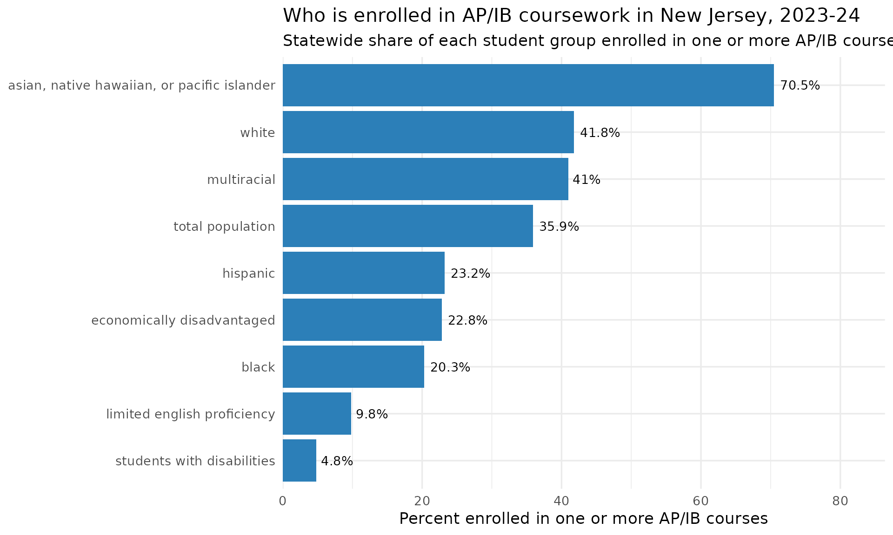
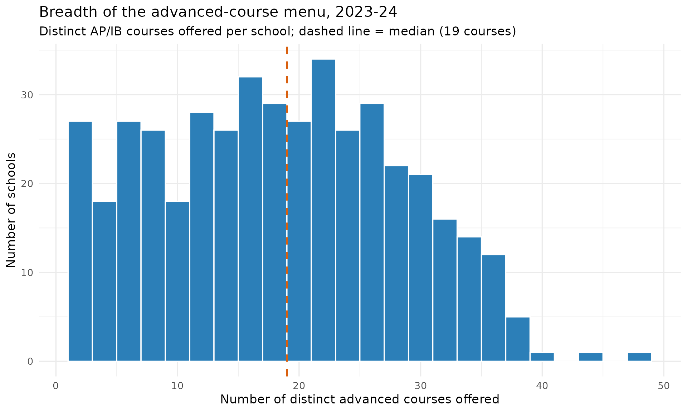

# Advanced-Coursework Access & Equity

``` r

library(njschooldata)
library(dplyr)
library(ggplot2)
```

The usual AP/IB question is “how many students took an exam.” The
harder, more newsworthy question is about **access**: does a school even
offer advanced courses, and once offered, who actually gets in.
[`fetch_advanced_course_access()`](https://almartin82.github.io/njschooldata/reference/fetch_advanced_course_access.md)
answers both. A single front door over three NJ School Performance
Report sheet families:

- `type = "courses_offered"` – one row per school per advanced course
  (enrolled / tested), 2017-2025.
- `type = "participation_by_group"` – AP/IB and dual-enrollment
  participation rates broken out by student group, 2021-2025.
- `type = "sle"` – Structured Learning Experience participation,
  2017-2025.

Every rate and count comes straight from the published SPR workbooks;
suppression and no-data text is kept as `NA`, never a guessed number.

## The AP/IB access gap by student group

`type = "participation_by_group"` reports, for each student group, the
percent of students enrolled in one or more AP/IB courses. The statewide
rate per group is carried in the `apib_pct_state` column. Lining the
groups up shows an access gap that is anything but subtle: in 2023-24
Asian students participated at **70%** while students with disabilities
sat at **under 5%**, with English learners, Black, Hispanic, and
economically disadvantaged students all well below the statewide
average.

``` r

groups <- c(
  "asian, native hawaiian, or pacific islander", "white", "multiracial",
  "total population", "hispanic", "black", "economically disadvantaged",
  "limited english proficiency", "students with disabilities"
)

apib_state <- fetch_advanced_course_access(
  2024, type = "participation_by_group", level = "district"
) %>%
  filter(is_state, subgroup %in% groups) %>%
  group_by(subgroup) %>%
  summarise(apib_pct = first(apib_pct_state), .groups = "drop") %>%
  filter(!is.na(apib_pct)) %>%
  arrange(apib_pct)

# Print-before-plot: confirm the data feeding the chart.
stopifnot(nrow(apib_state) > 0)
apib_state
#> # A tibble: 9 × 2
#>   subgroup                                    apib_pct
#>   <chr>                                          <dbl>
#> 1 students with disabilities                       4.8
#> 2 limited english proficiency                      9.8
#> 3 black                                           20.3
#> 4 economically disadvantaged                      22.8
#> 5 hispanic                                        23.2
#> 6 total population                                35.9
#> 7 multiracial                                     41  
#> 8 white                                           41.8
#> 9 asian, native hawaiian, or pacific islander     70.5
```

``` r

ggplot(apib_state, aes(x = reorder(subgroup, apib_pct), y = apib_pct)) +
  geom_col(fill = "#2c7fb8") +
  geom_text(aes(label = paste0(apib_pct, "%")), hjust = -0.15, size = 3.6) +
  coord_flip() +
  scale_y_continuous(limits = c(0, 80), expand = expansion(mult = c(0, 0.08))) +
  labs(
    title = "Who is enrolled in AP/IB coursework in New Jersey, 2023-24",
    subtitle = "Statewide share of each student group enrolled in one or more AP/IB courses",
    x = NULL,
    y = "Percent enrolled in one or more AP/IB courses"
  ) +
  theme_minimal(base_size = 13)
```



## How many advanced courses does a school offer at all?

Access starts with supply. `type = "courses_offered"` lists every
advanced course a school runs, so counting distinct courses per school
measures the **breadth** of the advanced-course menu. In 2023-24 the
typical NJ high school offering any advanced course listed about 19 of
them, but the range is enormous - from a single course to nearly 50.

``` r

breadth <- fetch_advanced_course_access(2024, type = "courses_offered") %>%
  filter(is_school) %>%
  group_by(district_id, school_id, school_name) %>%
  summarise(n_courses = n_distinct(course_name), .groups = "drop")

# Print-before-plot.
stopifnot(nrow(breadth) > 0)
summary(breadth$n_courses)
#>    Min. 1st Qu.  Median    Mean 3rd Qu.    Max. 
#>    2.00   11.00   19.00   18.81   26.00   49.00
```

``` r

ggplot(breadth, aes(x = n_courses)) +
  geom_histogram(binwidth = 2, fill = "#2c7fb8", colour = "white") +
  geom_vline(xintercept = median(breadth$n_courses),
             linetype = "dashed", colour = "#d95f0e", linewidth = 0.9) +
  labs(
    title = "Breadth of the advanced-course menu, 2023-24",
    subtitle = paste0("Distinct AP/IB courses offered per school; dashed line = median (",
                      median(breadth$n_courses), " courses)"),
    x = "Number of distinct advanced courses offered",
    y = "Number of schools"
  ) +
  theme_minimal(base_size = 13)
```



The schools with the widest menus:

``` r

breadth %>%
  arrange(desc(n_courses)) %>%
  slice_head(n = 10) %>%
  select(school_name, n_courses)
#> # A tibble: 10 × 2
#>    school_name                     n_courses
#>    <chr>                               <int>
#>  1 West Morris Mendham High School        49
#>  2 West Morris Central High School        45
#>  3 Howell High School                     41
#>  4 Morris Knolls High School              39
#>  5 Freehold Township High School          38
#>  6 Livingston High School                 38
#>  7 Randolph High School                   38
#>  8 Red Bank Regional High School          38
#>  9 Bergen County Academies                37
#> 10 Bridgewater-Raritan High School        37
```

## Notes

- [`fetch_advanced_course_access()`](https://almartin82.github.io/njschooldata/reference/fetch_advanced_course_access.md)
  accepts `level = "school"` (default) or `level = "district"`; the
  statewide `is_state` row lives in the District workbook.
- Coverage: `courses_offered` and `sle` span 2017-2025;
  `participation_by_group` spans 2021-2025 (the sheet is absent
  2017-2020 and those years error). The 2025 participation sheet is a
  multi-year trend table filtered to the requested year.
- Suppression / no-data strings (e.g. “There is no data available for
  this school year.”) are coerced to `NA`, never a fabricated number.

``` r

sessionInfo()
#> R version 4.6.1 (2026-06-24)
#> Platform: x86_64-pc-linux-gnu
#> Running under: Ubuntu 24.04.4 LTS
#> 
#> Matrix products: default
#> BLAS:   /usr/lib/x86_64-linux-gnu/openblas-pthread/libblas.so.3 
#> LAPACK: /usr/lib/x86_64-linux-gnu/openblas-pthread/libopenblasp-r0.3.26.so;  LAPACK version 3.12.0
#> 
#> locale:
#>  [1] LC_CTYPE=C.UTF-8       LC_NUMERIC=C           LC_TIME=C.UTF-8       
#>  [4] LC_COLLATE=C.UTF-8     LC_MONETARY=C.UTF-8    LC_MESSAGES=C.UTF-8   
#>  [7] LC_PAPER=C.UTF-8       LC_NAME=C              LC_ADDRESS=C          
#> [10] LC_TELEPHONE=C         LC_MEASUREMENT=C.UTF-8 LC_IDENTIFICATION=C   
#> 
#> time zone: UTC
#> tzcode source: system (glibc)
#> 
#> attached base packages:
#> [1] stats     graphics  grDevices utils     datasets  methods   base     
#> 
#> other attached packages:
#> [1] ggplot2_4.0.3       dplyr_1.2.1         njschooldata_0.9.26
#> 
#> loaded via a namespace (and not attached):
#>  [1] utf8_1.2.6         sass_0.4.10        generics_0.1.4     tidyr_1.3.2       
#>  [5] stringi_1.8.7      hms_1.1.4          digest_0.6.39      magrittr_2.0.5    
#>  [9] evaluate_1.0.5     grid_4.6.1         timechange_0.4.0   RColorBrewer_1.1-3
#> [13] fastmap_1.2.0      cellranger_1.1.0   jsonlite_2.0.0     purrr_1.2.2       
#> [17] scales_1.4.0       textshaping_1.0.5  jquerylib_0.1.4    cli_3.6.6         
#> [21] rlang_1.3.0        withr_3.0.3        cachem_1.1.0       yaml_2.3.12       
#> [25] otel_0.2.0         downloader_0.4.1   tools_4.6.1        tzdb_0.5.0        
#> [29] vctrs_0.7.3        R6_2.6.1           lifecycle_1.0.5    lubridate_1.9.5   
#> [33] snakecase_0.11.1   stringr_1.6.0      fs_2.1.0           ragg_1.5.2        
#> [37] janitor_2.2.1      pkgconfig_2.0.3    desc_1.4.3         pkgdown_2.2.1     
#> [41] pillar_1.11.1      bslib_0.11.0       gtable_0.3.6       glue_1.8.1        
#> [45] systemfonts_1.3.2  xfun_0.60          tibble_3.3.1       tidyselect_1.2.1  
#> [49] knitr_1.51         farver_2.1.2       htmltools_0.5.9    labeling_0.4.3    
#> [53] rmarkdown_2.31     readr_2.2.0        compiler_4.6.1     S7_0.2.2          
#> [57] readxl_1.5.0
```
