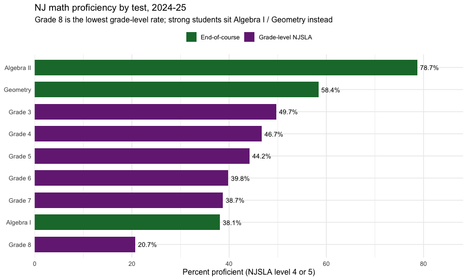
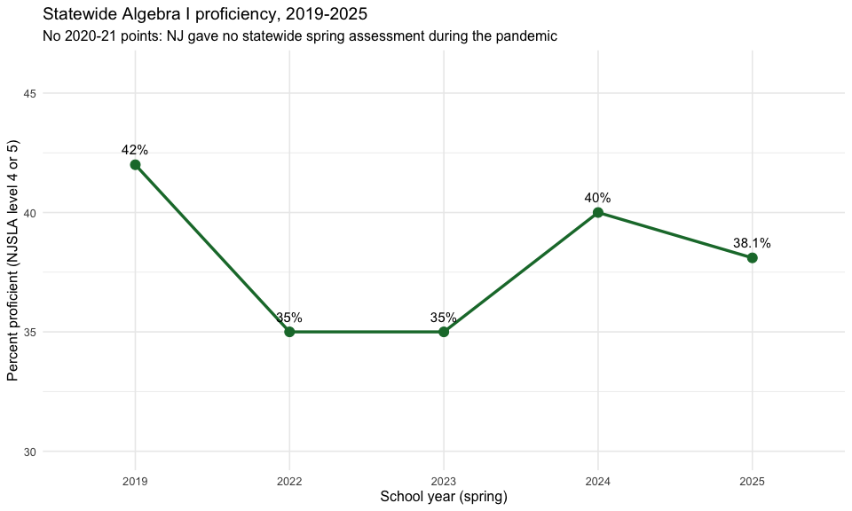
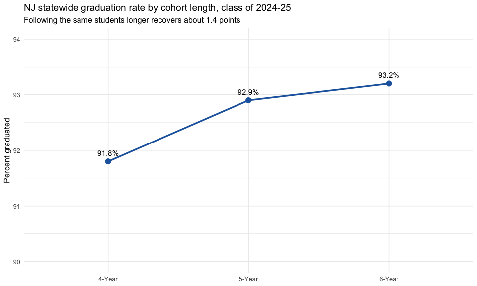
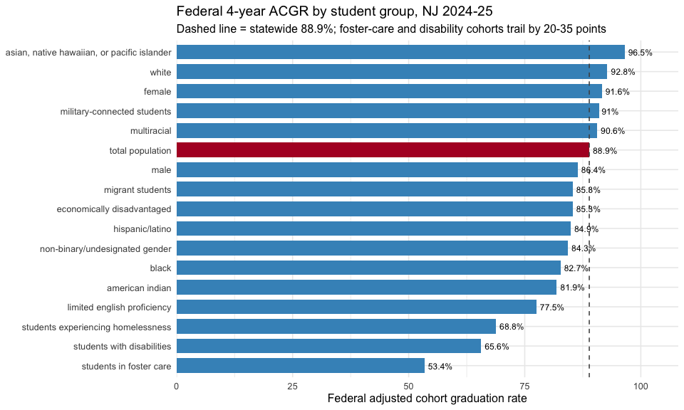

# Assessment & Graduation Detail: Behind the Headline Rates

``` r

library(njschooldata)
library(dplyr)
library(ggplot2)
```

The 2024-25 School Performance Reports added several sheets that slice
assessment and graduation results more finely than the headline
proficiency and graduation rates. This vignette uses three of the new
fetchers to show how the detail changes the story:

- [`fetch_spr_proficiency_by_test()`](https://almartin82.github.io/njschooldata/reference/fetch_spr_proficiency_by_test.md)
  splits NJSLA math by the *test* a student sat, separating the
  grade-level tests from the high-school end-of-course exams (Algebra I,
  Geometry, Algebra II) that
  [`fetch_parcc()`](https://almartin82.github.io/njschooldata/reference/fetch_parcc.md)
  folds together.
- [`fetch_spr_grad_cohort()`](https://almartin82.github.io/njschooldata/reference/fetch_spr_grad_cohort.md)
  returns the 4-, 5-, and 6-year graduation cohorts in one frame, so the
  recovery between them is visible at a glance.
- [`fetch_spr_fed_grad()`](https://almartin82.github.io/njschooldata/reference/fetch_spr_fed_grad.md)
  reads the federally reported Adjusted Cohort Graduation Rate (ACGR) by
  student group, the rate used for ESSA accountability.

Two companion fetchers round out the set:
[`fetch_spr_science_grade()`](https://almartin82.github.io/njschooldata/reference/fetch_spr_science_grade.md)
(NJSLA science by grade) and
[`fetch_spr_elp_progress()`](https://almartin82.github.io/njschooldata/reference/fetch_spr_elp_progress.md)
(progress toward English language proficiency). Every value comes
straight from the published workbook; suppressed cells stay `NA` rather
than being guessed.

## Grade-8 math looks like a crisis until you see who skipped the test

The single lowest NJSLA math proficiency rate in New Jersey is **Grade
8, at 20.7%**. Taken alone that reads like a collapse. The by-test
breakdown explains it: the strongest eighth graders do not sit the Grade
8 NJSLA at all. They take **Algebra I** (38.1% proficient) or
**Geometry** (58.4%) as accelerated math. What is left in the Grade 8
pool is the lower-performing remainder, so the grade-level rate is
depressed by who *left* it, not only by who is in it. The end-of-course
exams, which
[`fetch_parcc()`](https://almartin82.github.io/njschooldata/reference/fetch_parcc.md)
does not separate, are the missing context.

``` r

math_state <- fetch_spr_proficiency_by_test(2025, subject = "math",
                                            level = "district") %>%
  filter(is_state, subgroup == "total population")

stopifnot(nrow(math_state) > 0)

math_state <- math_state %>%
  mutate(kind = if_else(grade_test %in% c("Algebra I", "Geometry", "Algebra II"),
                        "End-of-course", "Grade-level NJSLA")) %>%
  arrange(proficiency_rate)

# Print-before-plot: the data feeding the chart.
math_state %>% select(grade_test, kind, valid_scores, proficiency_rate)
#> # A tibble: 9 × 4
#>   grade_test kind              valid_scores proficiency_rate
#>   <chr>      <chr>                    <dbl>            <dbl>
#> 1 Grade 8    Grade-level NJSLA        66292             20.7
#> 2 Algebra I  End-of-course           101493             38.1
#> 3 Grade 7    Grade-level NJSLA        92817             38.7
#> 4 Grade 6    Grade-level NJSLA        96917             39.8
#> 5 Grade 5    Grade-level NJSLA        96345             44.2
#> 6 Grade 4    Grade-level NJSLA        94866             46.7
#> 7 Grade 3    Grade-level NJSLA        95272             49.7
#> 8 Geometry   End-of-course            29017             58.4
#> 9 Algebra II End-of-course             7442             78.7
```

``` r

ggplot(math_state, aes(x = reorder(grade_test, proficiency_rate),
                       y = proficiency_rate, fill = kind)) +
  geom_col(width = 0.7) +
  geom_text(aes(label = paste0(proficiency_rate, "%")), hjust = -0.15,
            size = 3.6) +
  coord_flip() +
  scale_y_continuous(expand = expansion(mult = c(0, 0.12))) +
  scale_fill_manual(values = c("End-of-course" = "#1b7837",
                               "Grade-level NJSLA" = "#762a83")) +
  labs(
    title = "NJ math proficiency by test, 2024-25",
    subtitle = "Grade 8 is the lowest grade-level rate; strong students sit Algebra I / Geometry instead",
    x = NULL,
    y = "Percent proficient (NJSLA level 4 or 5)",
    fill = NULL
  ) +
  theme_minimal(base_size = 12) +
  theme(legend.position = "top")
```



## Algebra I never fully recovered from the pandemic

Because the by-test sheet reaches back to the pre-redesign databases,
[`fetch_spr_proficiency_by_test()`](https://almartin82.github.io/njschooldata/reference/fetch_spr_proficiency_by_test.md)
can follow a single test across years. Statewide Algebra I proficiency
was **42% in spring 2019**, fell to **35% in 2022** (the first
administration after the COVID testing pause), and has only partly
recovered to **38% in 2025** — still four points below where it started.
There is no 2020 or 2021 point because New Jersey gave no statewide
spring assessment those years; the function errors on those years rather
than inventing a value.

``` r

alg_years <- c(2019, 2022, 2023, 2024, 2025)

alg_trend <- lapply(alg_years, function(y) {
  fetch_spr_proficiency_by_test(y, subject = "math", level = "district") %>%
    filter(is_state, grade_test == "Algebra I",
           subgroup == "total population") %>%
    transmute(end_year = y, proficiency_rate)
}) %>% bind_rows()

stopifnot(nrow(alg_trend) == length(alg_years))

# Print-before-plot.
alg_trend
#> # A tibble: 5 × 2
#>   end_year proficiency_rate
#>      <dbl>            <dbl>
#> 1     2019             42  
#> 2     2022             35  
#> 3     2023             35  
#> 4     2024             40  
#> 5     2025             38.1
```

``` r

ggplot(alg_trend, aes(x = factor(end_year), y = proficiency_rate, group = 1)) +
  geom_line(color = "#1b7837", linewidth = 1.2) +
  geom_point(color = "#1b7837", size = 3.5) +
  geom_text(aes(label = paste0(proficiency_rate, "%")), vjust = -1.1, size = 4) +
  scale_y_continuous(limits = c(30, 46)) +
  labs(
    title = "Statewide Algebra I proficiency, 2019-2025",
    subtitle = "No 2020-21 points: NJ gave no statewide spring assessment during the pandemic",
    x = "School year (spring)",
    y = "Percent proficient (NJSLA level 4 or 5)"
  ) +
  theme_minimal(base_size = 12)
```



## The 6-year cohort quietly recovers students the 4-year rate misses

The headline graduation rate is the 4-year cohort: 91.8% statewide for
the class that should have finished in 2024-25. Following the same
students another two years lifts the rate to **92.9% at five years and
93.2% at six**, while the share still enrolled (“continuing”) falls from
3.4% to 1.0%. The 6-year cohort also reports a high-school
**persistence** rate of 94.2% (graduated plus still enrolled). Combining
all three cohort lengths in one frame, which
[`fetch_spr_grad_cohort()`](https://almartin82.github.io/njschooldata/reference/fetch_spr_grad_cohort.md)
does, makes the slow recovery legible.

``` r

cohort_state <- fetch_spr_grad_cohort(2025, level = "district") %>%
  filter(is_state, subgroup == "total population") %>%
  select(cohort_type, graduated, continuing, non_continuing, persisting)

stopifnot(nrow(cohort_state) == 3)

# Print-before-plot.
cohort_state
#> # A tibble: 3 × 5
#>   cohort_type graduated continuing non_continuing persisting
#>   <chr>           <dbl>      <dbl>          <dbl>      <dbl>
#> 1 4-Year           91.8        3.4            4.8       NA  
#> 2 5-Year           92.9        1.7            5.4       NA  
#> 3 6-Year           93.2        1              5.8       94.2
```

``` r

ggplot(cohort_state, aes(x = cohort_type, y = graduated, group = 1)) +
  geom_line(color = "#2166ac", linewidth = 1.2) +
  geom_point(color = "#2166ac", size = 3.5) +
  geom_text(aes(label = paste0(graduated, "%")), vjust = -1.1, size = 4) +
  scale_y_continuous(limits = c(90, 94)) +
  labs(
    title = "NJ statewide graduation rate by cohort length, class of 2024-25",
    subtitle = "Following the same students longer recovers about 1.4 points",
    x = NULL,
    y = "Percent graduated"
  ) +
  theme_minimal(base_size = 12)
```



## The federal graduation rate hides a 43-point equity gap

The federally reported ACGR is a single statewide 4-year number, 88.9%.
By student group it spans an enormous range. Students in foster care
graduate at **53.4%** and students with disabilities at **65.6%**,
against **96.5%** for Asian/Native Hawaiian/Pacific Islander students
and **92.8%** for white students.
[`fetch_spr_fed_grad()`](https://almartin82.github.io/njschooldata/reference/fetch_spr_fed_grad.md)
returns the rate by subgroup and cohort length, so the gap behind the
headline is one filter away.

``` r

fed_state <- fetch_spr_fed_grad(2025, level = "district") %>%
  filter(is_state, cohort_years == 4,
         !is.na(graduation_rate_federal)) %>%
  select(subgroup, graduation_rate_federal) %>%
  arrange(graduation_rate_federal)

stopifnot(nrow(fed_state) > 0)

total_rate <- fed_state$graduation_rate_federal[fed_state$subgroup == "total population"]

# Print-before-plot.
fed_state
#> # A tibble: 17 × 2
#>    subgroup                                    graduation_rate_federal
#>    <chr>                                                         <dbl>
#>  1 students in foster care                                        53.4
#>  2 students with disabilities                                     65.6
#>  3 students experiencing homelessness                             68.8
#>  4 limited english proficiency                                    77.5
#>  5 american indian                                                81.9
#>  6 black                                                          82.7
#>  7 non-binary/undesignated gender                                 84.3
#>  8 hispanic/latino                                                84.9
#>  9 economically disadvantaged                                     85.3
#> 10 migrant students                                               85.3
#> 11 male                                                           86.4
#> 12 total population                                               88.9
#> 13 multiracial                                                    90.6
#> 14 military-connected students                                    91  
#> 15 female                                                         91.6
#> 16 white                                                          92.8
#> 17 asian, native hawaiian, or pacific islander                    96.5
```

``` r

fed_plot <- fed_state %>%
  mutate(highlight = subgroup == "total population")

ggplot(fed_plot, aes(x = reorder(subgroup, graduation_rate_federal),
                     y = graduation_rate_federal, fill = highlight)) +
  geom_col(width = 0.75) +
  geom_hline(yintercept = total_rate, linetype = "dashed", color = "grey30") +
  geom_text(aes(label = paste0(graduation_rate_federal, "%")), hjust = -0.15,
            size = 3.2) +
  coord_flip() +
  scale_y_continuous(expand = expansion(mult = c(0, 0.12))) +
  scale_fill_manual(values = c("TRUE" = "#b2182b", "FALSE" = "#4393c3"),
                    guide = "none") +
  labs(
    title = "Federal 4-year ACGR by student group, NJ 2024-25",
    subtitle = "Dashed line = statewide 88.9%; foster-care and disability cohorts trail by 20-35 points",
    x = NULL,
    y = "Federal adjusted cohort graduation rate"
  ) +
  theme_minimal(base_size = 12)
```



## Notes

- **Coverage.** Although these sheets were redesigned in 2024-25, most
  reach further back through their pre-redesign predecessors:
  [`fetch_spr_proficiency_by_test()`](https://almartin82.github.io/njschooldata/reference/fetch_spr_proficiency_by_test.md)
  covers 2017-2019 and 2022-2025 (no by-grade/test sheet in the 2020-21
  COVID years);
  [`fetch_spr_science_grade()`](https://almartin82.github.io/njschooldata/reference/fetch_spr_science_grade.md)
  covers 2019 and 2021-2025 (NJSLA science began in 2019; 2020 was not
  tested and the earlier NJASK is a different scale);
  [`fetch_spr_grad_cohort()`](https://almartin82.github.io/njschooldata/reference/fetch_spr_grad_cohort.md)
  covers 2020-2025 (2020 has only the 4- and 5-year cohorts);
  [`fetch_spr_fed_grad()`](https://almartin82.github.io/njschooldata/reference/fetch_spr_fed_grad.md)
  covers 2021-2025 (6-year cohort from 2024).
  [`fetch_spr_elp_progress()`](https://almartin82.github.io/njschooldata/reference/fetch_spr_elp_progress.md)
  is 2025-only — the pre-redesign sheet measured a different,
  target-based quantity, so it is deliberately not mapped.
- **Suppression.** Cells for fewer than ten students are masked in the
  source and return `NA`; the 4- and 5-year cohorts report no
  persistence rate (“n/a”), so `persisting` is `NA` there.
- **Entity values.** Each sheet stores its values as a
  school/district/state triple (or, in the pre-redesign databases, an
  entity column beside a parallel statewide column); these fetchers
  return the entity-appropriate value, and the statewide figure is
  carried on the `is_state` row of district-level output.

``` r

sessionInfo()
#> R version 4.6.1 (2026-06-24)
#> Platform: x86_64-pc-linux-gnu
#> Running under: Ubuntu 24.04.4 LTS
#> 
#> Matrix products: default
#> BLAS:   /usr/lib/x86_64-linux-gnu/openblas-pthread/libblas.so.3 
#> LAPACK: /usr/lib/x86_64-linux-gnu/openblas-pthread/libopenblasp-r0.3.26.so;  LAPACK version 3.12.0
#> 
#> locale:
#>  [1] LC_CTYPE=C.UTF-8       LC_NUMERIC=C           LC_TIME=C.UTF-8       
#>  [4] LC_COLLATE=C.UTF-8     LC_MONETARY=C.UTF-8    LC_MESSAGES=C.UTF-8   
#>  [7] LC_PAPER=C.UTF-8       LC_NAME=C              LC_ADDRESS=C          
#> [10] LC_TELEPHONE=C         LC_MEASUREMENT=C.UTF-8 LC_IDENTIFICATION=C   
#> 
#> time zone: UTC
#> tzcode source: system (glibc)
#> 
#> attached base packages:
#> [1] stats     graphics  grDevices utils     datasets  methods   base     
#> 
#> other attached packages:
#> [1] ggplot2_4.0.3       dplyr_1.2.1         njschooldata_0.9.26
#> 
#> loaded via a namespace (and not attached):
#>  [1] utf8_1.2.6         sass_0.4.10        generics_0.1.4     tidyr_1.3.2       
#>  [5] stringi_1.8.7      hms_1.1.4          digest_0.6.39      magrittr_2.0.5    
#>  [9] evaluate_1.0.5     grid_4.6.1         timechange_0.4.0   RColorBrewer_1.1-3
#> [13] fastmap_1.2.0      cellranger_1.1.0   jsonlite_2.0.0     purrr_1.2.2       
#> [17] scales_1.4.0       textshaping_1.0.5  jquerylib_0.1.4    cli_3.6.6         
#> [21] rlang_1.3.0        withr_3.0.3        cachem_1.1.0       yaml_2.3.12       
#> [25] otel_0.2.0         downloader_0.4.1   tools_4.6.1        tzdb_0.5.0        
#> [29] vctrs_0.7.3        R6_2.6.1           lifecycle_1.0.5    lubridate_1.9.5   
#> [33] snakecase_0.11.1   stringr_1.6.0      fs_2.1.0           ragg_1.5.2        
#> [37] janitor_2.2.1      pkgconfig_2.0.3    desc_1.4.3         pkgdown_2.2.1     
#> [41] pillar_1.11.1      bslib_0.11.0       gtable_0.3.6       glue_1.8.1        
#> [45] systemfonts_1.3.2  xfun_0.59          tibble_3.3.1       tidyselect_1.2.1  
#> [49] knitr_1.51         farver_2.1.2       htmltools_0.5.9    labeling_0.4.3    
#> [53] rmarkdown_2.31     readr_2.2.0        compiler_4.6.1     S7_0.2.2          
#> [57] readxl_1.5.0
```
