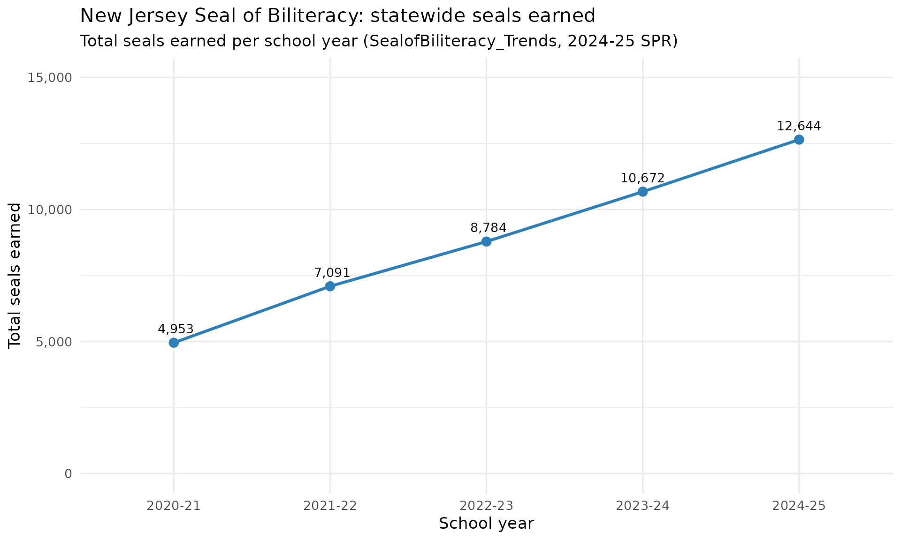
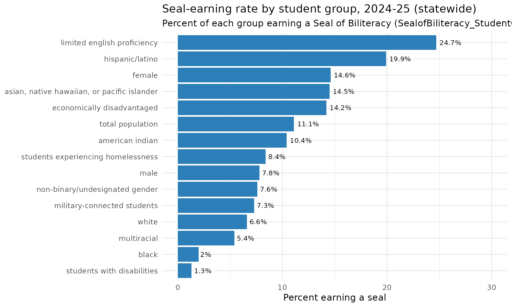

# Seal of Biliteracy: Statewide Trend & the Seal-Earning Equity Gap

``` r

library(njschooldata)
library(dplyr)
library(ggplot2)
```

The New Jersey State Seal of Biliteracy recognizes graduating students
who reach proficiency in English and at least one world language. The
2024-25 School Performance Reports split this into a richer set of
views: a school/district/state **summary**
([`fetch_biliteracy_summary()`](https://almartin82.github.io/njschooldata/reference/fetch_biliteracy_summary.md)),
a five-year **trend**
([`fetch_biliteracy_trends()`](https://almartin82.github.io/njschooldata/reference/fetch_biliteracy_trends.md)),
and a seal-earning rate **by student group**
([`fetch_biliteracy_by_group()`](https://almartin82.github.io/njschooldata/reference/fetch_biliteracy_by_group.md)).
All three are new in the 2024-25 redesign and cover end_year 2025 only;
the per-language detail (2018-2025) stays in
[`fetch_biliteracy_seal()`](https://almartin82.github.io/njschooldata/reference/fetch_biliteracy_seal.md).

Throughout, suppressed cells (`"Fewer than 5 seals"`,
`"Enrollment for the group is <10 students."`) are returned as `NA`,
never a guessed number. A real published `0` stays `0`.

## Statewide seals more than doubled in four years

The trend sheet is unusual: it carries five school years inside the
single 2025 workbook. The statewide row shows seals earned climbing from
about 4,950 in 2020-21 to 12,644 in 2024-25.

``` r

state_trend <- fetch_biliteracy_trends(2025, level = "district") %>%
  filter(is_state) %>%
  select(school_year, total_seals_earned) %>%
  arrange(school_year)
```

``` r

# Print-before-plot: confirm the data feeding the chart.
state_trend
#> # A tibble: 5 × 2
#>   school_year total_seals_earned
#>   <chr>                    <dbl>
#> 1 2020-21                   4953
#> 2 2021-22                   7091
#> 3 2022-23                   8784
#> 4 2023-24                  10672
#> 5 2024-25                  12644
stopifnot(nrow(state_trend) == 5)
```

``` r

ggplot(state_trend, aes(x = school_year, y = total_seals_earned, group = 1)) +
  geom_line(colour = "#2c7fb8", linewidth = 1.1) +
  geom_point(size = 3, colour = "#2c7fb8") +
  geom_text(aes(label = format(total_seals_earned, big.mark = ",")),
            vjust = -1, size = 3.6) +
  scale_y_continuous(limits = c(0, 15000),
                     labels = function(x) format(x, big.mark = ",")) +
  labs(
    title = "New Jersey Seal of Biliteracy: statewide seals earned",
    subtitle = "Total seals earned per school year (SealofBiliteracy_Trends, 2024-25 SPR)",
    x = "School year",
    y = "Total seals earned"
  ) +
  theme_minimal(base_size = 13)
```



## English learners earn seals at the highest rate

The student-group view reframes the seal as an equity measure. Because
the seal rewards proficiency in a language other than English, the
groups earning it at the highest rates are exactly the students who
arrive multilingual: current and former English learners lead at about
25%, with Hispanic/Latino students next. Students with disabilities and
Black students earn seals at the lowest rates. The statewide rate for
each group is carried in the `students_earning_seal_pct_state` column.

``` r

group_rates <- fetch_biliteracy_by_group(2025, level = "district") %>%
  filter(!is.na(students_earning_seal_pct_state)) %>%
  distinct(subgroup, students_earning_seal_pct_state)
```

``` r

# Print-before-plot: confirm the values exist and are sane.
group_rates <- group_rates %>%
  arrange(desc(students_earning_seal_pct_state))
group_rates
#> # A tibble: 15 × 2
#>    subgroup                                    students_earning_seal_pct_state
#>    <chr>                                                                 <dbl>
#>  1 limited english proficiency                                            24.7
#>  2 hispanic/latino                                                        19.9
#>  3 female                                                                 14.6
#>  4 asian, native hawaiian, or pacific islander                            14.5
#>  5 economically disadvantaged                                             14.2
#>  6 total population                                                       11.1
#>  7 american indian                                                        10.4
#>  8 students experiencing homelessness                                      8.4
#>  9 male                                                                    7.8
#> 10 non-binary/undesignated gender                                          7.6
#> 11 military-connected students                                             7.3
#> 12 white                                                                   6.6
#> 13 multiracial                                                             5.4
#> 14 black                                                                   2  
#> 15 students with disabilities                                              1.3
stopifnot(nrow(group_rates) > 0)
stopifnot("limited english proficiency" %in% group_rates$subgroup)
```

``` r

ggplot(
  group_rates,
  aes(x = reorder(subgroup, students_earning_seal_pct_state),
      y = students_earning_seal_pct_state)
) +
  geom_col(fill = "#2c7fb8") +
  geom_text(aes(label = paste0(students_earning_seal_pct_state, "%")),
            hjust = -0.15, size = 3.4) +
  coord_flip() +
  scale_y_continuous(limits = c(0, 30)) +
  labs(
    title = "Seal-earning rate by student group, 2024-25 (statewide)",
    subtitle = "Percent of each group earning a Seal of Biliteracy (SealofBiliteracy_StudentGroup)",
    x = NULL,
    y = "Percent earning a seal"
  ) +
  theme_minimal(base_size = 13)
```



## Summary view: seals, languages, and unique earners

The summary sheet pairs each entity’s seal count with the number of
distinct languages and the count and share of unique students earning a
seal. Here are the districts producing the most seals statewide.

``` r

summary25 <- fetch_biliteracy_summary(2025, level = "district") %>%
  filter(is_district, !is.na(total_seals_earned))
```

``` r

nrow(summary25)
#> [1] 294
stopifnot(nrow(summary25) > 0)

summary25 %>%
  arrange(desc(total_seals_earned)) %>%
  slice(1:10) %>%
  select(district_name, total_seals_earned, numberof_languages,
         unique_students_earning_seals, unique_students_earning_seals_pct)
#> # A tibble: 10 × 5
#>    district_name    total_seals_earned numberof_languages unique_students_earn…¹
#>    <chr>                         <dbl>              <dbl>                  <dbl>
#>  1 Newark Public S…                460                  4                    449
#>  2 Elizabeth Publi…                373                  5                    368
#>  3 Perth Amboy Pub…                326                  5                    325
#>  4 Passaic City Sc…                266                  1                    266
#>  5 Clifton Public …                214                 13                    207
#>  6 Freehold Region…                209                 14                    200
#>  7 Northern Valley…                197                 12                    193
#>  8 Jersey City Pub…                190                 15                    188
#>  9 Union City Scho…                180                  5                    175
#> 10 Kearny                          162                  8                    153
#> # ℹ abbreviated name: ¹​unique_students_earning_seals
#> # ℹ 1 more variable: unique_students_earning_seals_pct <dbl>
```

## Notes

- All three fetchers cover **end_year 2025 only** (the 2024-25 SPR
  redesign sheets `SealofBiliteracy_Summary`, `_Trends`,
  `_StudentGroup`). For the per-language detail across 2018-2025 use
  [`fetch_biliteracy_seal()`](https://almartin82.github.io/njschooldata/reference/fetch_biliteracy_seal.md).
- Suppression and text-bleed strings become `NA`, never a fabricated
  number. A genuine published `0` is preserved.
- A handful of small high schools publish a seal-earning rate above 100%
  for a group (the rate is seals earned over a 12th-grade-style
  denominator, not over the group’s own enrollment); those real cells
  pass through unclipped.

``` r

sessionInfo()
#> R version 4.6.1 (2026-06-24)
#> Platform: x86_64-pc-linux-gnu
#> Running under: Ubuntu 24.04.4 LTS
#> 
#> Matrix products: default
#> BLAS:   /usr/lib/x86_64-linux-gnu/openblas-pthread/libblas.so.3 
#> LAPACK: /usr/lib/x86_64-linux-gnu/openblas-pthread/libopenblasp-r0.3.26.so;  LAPACK version 3.12.0
#> 
#> locale:
#>  [1] LC_CTYPE=C.UTF-8       LC_NUMERIC=C           LC_TIME=C.UTF-8       
#>  [4] LC_COLLATE=C.UTF-8     LC_MONETARY=C.UTF-8    LC_MESSAGES=C.UTF-8   
#>  [7] LC_PAPER=C.UTF-8       LC_NAME=C              LC_ADDRESS=C          
#> [10] LC_TELEPHONE=C         LC_MEASUREMENT=C.UTF-8 LC_IDENTIFICATION=C   
#> 
#> time zone: UTC
#> tzcode source: system (glibc)
#> 
#> attached base packages:
#> [1] stats     graphics  grDevices utils     datasets  methods   base     
#> 
#> other attached packages:
#> [1] ggplot2_4.0.3       dplyr_1.2.1         njschooldata_0.9.25
#> 
#> loaded via a namespace (and not attached):
#>  [1] utf8_1.2.6         sass_0.4.10        generics_0.1.4     tidyr_1.3.2       
#>  [5] stringi_1.8.7      hms_1.1.4          digest_0.6.39      magrittr_2.0.5    
#>  [9] evaluate_1.0.5     grid_4.6.1         timechange_0.4.0   RColorBrewer_1.1-3
#> [13] fastmap_1.2.0      cellranger_1.1.0   jsonlite_2.0.0     purrr_1.2.2       
#> [17] scales_1.4.0       codetools_0.2-20   textshaping_1.0.5  jquerylib_0.1.4   
#> [21] cli_3.6.6          rlang_1.2.0        withr_3.0.3        cachem_1.1.0      
#> [25] yaml_2.3.12        otel_0.2.0         tools_4.6.1        tzdb_0.5.0        
#> [29] vctrs_0.7.3        R6_2.6.1           lifecycle_1.0.5    lubridate_1.9.5   
#> [33] snakecase_0.11.1   stringr_1.6.0      fs_2.1.0           ragg_1.5.2        
#> [37] janitor_2.2.1      pkgconfig_2.0.3    desc_1.4.3         pkgdown_2.2.0     
#> [41] pillar_1.11.1      bslib_0.11.0       gtable_0.3.6       glue_1.8.1        
#> [45] systemfonts_1.3.2  xfun_0.59          tibble_3.3.1       tidyselect_1.2.1  
#> [49] knitr_1.51         farver_2.1.2       htmltools_0.5.9    labeling_0.4.3    
#> [53] rmarkdown_2.31     readr_2.2.0        compiler_4.6.1     S7_0.2.2          
#> [57] readxl_1.5.0
```
