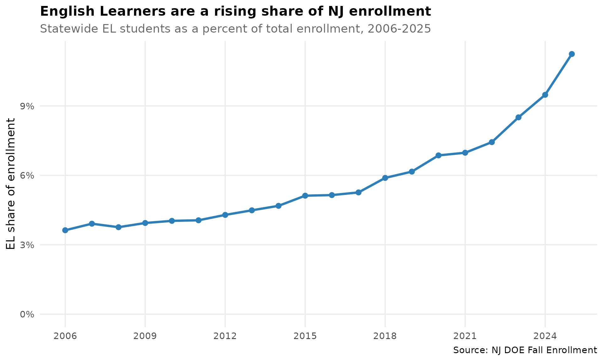
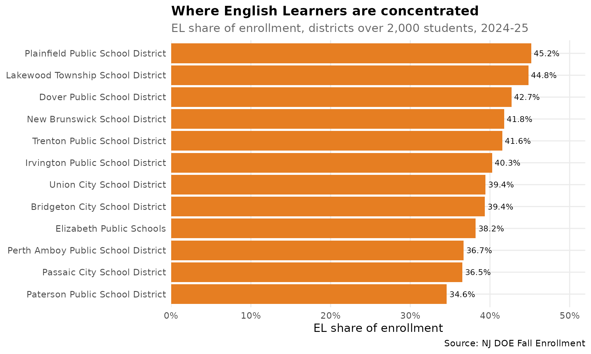
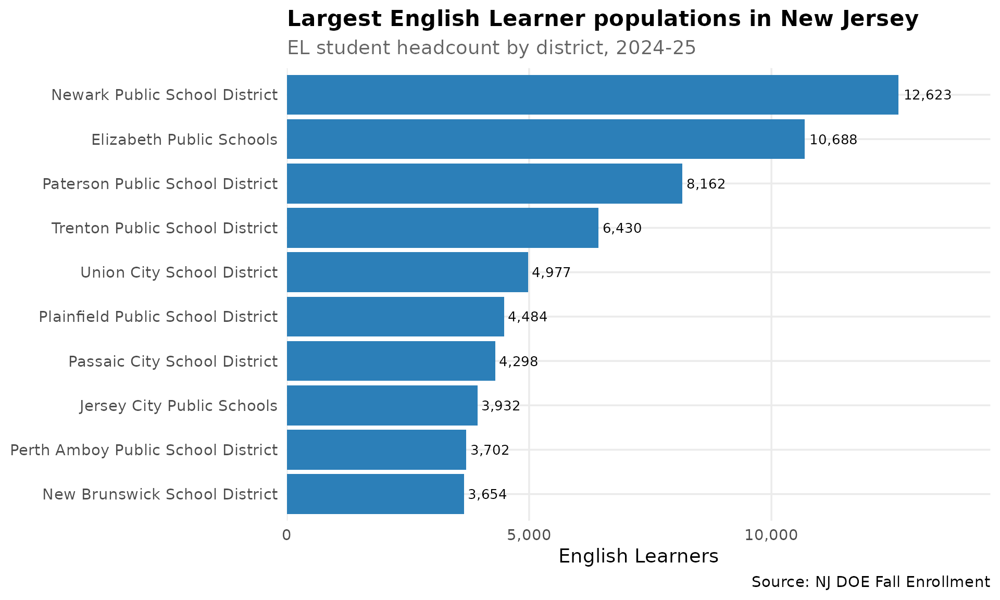

# New Jersey English Learners

[`fetch_ell()`](https://almartin82.github.io/njschooldata/reference/fetch_ell.md)
returns the **English Learner population** — how many students are
identified as English Learners (formerly “Limited English Proficient”,
now “Multilingual Learners” in NJ DOE parlance) and what share of
enrollment they make up — at the state, district, and school level. The
numbers come straight from the NJ DOE Fall Enrollment files; no count is
ever derived from a percentage.

This is the EL *population* feature. EL *proficiency* (the WIDA ACCESS
for ELLs assessment) is a separate measure, available through
[`fetch_access()`](https://almartin82.github.io/njschooldata/reference/fetch_access.md).

``` r

library(njschooldata)
library(ggplot2)
library(dplyr)
library(scales)
```

``` r

theme_nj <- function() {
  theme_minimal(base_size = 14) +
    theme(
      plot.title = element_text(face = "bold", size = 16),
      plot.subtitle = element_text(color = "gray40"),
      panel.grid.minor = element_blank(),
      legend.position = "bottom"
    )
}
el_blue <- "#2C7FB8"
el_orange <- "#E67E22"
```

## 1. New Jersey’s English Learner population has tripled since 2006

In the 2005-06 school year, New Jersey enrolled about 50,000 English
Learners — 3.6% of all students. By 2024-25 that had grown to more than
155,000, **11.2% of enrollment**. The EL count roughly tripled while
total enrollment barely moved, so the EL *share* of New Jersey’s
classrooms has more than doubled in two decades.

``` r

# Statewide EL population, every year NJ publishes a count (2006-2025).
state_el <- fetch_ell_multi(2006:2025, use_cache = TRUE) %>%
  filter(is_state) %>%
  select(end_year, n_students, total_enrollment, pct_of_enrollment) %>%
  arrange(end_year)

stopifnot(nrow(state_el) > 0)
print(state_el)
#>    end_year n_students total_enrollment pct_of_enrollment
#> 1      2006    50554.0          1393782          3.627111
#> 2      2007    54268.0          1387964          3.909901
#> 3      2008    51824.0          1378630          3.759093
#> 4      2009    54284.0          1377728          3.940110
#> 5      2010    55803.0          1383706          4.032867
#> 6      2011    55363.5          1364494          4.057437
#> 7      2012    58514.0          1363996          4.289894
#> 8      2013    61639.0          1373182          4.488773
#> 9      2014    64208.0          1371399          4.681934
#> 10     2015    70119.0          1369379          5.120496
#> 11     2016    70661.0          1372982          5.146535
#> 12     2017    72257.0          1373267          5.261686
#> 13     2018    80693.0          1370236          5.888986
#> 14     2019    84079.0          1364714          6.160925
#> 15     2020    94413.0          1375828          6.862265
#> 16     2021    95059.0          1362400          6.977319
#> 17     2022   101185.0          1360916          7.435066
#> 18     2023   116699.0          1371921          8.506248
#> 19     2024   130823.5          1379988          9.480046
#> 20     2025   155304.0          1381182         11.244282
```

``` r

stopifnot(nrow(state_el) > 0)

ggplot(state_el, aes(x = end_year, y = pct_of_enrollment)) +
  geom_line(color = el_blue, linewidth = 1.3) +
  geom_point(color = el_blue, size = 2.5) +
  scale_y_continuous(labels = label_percent(scale = 1), limits = c(0, NA)) +
  scale_x_continuous(breaks = seq(2006, 2025, 3)) +
  labs(
    title = "English Learners are a rising share of NJ enrollment",
    subtitle = "Statewide EL students as a percent of total enrollment, 2006-2025",
    x = NULL, y = "EL share of enrollment",
    caption = "Source: NJ DOE Fall Enrollment"
  ) +
  theme_nj()
```



## 2. In a dozen districts, two of every five students are English Learners

EL students are far from evenly spread. Statewide the share is about
11%, but in the highest-EL districts more than 40% of students are
English Learners. Plainfield tops the list at roughly 45%, followed by a
cluster of Central and North Jersey cities.

``` r

ell_2025 <- fetch_ell(2025, use_cache = TRUE)
stopifnot(nrow(ell_2025) > 0)

top_share <- ell_2025 %>%
  filter(is_district, total_enrollment > 2000, !is.na(n_students)) %>%
  arrange(desc(pct_of_enrollment)) %>%
  select(district_name, n_students, total_enrollment, pct_of_enrollment) %>%
  head(12)

print(top_share)
#>                         district_name n_students total_enrollment
#> 1   Plainfield Public School District     4484.0           9924.5
#> 2   Lakewood Township School District     1843.0           4112.0
#> 3        Dover Public School District     1462.5           3424.5
#> 4       New Brunswick School District     3654.0           8747.0
#> 5      Trenton Public School District     6430.0          15473.5
#> 6    Irvington Public School District     3253.0           8077.0
#> 7          Union City School District     4977.0          12617.0
#> 8      Bridgeton City School District     2379.0           6044.0
#> 9            Elizabeth Public Schools    10688.0          27979.5
#> 10 Perth Amboy Public School District     3702.0          10089.0
#> 11       Passaic City School District     4298.0          11764.0
#> 12    Paterson Public School District     8162.0          23609.0
#>    pct_of_enrollment
#> 1           45.18112
#> 2           44.82004
#> 3           42.70696
#> 4           41.77432
#> 5           41.55492
#> 6           40.27485
#> 7           39.44678
#> 8           39.36135
#> 9           38.19940
#> 10          36.69343
#> 11          36.53519
#> 12          34.57156
```

``` r

stopifnot(nrow(top_share) > 0)

ggplot(top_share, aes(x = reorder(district_name, pct_of_enrollment),
                      y = pct_of_enrollment)) +
  geom_col(fill = el_orange) +
  geom_text(aes(label = label_percent(scale = 1, accuracy = 0.1)(pct_of_enrollment)),
            hjust = -0.1, size = 3.5) +
  coord_flip() +
  scale_y_continuous(labels = label_percent(scale = 1),
                     expand = expansion(mult = c(0, 0.15))) +
  labs(
    title = "Where English Learners are concentrated",
    subtitle = "EL share of enrollment, districts over 2,000 students, 2024-25",
    x = NULL, y = "EL share of enrollment",
    caption = "Source: NJ DOE Fall Enrollment"
  ) +
  theme_nj()
```



## 3. The biggest EL populations are in New Jersey’s largest cities

Share and headcount tell different stories. The districts with the
*most* EL students are the big urban systems: Newark enrolls more than
12,000 English Learners, Elizabeth nearly 11,000, and Paterson over
8,000. Together a handful of cities account for a large slice of the
state’s EL students.

``` r

largest_el <- ell_2025 %>%
  filter(is_district, !is.na(n_students)) %>%
  arrange(desc(n_students)) %>%
  select(district_name, n_students, total_enrollment, pct_of_enrollment) %>%
  head(10)

stopifnot(nrow(largest_el) > 0)
print(largest_el)
#>                         district_name n_students total_enrollment
#> 1       Newark Public School District      12623          43980.0
#> 2            Elizabeth Public Schools      10688          27979.5
#> 3     Paterson Public School District       8162          23609.0
#> 4      Trenton Public School District       6430          15473.5
#> 5          Union City School District       4977          12617.0
#> 6   Plainfield Public School District       4484           9924.5
#> 7        Passaic City School District       4298          11764.0
#> 8          Jersey City Public Schools       3932          25692.0
#> 9  Perth Amboy Public School District       3702          10089.0
#> 10      New Brunswick School District       3654           8747.0
#>    pct_of_enrollment
#> 1           28.70168
#> 2           38.19940
#> 3           34.57156
#> 4           41.55492
#> 5           39.44678
#> 6           45.18112
#> 7           36.53519
#> 8           15.30437
#> 9           36.69343
#> 10          41.77432
```

``` r

stopifnot(nrow(largest_el) > 0)

ggplot(largest_el, aes(x = reorder(district_name, n_students), y = n_students)) +
  geom_col(fill = el_blue) +
  geom_text(aes(label = comma(round(n_students))), hjust = -0.1, size = 3.5) +
  coord_flip() +
  scale_y_continuous(labels = comma, expand = expansion(mult = c(0, 0.15))) +
  labs(
    title = "Largest English Learner populations in New Jersey",
    subtitle = "EL student headcount by district, 2024-25",
    x = NULL, y = "English Learners",
    caption = "Source: NJ DOE Fall Enrollment"
  ) +
  theme_nj()
```



## Data notes

- **Source:** NJ DOE Fall Enrollment files
  (`nj.gov/education/doedata/enr/`). The EL measure appears as `LEP`
  through 2018-19, `English Learners` for 2019-20 through 2022-23, and
  `Multilingual Learners` from 2023-24 onward —
  [`fetch_ell()`](https://almartin82.github.io/njschooldata/reference/fetch_ell.md)
  reconciles the renames.
- **Years:** 2006-2026
  ([`get_available_ell_years()`](https://almartin82.github.io/njschooldata/reference/get_available_ell_years.md)).
  Earlier enrollment files do not report an EL measure.
- **Counts vs. percent (COVID-era gap):** for 2020, 2021, and 2022 the
  NJ DOE *district* and *school* worksheets published only an EL
  **percent**, not a headcount. For those entity-years `n_students` is
  `NA` and only `pct_of_enrollment` is populated — the count is never
  back-derived from the percent. The statewide count is published every
  year. From 2023-24 on, real counts return at every level.
- **No suppression:** NJ does not suppress EL counts, so
  `n_students_lower` and `n_students_upper` equal `n_students` wherever
  a count is published.
- **Fractional values:** some counts and enrollment totals carry a `.5`
  — these are real shared-time / county-vocational FTE students,
  preserved exactly as published.
- **EL status:** NJ publishes a single current-EL headcount, so
  `el_status` is always `"current"` and `subgroup` is always `"total"`.

``` r

sessionInfo()
#> R version 4.6.1 (2026-06-24)
#> Platform: x86_64-pc-linux-gnu
#> Running under: Ubuntu 24.04.4 LTS
#> 
#> Matrix products: default
#> BLAS:   /usr/lib/x86_64-linux-gnu/openblas-pthread/libblas.so.3 
#> LAPACK: /usr/lib/x86_64-linux-gnu/openblas-pthread/libopenblasp-r0.3.26.so;  LAPACK version 3.12.0
#> 
#> locale:
#>  [1] LC_CTYPE=C.UTF-8       LC_NUMERIC=C           LC_TIME=C.UTF-8       
#>  [4] LC_COLLATE=C.UTF-8     LC_MONETARY=C.UTF-8    LC_MESSAGES=C.UTF-8   
#>  [7] LC_PAPER=C.UTF-8       LC_NAME=C              LC_ADDRESS=C          
#> [10] LC_TELEPHONE=C         LC_MEASUREMENT=C.UTF-8 LC_IDENTIFICATION=C   
#> 
#> time zone: UTC
#> tzcode source: system (glibc)
#> 
#> attached base packages:
#> [1] stats     graphics  grDevices utils     datasets  methods   base     
#> 
#> other attached packages:
#> [1] scales_1.4.0        dplyr_1.2.1         ggplot2_4.0.3      
#> [4] njschooldata_0.9.25
#> 
#> loaded via a namespace (and not attached):
#>  [1] sass_0.4.10        generics_0.1.4     tidyr_1.3.2        stringi_1.8.7     
#>  [5] hms_1.1.4          digest_0.6.39      magrittr_2.0.5     evaluate_1.0.5    
#>  [9] grid_4.6.1         timechange_0.4.0   RColorBrewer_1.1-3 fastmap_1.2.0     
#> [13] cellranger_1.1.0   jsonlite_2.0.0     httr_1.4.8         purrr_1.2.2       
#> [17] codetools_0.2-20   textshaping_1.0.5  jquerylib_0.1.4    cli_3.6.6         
#> [21] crayon_1.5.3       rlang_1.2.0        bit64_4.8.2        withr_3.0.3       
#> [25] cachem_1.1.0       yaml_2.3.12        otel_0.2.0         parallel_4.6.1    
#> [29] downloader_0.4.1   tools_4.6.1        tzdb_0.5.0         curl_7.1.0        
#> [33] vctrs_0.7.3        R6_2.6.1           lifecycle_1.0.5    lubridate_1.9.5   
#> [37] snakecase_0.11.1   stringr_1.6.0      bit_4.6.0          fs_2.1.0          
#> [41] vroom_1.7.1        ragg_1.5.2         janitor_2.2.1      pkgconfig_2.0.3   
#> [45] desc_1.4.3         pkgdown_2.2.0      pillar_1.11.1      bslib_0.11.0      
#> [49] gtable_0.3.6       glue_1.8.1         systemfonts_1.3.2  xfun_0.59         
#> [53] tibble_3.3.1       tidyselect_1.2.1   knitr_1.51         farver_2.1.2      
#> [57] htmltools_0.5.9    labeling_0.4.3     rmarkdown_2.31     readr_2.2.0       
#> [61] compiler_4.6.1     S7_0.2.2           readxl_1.5.0
```
