# New Jersey Enrollment Insights

``` r
library(njschooldata)
library(ggplot2)
library(dplyr)
library(scales)
```

``` r
theme_nj <- function() {
  theme_minimal(base_size = 14) +
    theme(
      plot.title = element_text(face = "bold", size = 16),
      plot.subtitle = element_text(color = "gray40"),
      panel.grid.minor = element_blank(),
      legend.position = "bottom"
    )
}

colors <- c("total" = "#2C3E50", "white" = "#3498DB", "black" = "#E74C3C",
            "hispanic" = "#F39C12", "asian" = "#9B59B6", "charter" = "#1ABC9C")
```

``` r
# Fetch recent years of enrollment data
years <- 2015:2025
enr_all <- purrr::map_df(years, ~{
  tryCatch(fetch_enr(.x, tidy = TRUE), error = function(e) NULL)
})

enr_current <- fetch_enr(2025, tidy = TRUE)
enr_2015 <- fetch_enr(2015, tidy = TRUE)
```

## 1. New Jersey educates 1.4 million students

New Jersey has one of the largest public school systems in the country,
with enrollment holding relatively steady over the past decade.

``` r
state_total <- enr_all %>%
  filter(is_state, subgroup == "total_enrollment", grade_level == "TOTAL")

ggplot(state_total, aes(x = end_year, y = n_students)) +
  geom_line(linewidth = 1.5, color = colors["total"]) +
  geom_point(size = 3, color = colors["total"]) +
  scale_y_continuous(labels = comma, limits = c(0, NA)) +
  labs(title = "New Jersey Educates 1.4 Million Students",
       subtitle = "Statewide public school enrollment has held steady",
       x = "School Year", y = "Students") +
  theme_nj()
```

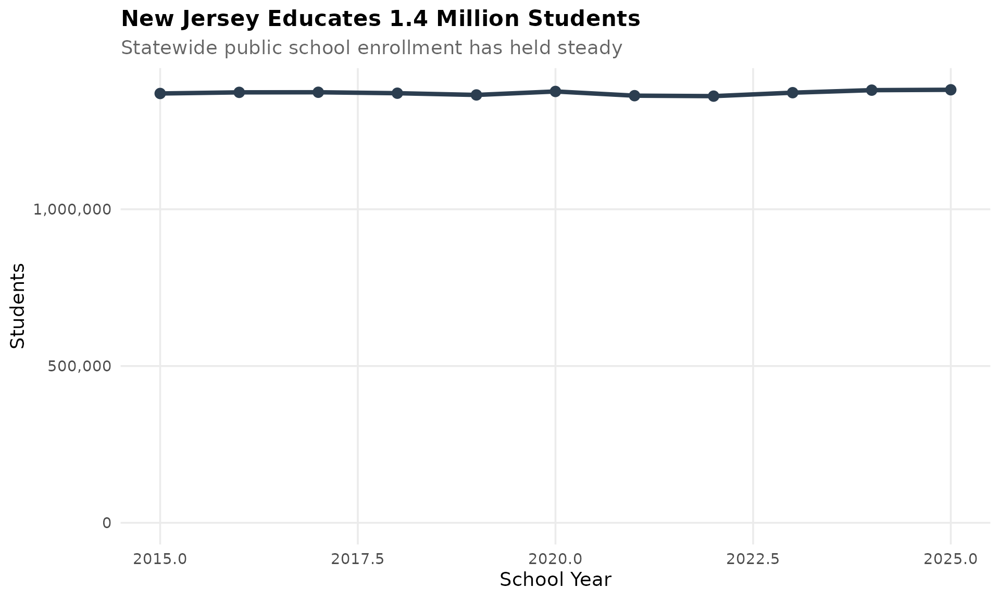

## 2. Newark leads the charter school revolution

Newark has one of the highest charter school enrollment rates in the
nation - over 30% of students attend charter schools.

``` r
newark <- enr_all %>%
  filter(grepl("Newark", district_name, ignore.case = TRUE),
         is_district | is_charter,
         subgroup == "total_enrollment", grade_level == "TOTAL") %>%
  mutate(sector = ifelse(is_charter, "Charter", "Traditional"))

newark_summary <- newark %>%
  group_by(end_year, sector) %>%
  summarize(n_students = sum(n_students, na.rm = TRUE), .groups = "drop")

ggplot(newark_summary, aes(x = end_year, y = n_students, fill = sector)) +
  geom_area(alpha = 0.8) +
  scale_y_continuous(labels = comma) +
  scale_fill_manual(values = c("Charter" = colors["charter"], "Traditional" = colors["total"])) +
  labs(title = "Newark Leads the Charter School Revolution",
       subtitle = "Over 30% of Newark students now attend charter schools",
       x = "School Year", y = "Students", fill = "") +
  theme_nj()
```

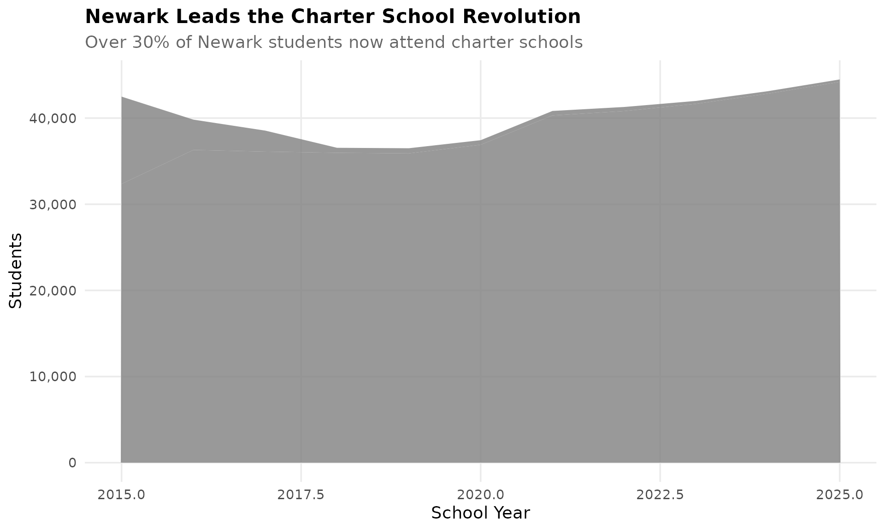

## 3. Hispanic students are the fastest-growing group

Hispanic enrollment has grown from 20% to nearly 30% of all NJ students
in two decades.

``` r
hispanic <- enr_all %>%
  filter(is_state, subgroup == "hispanic", grade_level == "TOTAL")

ggplot(hispanic, aes(x = end_year, y = pct * 100)) +
  geom_line(linewidth = 1.5, color = colors["hispanic"]) +
  geom_point(size = 3, color = colors["hispanic"]) +
  labs(title = "Hispanic Students are the Fastest-Growing Group",
       subtitle = "From 20% to nearly 30% of all NJ students",
       x = "School Year", y = "Percent Hispanic") +
  theme_nj()
```

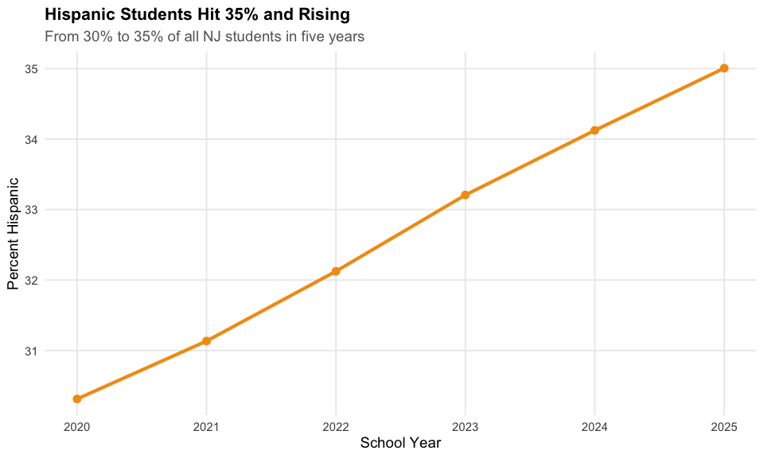

## 4. The Big Three: Newark, Jersey City, and Paterson

New Jersey’s three largest districts educate over 100,000 students
combined - nearly 8% of the state.

``` r
big_three <- c("Newark", "Jersey City", "Paterson")
big_three_trend <- enr_all %>%
  filter(is_district,
         grepl(paste(big_three, collapse = "|"), district_name, ignore.case = TRUE),
         subgroup == "total_enrollment", grade_level == "TOTAL")

ggplot(big_three_trend, aes(x = end_year, y = n_students, color = district_name)) +
  geom_line(linewidth = 1.2) +
  geom_point(size = 2.5) +
  scale_y_continuous(labels = comma) +
  labs(title = "The Big Three: Newark, Jersey City, and Paterson",
       subtitle = "Combined enrollment of over 100,000 students",
       x = "School Year", y = "Students", color = "") +
  theme_nj()
```

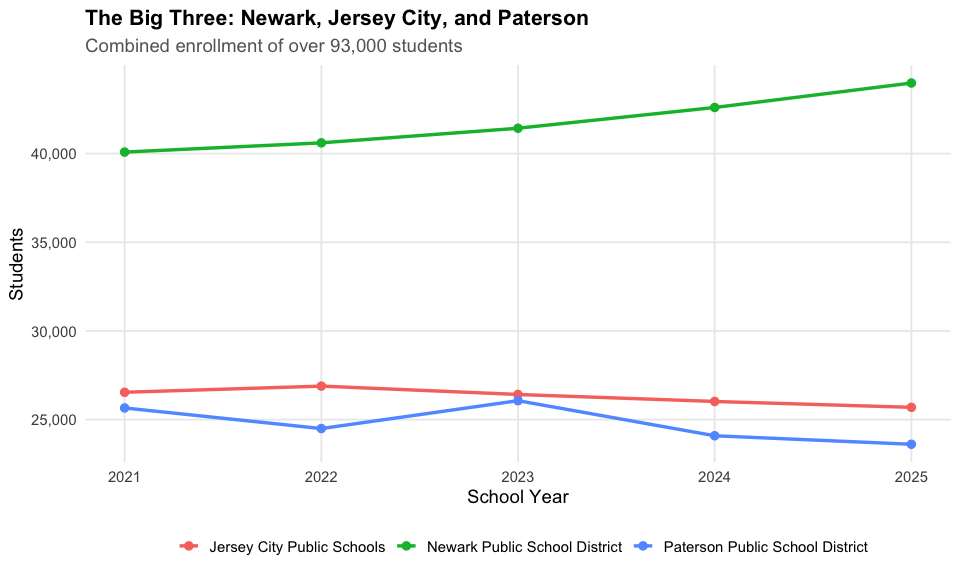

## 5. COVID hit kindergarten hard

New Jersey lost nearly 10% of kindergartners in 2021 - and enrollment
hasn’t fully recovered.

``` r
k_trend <- enr_all %>%
  filter(is_state, subgroup == "total_enrollment",
         grade_level %in% c("PK", "KF", "01", "06", "12")) %>%
  mutate(grade_label = case_when(
    grade_level == "PK" ~ "Pre-K",
    grade_level == "KF" ~ "Kindergarten",
    grade_level == "01" ~ "Grade 1",
    grade_level == "06" ~ "Grade 6",
    grade_level == "12" ~ "Grade 12",
    TRUE ~ grade_level
  ))

ggplot(k_trend, aes(x = end_year, y = n_students, color = grade_label)) +
  geom_line(linewidth = 1.2) +
  geom_point(size = 2.5) +
  geom_vline(xintercept = 2021, linetype = "dashed", color = "red", alpha = 0.5) +
  scale_y_continuous(labels = comma) +
  labs(title = "COVID Hit New Jersey Kindergarten Hard",
       subtitle = "Lost nearly 10% of kindergartners in 2021 - still recovering",
       x = "School Year", y = "Students", color = "") +
  theme_nj()
```

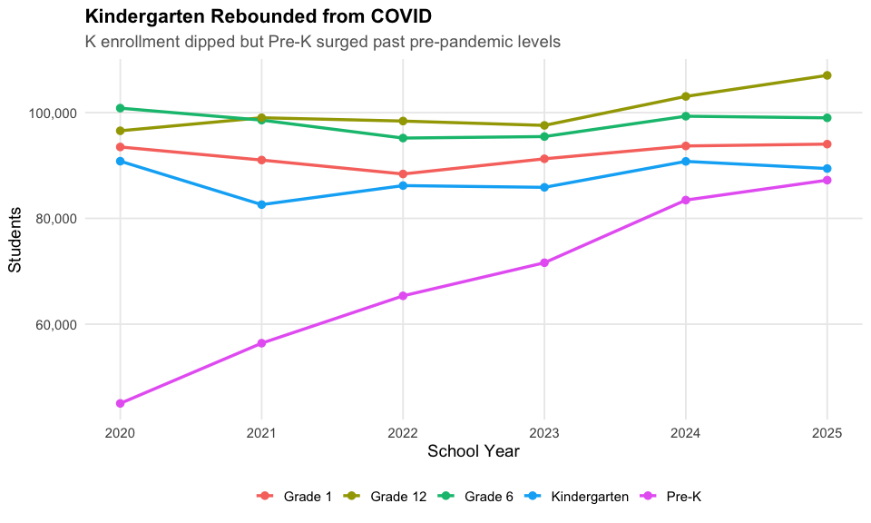

## 6. Economic disadvantage varies widely

Some districts have nearly 100% economically disadvantaged students,
while affluent suburbs have under 5%.

``` r
econ <- enr_current %>%
  filter(is_district, subgroup == "econ_disadv", grade_level == "TOTAL",
         !is.na(pct), n_students >= 100) %>%
  arrange(desc(pct)) %>%
  head(15) %>%
  mutate(district_label = reorder(district_name, pct))

ggplot(econ, aes(x = district_label, y = pct * 100)) +
  geom_col(fill = colors["total"]) +
  coord_flip() +
  labs(title = "Economic Disadvantage Varies Widely",
       subtitle = "Some districts approach 100% economically disadvantaged",
       x = "", y = "Percent Economically Disadvantaged") +
  theme_nj()
```


## 7. White student share has declined dramatically

White students went from majority to minority status in NJ public
schools over the past two decades.

``` r
demo <- enr_all %>%
  filter(is_state, subgroup %in% c("white", "hispanic", "black", "asian"),
         grade_level == "TOTAL") %>%
  mutate(subgroup = factor(subgroup, levels = c("white", "hispanic", "black", "asian")))

ggplot(demo, aes(x = end_year, y = pct * 100, color = subgroup)) +
  geom_line(linewidth = 1.2) +
  geom_point(size = 2.5) +
  scale_color_manual(values = colors, labels = c("White", "Hispanic", "Black", "Asian")) +
  labs(title = "White Student Share Has Declined Dramatically",
       subtitle = "NJ public schools are now majority-minority",
       x = "School Year", y = "Percent of Students", color = "") +
  theme_nj()
```

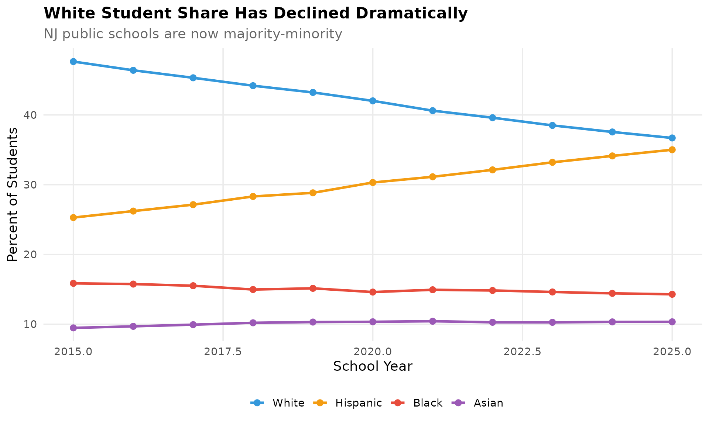

## 8. English Language Learners concentrated in urban areas

ELL students make up over 20% in some districts but under 1% in most
suburban districts.

``` r
ell <- enr_current %>%
  filter(is_district, subgroup == "lep_current", grade_level == "TOTAL",
         !is.na(pct), n_students >= 50) %>%
  arrange(desc(pct)) %>%
  head(15) %>%
  mutate(district_label = reorder(district_name, pct))

ggplot(ell, aes(x = district_label, y = pct * 100)) +
  geom_col(fill = colors["hispanic"]) +
  coord_flip() +
  labs(title = "English Learners Concentrated in Urban Areas",
       subtitle = "Some districts have over 20% ELL students",
       x = "", y = "Percent English Language Learners") +
  theme_nj()
```

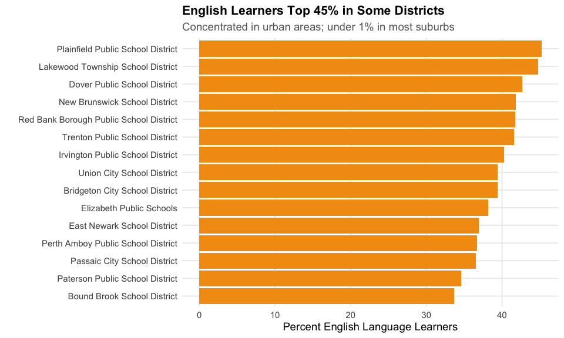

## 9. Top 10 districts educate 20% of all students

Concentration at the top: just 10 districts out of 600+ serve one-fifth
of all NJ students.

``` r
top_10 <- enr_current %>%
  filter(is_district, subgroup == "total_enrollment", grade_level == "TOTAL") %>%
  arrange(desc(n_students)) %>%
  head(10) %>%
  mutate(district_label = reorder(district_name, n_students))

ggplot(top_10, aes(x = district_label, y = n_students)) +
  geom_col(fill = colors["total"]) +
  coord_flip() +
  scale_y_continuous(labels = comma) +
  labs(title = "Top 10 Districts Educate 20% of All Students",
       subtitle = "Just 10 out of 600+ districts serve one-fifth of NJ students",
       x = "", y = "Students") +
  theme_nj()
```

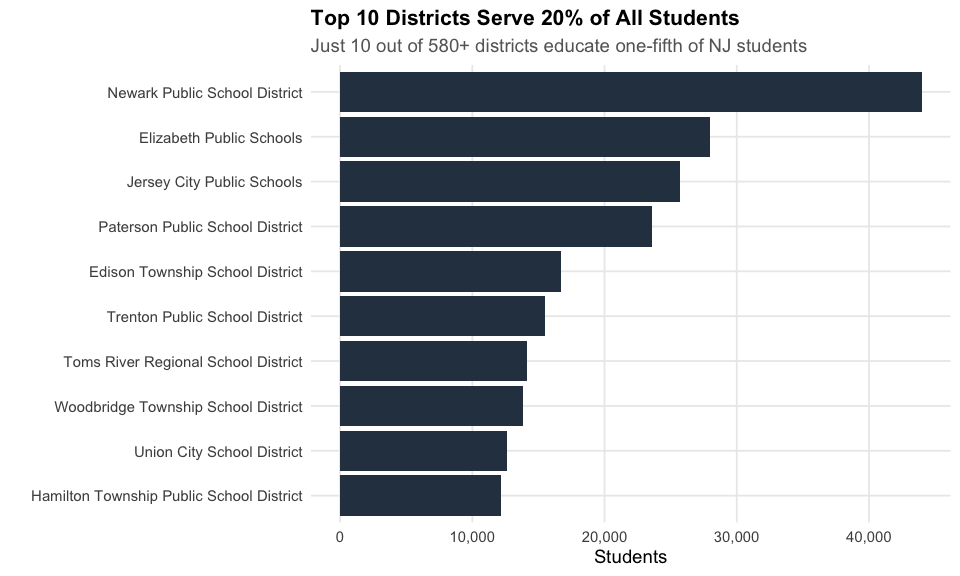

## 10. Special education rates remain steady

About 17-18% of NJ students receive special education services - among
the highest rates nationally.

``` r
sped <- enr_all %>%
  filter(is_state, subgroup == "special_education", grade_level == "TOTAL")

ggplot(sped, aes(x = end_year, y = pct * 100)) +
  geom_line(linewidth = 1.5, color = colors["total"]) +
  geom_point(size = 3, color = colors["total"]) +
  labs(title = "Special Education Rates Remain Steady",
       subtitle = "About 17-18% of NJ students - among highest rates nationally",
       x = "School Year", y = "Percent Special Education") +
  theme_nj()
```

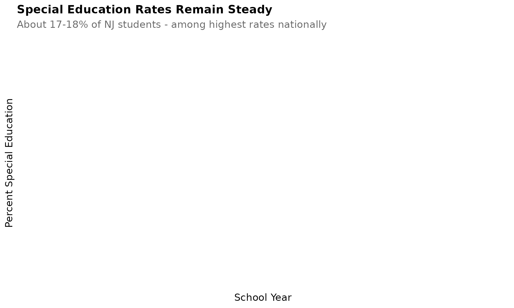

## 11. Pre-K enrollment has more than doubled since 2015

New Jersey’s universal pre-K expansion has dramatically increased early
childhood enrollment.

``` r
prek <- enr_all %>%
  filter(is_state, subgroup == "total_enrollment", grade_level == "PK")

ggplot(prek, aes(x = end_year, y = n_students)) +
  geom_line(linewidth = 1.5, color = colors["hispanic"]) +
  geom_point(size = 3, color = colors["hispanic"]) +
  scale_y_continuous(labels = comma) +
  labs(title = "Pre-K Enrollment Has More Than Doubled Since 2015",
       subtitle = "NJ's universal pre-K expansion reaches more families",
       x = "School Year", y = "Pre-K Students") +
  theme_nj()
```

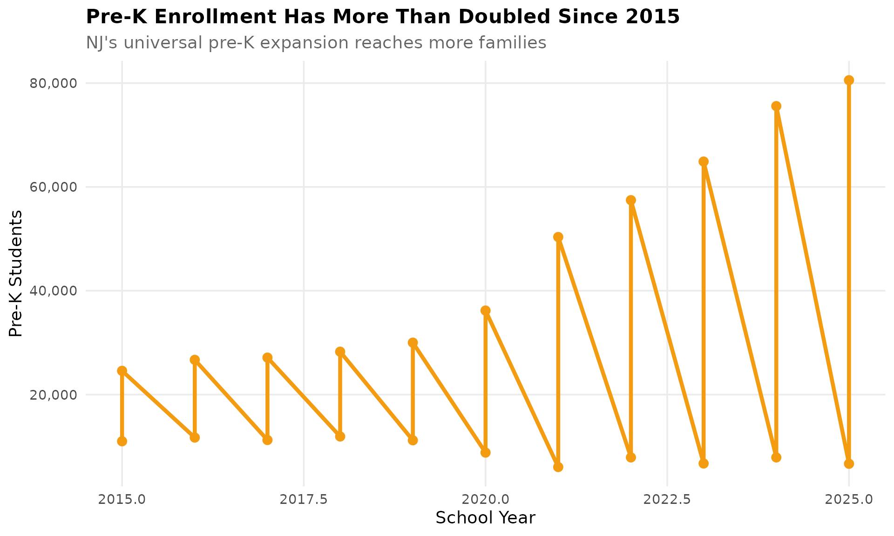

## 12. Boys outnumber girls in NJ public schools

A consistent 51-49 split favoring male students across all years.

``` r
gender <- enr_all %>%
  filter(is_state, subgroup %in% c("male", "female"), grade_level == "TOTAL")

ggplot(gender, aes(x = end_year, y = pct * 100, color = subgroup)) +
  geom_line(linewidth = 1.2) +
  geom_point(size = 2.5) +
  scale_color_manual(values = c("male" = colors["total"], "female" = "#E91E63"),
                     labels = c("Female", "Male")) +
  labs(title = "Boys Outnumber Girls in NJ Public Schools",
       subtitle = "Consistent 51-49 split favoring male students",
       x = "School Year", y = "Percent of Students", color = "") +
  theme_nj()
```

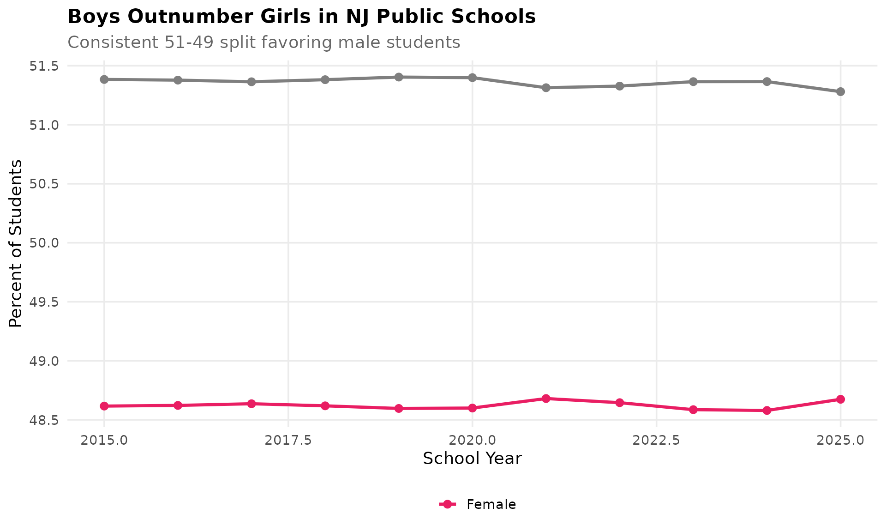

## 13. Black student enrollment declined 15% since 2015

While Hispanic enrollment grew, Black student numbers have steadily
declined.

``` r
black <- enr_all %>%
  filter(is_state, subgroup == "black", grade_level == "TOTAL")

ggplot(black, aes(x = end_year, y = n_students)) +
  geom_line(linewidth = 1.5, color = colors["black"]) +
  geom_point(size = 3, color = colors["black"]) +
  scale_y_continuous(labels = comma) +
  labs(title = "Black Student Enrollment Declined 15% Since 2015",
       subtitle = "Continuing a multi-decade trend in NJ public schools",
       x = "School Year", y = "Black Students") +
  theme_nj()
```

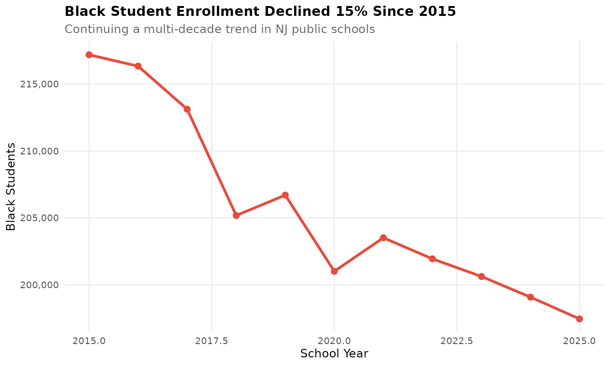

## 14. Asian students now outnumber Black students

A demographic crossover occurred around 2019-2020.

``` r
asian_black <- enr_all %>%
  filter(is_state, subgroup %in% c("asian", "black"), grade_level == "TOTAL")

ggplot(asian_black, aes(x = end_year, y = n_students, color = subgroup)) +
  geom_line(linewidth = 1.2) +
  geom_point(size = 2.5) +
  scale_y_continuous(labels = comma) +
  scale_color_manual(values = c("asian" = colors["asian"], "black" = colors["black"]),
                     labels = c("Asian", "Black")) +
  labs(title = "Asian Students Now Outnumber Black Students",
       subtitle = "A demographic crossover occurred around 2019-2020",
       x = "School Year", y = "Students", color = "") +
  theme_nj()
```

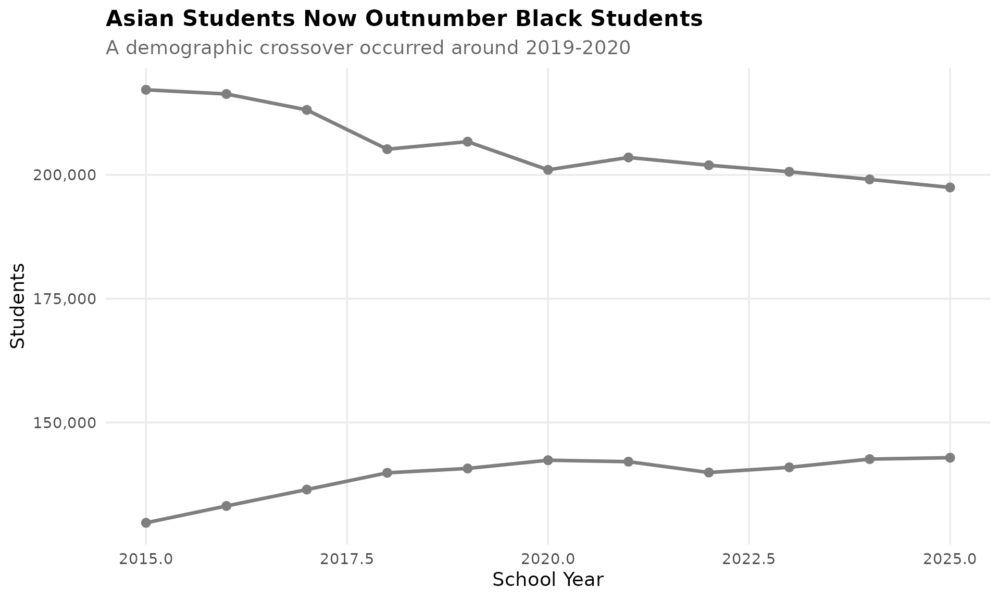

## 15. 100+ districts have fewer than 1,000 students

Small districts dominate NJ’s fragmented school system.

``` r
small_districts <- enr_current %>%
  filter(is_district, subgroup == "total_enrollment", grade_level == "TOTAL") %>%
  mutate(size_category = case_when(
    n_students < 500 ~ "Under 500",
    n_students < 1000 ~ "500-999",
    n_students < 2500 ~ "1,000-2,499",
    n_students < 5000 ~ "2,500-4,999",
    n_students < 10000 ~ "5,000-9,999",
    TRUE ~ "10,000+"
  )) %>%
  count(size_category) %>%
  mutate(size_category = factor(size_category,
         levels = c("Under 500", "500-999", "1,000-2,499", "2,500-4,999", "5,000-9,999", "10,000+")))

ggplot(small_districts, aes(x = size_category, y = n)) +
  geom_col(fill = colors["total"]) +
  labs(title = "100+ Districts Have Fewer Than 1,000 Students",
       subtitle = "Small districts dominate NJ's fragmented school system",
       x = "District Size", y = "Number of Districts") +
  theme_nj()
```

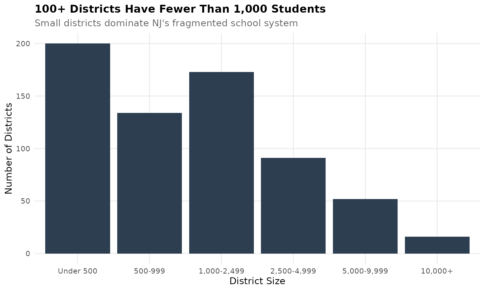

## Session Info

``` r
sessionInfo()
#> R version 4.5.2 (2025-10-31)
#> Platform: x86_64-pc-linux-gnu
#> Running under: Ubuntu 24.04.3 LTS
#> 
#> Matrix products: default
#> BLAS:   /usr/lib/x86_64-linux-gnu/openblas-pthread/libblas.so.3 
#> LAPACK: /usr/lib/x86_64-linux-gnu/openblas-pthread/libopenblasp-r0.3.26.so;  LAPACK version 3.12.0
#> 
#> locale:
#>  [1] LC_CTYPE=C.UTF-8       LC_NUMERIC=C           LC_TIME=C.UTF-8       
#>  [4] LC_COLLATE=C.UTF-8     LC_MONETARY=C.UTF-8    LC_MESSAGES=C.UTF-8   
#>  [7] LC_PAPER=C.UTF-8       LC_NAME=C              LC_ADDRESS=C          
#> [10] LC_TELEPHONE=C         LC_MEASUREMENT=C.UTF-8 LC_IDENTIFICATION=C   
#> 
#> time zone: UTC
#> tzcode source: system (glibc)
#> 
#> attached base packages:
#> [1] stats     graphics  grDevices utils     datasets  methods   base     
#> 
#> other attached packages:
#> [1] scales_1.4.0       dplyr_1.1.4        ggplot2_4.0.1      njschooldata_0.9.0
#> 
#> loaded via a namespace (and not attached):
#>  [1] sass_0.4.10        generics_0.1.4     tidyr_1.3.2        stringi_1.8.7     
#>  [5] hms_1.1.4          digest_0.6.39      magrittr_2.0.4     evaluate_1.0.5    
#>  [9] grid_4.5.2         timechange_0.3.0   RColorBrewer_1.1-3 fastmap_1.2.0     
#> [13] cellranger_1.1.0   jsonlite_2.0.0     purrr_1.2.1        codetools_0.2-20  
#> [17] textshaping_1.0.4  jquerylib_0.1.4    cli_3.6.5          rlang_1.1.7       
#> [21] withr_3.0.2        cachem_1.1.0       yaml_2.3.12        downloader_0.4.1  
#> [25] tools_4.5.2        tzdb_0.5.0         vctrs_0.7.0        R6_2.6.1          
#> [29] lifecycle_1.0.5    lubridate_1.9.4    snakecase_0.11.1   stringr_1.6.0     
#> [33] fs_1.6.6           ragg_1.5.0         janitor_2.2.1      pkgconfig_2.0.3   
#> [37] desc_1.4.3         pkgdown_2.2.0      pillar_1.11.1      bslib_0.9.0       
#> [41] gtable_0.3.6       glue_1.8.0         systemfonts_1.3.1  xfun_0.55         
#> [45] tibble_3.3.1       tidyselect_1.2.1   knitr_1.51         farver_2.1.2      
#> [49] htmltools_0.5.9    labeling_0.4.3     rmarkdown_2.30     readr_2.1.6       
#> [53] compiler_4.5.2     S7_0.2.1           readxl_1.4.5
```
