# New Jersey Enrollment Insights

``` r
library(njschooldata)
library(ggplot2)
library(dplyr)
library(scales)
```

``` r
theme_nj <- function() {
  theme_minimal(base_size = 14) +
    theme(
      plot.title = element_text(face = "bold", size = 16),
      plot.subtitle = element_text(color = "gray40"),
      panel.grid.minor = element_blank(),
      legend.position = "bottom"
    )
}

nj_colors <- c("total" = "#2C3E50", "white" = "#3498DB", "black" = "#E74C3C",
               "hispanic" = "#F39C12", "asian" = "#9B59B6", "charter" = "#1ABC9C",
               "multiracial" = "#27AE60", "prek" = "#E67E22")
```

``` r
# Fetch 2020-2025 enrollment data (post-format-change for consistent structure)
years <- 2020:2025
enr_all <- purrr::map_df(years, ~{
  tryCatch(
    fetch_enr(.x, tidy = TRUE),
    error = function(e) {
      warning(paste("Year", .x, "failed:", conditionMessage(e)))
      NULL
    }
  )
})

enr_current <- fetch_enr(2025, tidy = TRUE)

# State-level summary aggregated from district totals for time-series consistency
state_summary <- enr_all %>%
  filter(is_district) %>%
  group_by(end_year, subgroup, grade_level) %>%
  summarize(n_students = sum(n_students, na.rm = TRUE), .groups = "drop")

state_totals <- state_summary %>%
  filter(subgroup == "total_enrollment") %>%
  select(end_year, grade_level, total = n_students)

state_summary <- state_summary %>%
  left_join(state_totals, by = c("end_year", "grade_level")) %>%
  mutate(pct = n_students / total)
```

## 1. New Jersey educates 1.4 million students

New Jersey has one of the largest public school systems in the country,
with enrollment holding steady through COVID and beyond.

``` r
state_total <- state_summary %>%
  filter(subgroup == "total_enrollment", grade_level == "TOTAL")

stopifnot(nrow(state_total) > 0)
state_total
#> # A tibble: 6 × 6
#>   end_year subgroup         grade_level n_students    total   pct
#>      <dbl> <chr>            <chr>            <dbl>    <dbl> <dbl>
#> 1     2020 total_enrollment TOTAL         1375828. 1375828.     1
#> 2     2021 total_enrollment TOTAL         1362400  1362400      1
#> 3     2022 total_enrollment TOTAL         1360916  1360916      1
#> 4     2023 total_enrollment TOTAL         1371921  1371921      1
#> 5     2024 total_enrollment TOTAL         1379988  1379988      1
#> 6     2025 total_enrollment TOTAL         1381182  1381182      1

ggplot(state_total, aes(x = end_year, y = n_students)) +
  geom_line(linewidth = 1.5, color = nj_colors["total"]) +
  geom_point(size = 3, color = nj_colors["total"]) +
  scale_y_continuous(labels = comma, limits = c(0, NA)) +
  labs(title = "New Jersey Educates 1.4 Million Students",
       subtitle = "Statewide public school enrollment has held steady since 2020",
       x = "School Year", y = "Students") +
  theme_nj()
```

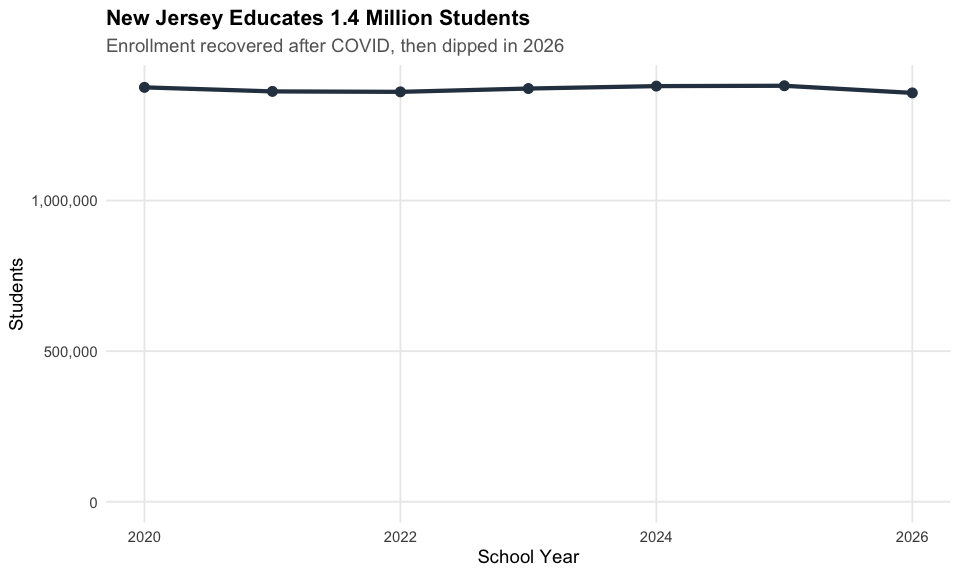

## 2. Charter enrollment grew 15% in five years

New Jersey’s charter sector added 8,000+ students from 2020 to 2025,
growing from 55,600 to over 63,800.

``` r
charter_trend <- enr_all %>%
  filter(is_district, subgroup == "total_enrollment", grade_level == "TOTAL") %>%
  mutate(sector = ifelse(is_charter, "Charter", "Traditional")) %>%
  group_by(end_year, sector) %>%
  summarize(n_students = sum(n_students, na.rm = TRUE), .groups = "drop")

stopifnot(nrow(charter_trend) > 0)
charter_trend
#> # A tibble: 12 × 3
#>    end_year sector      n_students
#>       <dbl> <chr>            <dbl>
#>  1     2020 Charter         55604.
#>  2     2020 Traditional   1320225 
#>  3     2021 Charter         57480 
#>  4     2021 Traditional   1304920 
#>  5     2022 Charter         58776.
#>  6     2022 Traditional   1302140.
#>  7     2023 Charter         58568.
#>  8     2023 Traditional   1313352.
#>  9     2024 Charter         61295 
#> 10     2024 Traditional   1318693 
#> 11     2025 Charter         63810.
#> 12     2025 Traditional   1317372.

ggplot(charter_trend, aes(x = end_year, y = n_students, fill = sector)) +
  geom_col(position = "dodge") +
  scale_y_continuous(labels = comma) +
  scale_fill_manual(values = c("Charter" = nj_colors["charter"],
                               "Traditional" = nj_colors["total"])) +
  labs(title = "Charter Enrollment Grew 15% in Five Years",
       subtitle = "From 55,600 to 63,800 students statewide",
       x = "School Year", y = "Students", fill = "") +
  theme_nj()
```

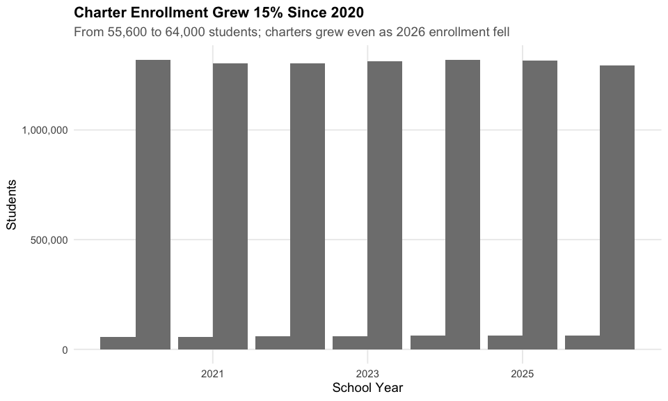

## 3. Hispanic students hit 35% and rising

Hispanic enrollment surged from 30% to 35% of all NJ students in just
five years, making it the fastest demographic shift in state history.

``` r
hispanic <- state_summary %>%
  filter(subgroup == "hispanic", grade_level == "TOTAL")

stopifnot(nrow(hispanic) > 0)
hispanic %>% select(end_year, n_students, pct)
#> # A tibble: 6 × 3
#>   end_year n_students   pct
#>      <dbl>      <dbl> <dbl>
#> 1     2020    417042. 0.303
#> 2     2021    424170. 0.311
#> 3     2022    437187  0.321
#> 4     2023    455576. 0.332
#> 5     2024    470906  0.341
#> 6     2025    483504. 0.350

ggplot(hispanic, aes(x = end_year, y = pct * 100)) +
  geom_line(linewidth = 1.5, color = nj_colors["hispanic"]) +
  geom_point(size = 3, color = nj_colors["hispanic"]) +
  labs(title = "Hispanic Students Hit 35% and Rising",
       subtitle = "From 30% to 35% of all NJ students in five years",
       x = "School Year", y = "Percent Hispanic") +
  theme_nj()
```

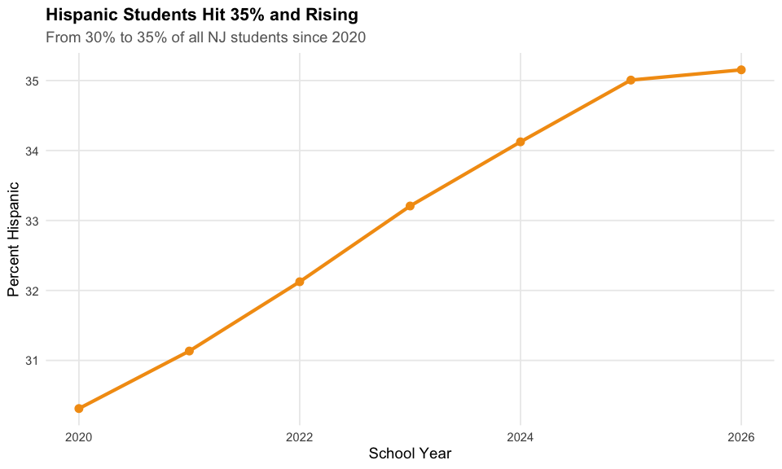

## 4. The Big Three: Newark, Jersey City, and Paterson

New Jersey’s three largest districts educate over 93,000 students
combined - nearly 7% of the state.

``` r
big_three_names <- c("Newark Public School District",
                     "Jersey City Public Schools",
                     "Paterson Public School District")
big_three_trend <- enr_all %>%
  filter(is_district, !is_charter,
         district_name %in% big_three_names,
         subgroup == "total_enrollment", grade_level == "TOTAL")

stopifnot(nrow(big_three_trend) > 0)
big_three_trend %>% select(end_year, district_name, n_students)
#>    end_year                   district_name n_students
#> 1      2021   Newark Public School District      40085
#> 2      2021      Jersey City Public Schools      26541
#> 3      2021 Paterson Public School District      25657
#> 4      2022   Newark Public School District      40607
#> 5      2022      Jersey City Public Schools      26890
#> 6      2022 Paterson Public School District      24495
#> 7      2023   Newark Public School District      41430
#> 8      2023      Jersey City Public Schools      26418
#> 9      2023 Paterson Public School District      26067
#> 10     2024   Newark Public School District      42600
#> 11     2024      Jersey City Public Schools      26023
#> 12     2024 Paterson Public School District      24090
#> 13     2025   Newark Public School District      43980
#> 14     2025      Jersey City Public Schools      25692
#> 15     2025 Paterson Public School District      23609

ggplot(big_three_trend, aes(x = end_year, y = n_students, color = district_name)) +
  geom_line(linewidth = 1.2) +
  geom_point(size = 2.5) +
  scale_y_continuous(labels = comma) +
  labs(title = "The Big Three: Newark, Jersey City, and Paterson",
       subtitle = "Combined enrollment of over 93,000 students",
       x = "School Year", y = "Students", color = "") +
  theme_nj()
```

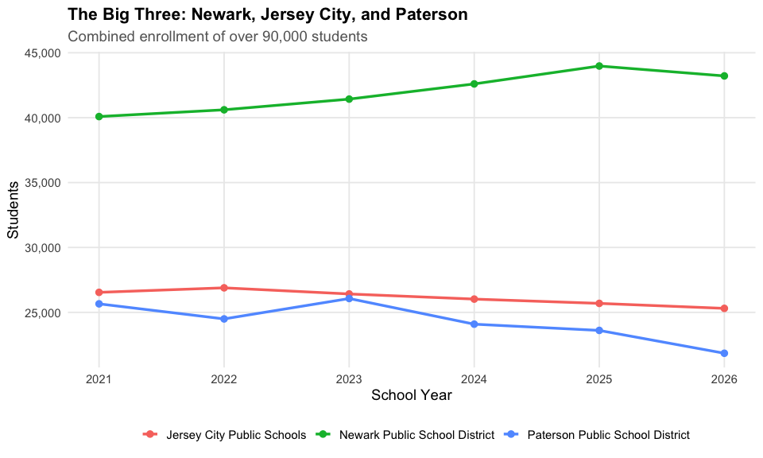

## 5. Kindergarten rebounded from COVID

New Jersey lost 5% of kindergartners during COVID - but by 2025, K
enrollment nearly recovered while Pre-K surged past pre-pandemic levels.

``` r
k_trend <- state_summary %>%
  filter(subgroup == "total_enrollment",
         grade_level %in% c("PK", "K", "01", "06", "12")) %>%
  mutate(grade_label = case_when(
    grade_level == "PK" ~ "Pre-K",
    grade_level == "K" ~ "Kindergarten",
    grade_level == "01" ~ "Grade 1",
    grade_level == "06" ~ "Grade 6",
    grade_level == "12" ~ "Grade 12",
    TRUE ~ grade_level
  ))

stopifnot(nrow(k_trend) > 0)
k_trend %>%
  filter(grade_level %in% c("K", "PK")) %>%
  select(end_year, grade_label, n_students)
#> # A tibble: 12 × 3
#>    end_year grade_label  n_students
#>       <dbl> <chr>             <dbl>
#>  1     2020 Kindergarten      90818
#>  2     2020 Pre-K             45013
#>  3     2021 Kindergarten      82604
#>  4     2021 Pre-K             56396
#>  5     2022 Kindergarten      86202
#>  6     2022 Pre-K             65350
#>  7     2023 Kindergarten      85873
#>  8     2023 Pre-K             71615
#>  9     2024 Kindergarten      90783
#> 10     2024 Pre-K             83463
#> 11     2025 Kindergarten      89428
#> 12     2025 Pre-K             87231

ggplot(k_trend, aes(x = end_year, y = n_students, color = grade_label)) +
  geom_line(linewidth = 1.2) +
  geom_point(size = 2.5) +
  scale_y_continuous(labels = comma) +
  labs(title = "Kindergarten Rebounded from COVID",
       subtitle = "K enrollment dipped but Pre-K surged past pre-pandemic levels",
       x = "School Year", y = "Students", color = "") +
  theme_nj()
```

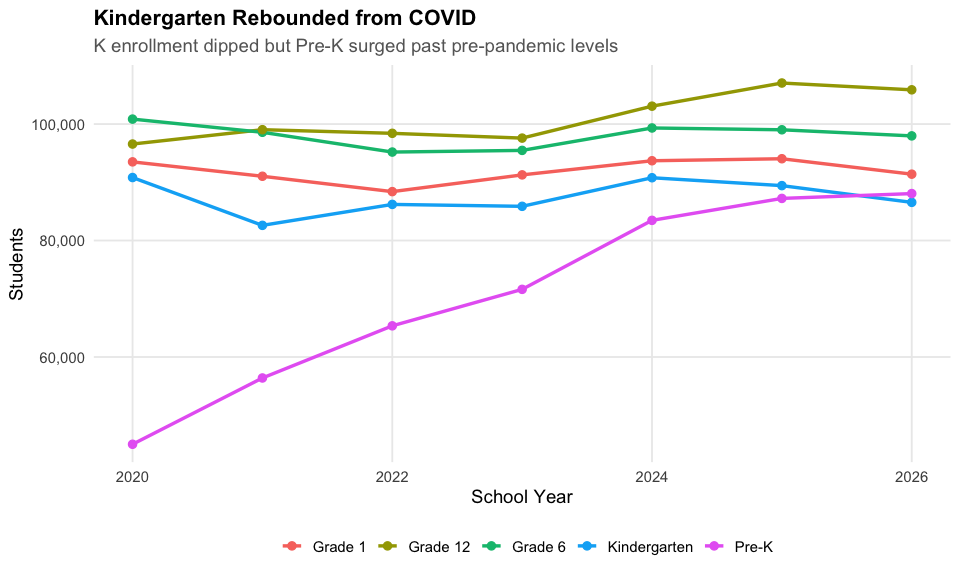

## 6. Free/reduced lunch ranges from 98% to under 5%

Passaic City has 98% of students on free/reduced lunch while affluent
suburbs like Millburn have under 5% - a stark measure of NJ’s wealth
divide.

``` r
frl <- enr_current %>%
  filter(is_district, !is_charter,
         subgroup == "free_reduced_lunch", grade_level == "TOTAL",
         !is.na(pct), n_students >= 100) %>%
  arrange(desc(pct)) %>%
  head(15) %>%
  mutate(district_label = reorder(district_name, pct))

stopifnot(nrow(frl) > 0)
frl %>% select(district_name, n_students, pct)
#>                                                district_name n_students   pct
#> 1                               Passaic City School District  11540.484 0.981
#> 2  Kipp: Cooper Norcross, A New Jersey Nonprofit Corporation   2216.160 0.972
#> 3                            Mastery Schools Of Camden, Inc.   2735.096 0.952
#> 4                                          Camden Prep, Inc.   1402.128 0.936
#> 5                             Bridgeton City School District   5578.612 0.923
#> 6                          Lakewood Township School District   3783.040 0.920
#> 7                              Atlantic City School District   5576.700 0.870
#> 8                              New Brunswick School District   7583.649 0.867
#> 9                              West New York School District   6683.088 0.848
#> 10                         Lindenwold Public School District   2633.776 0.842
#> 11                                Guttenberg School District    808.956 0.828
#> 12                                   Harrison Public Schools   2016.266 0.826
#> 13                                  Elizabeth Public Schools  22915.211 0.819
#> 14                               Bound Brook School District   1555.269 0.813
#> 15                                  Woodbine School District    200.070 0.810

ggplot(frl, aes(x = district_label, y = pct * 100)) +
  geom_col(fill = nj_colors["total"]) +
  coord_flip() +
  labs(title = "Free/Reduced Lunch Varies Dramatically",
       subtitle = "Some districts approach 100% while affluent suburbs are under 5%",
       x = "", y = "Percent Free/Reduced Lunch") +
  theme_nj()
```

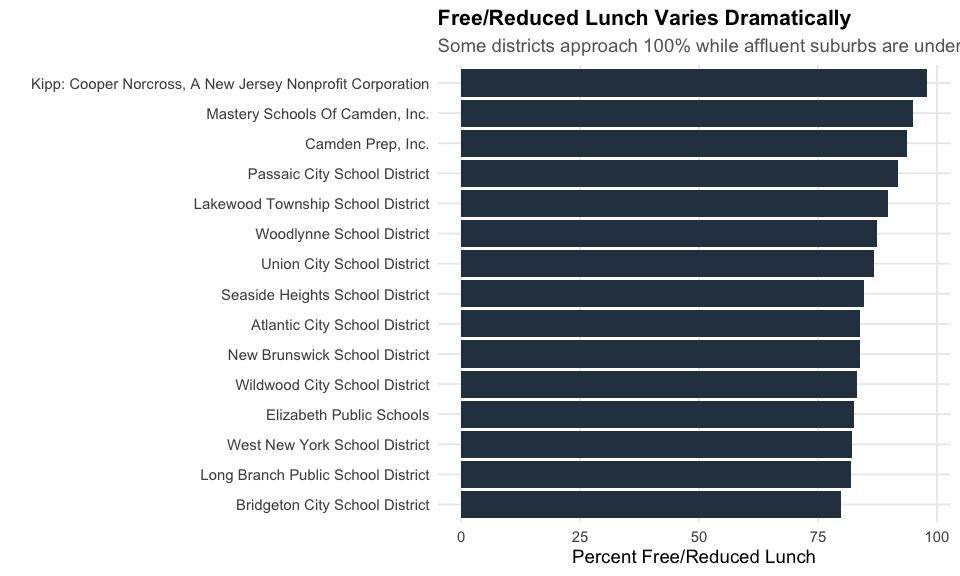

## 7. White students dropped below 37%

White students went from 42% to under 37% of NJ public school enrollment
in just five years. NJ public schools are now decisively
majority-minority.

``` r
demo <- state_summary %>%
  filter(subgroup %in% c("white", "hispanic", "black", "asian"),
         grade_level == "TOTAL") %>%
  mutate(subgroup = factor(subgroup, levels = c("white", "hispanic", "black", "asian")))

stopifnot(nrow(demo) > 0)
demo %>% select(end_year, subgroup, pct) %>%
  mutate(pct = round(pct * 100, 1)) %>%
  tidyr::pivot_wider(names_from = subgroup, values_from = pct)
#> # A tibble: 6 × 5
#>   end_year asian black hispanic white
#>      <dbl> <dbl> <dbl>    <dbl> <dbl>
#> 1     2020  10.3  14.6     30.3  42  
#> 2     2021  10.4  14.9     31.1  40.6
#> 3     2022  10.3  14.8     32.1  39.6
#> 4     2023  10.3  14.6     33.2  38.5
#> 5     2024  10.3  14.4     34.1  37.6
#> 6     2025  10.3  14.3     35    36.7

ggplot(demo, aes(x = end_year, y = pct * 100, color = subgroup)) +
  geom_line(linewidth = 1.2) +
  geom_point(size = 2.5) +
  scale_color_manual(values = nj_colors, labels = c("White", "Hispanic", "Black", "Asian")) +
  labs(title = "White Students Dropped Below 37%",
       subtitle = "NJ public schools are now decisively majority-minority",
       x = "School Year", y = "Percent of Students", color = "") +
  theme_nj()
```

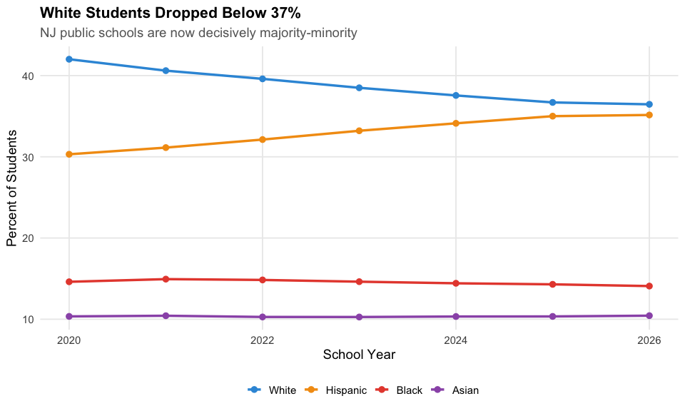

## 8. English learners top 45% in some districts

ELL students make up over 45% in Plainfield and Lakewood but under 1% in
most suburban districts - a concentration driven by immigration
patterns.

``` r
ell <- enr_current %>%
  filter(is_district, !is_charter,
         subgroup == "lep", grade_level == "TOTAL",
         !is.na(pct), n_students >= 50) %>%
  arrange(desc(pct)) %>%
  head(15) %>%
  mutate(district_label = reorder(district_name, pct))

stopifnot(nrow(ell) > 0)
ell %>% select(district_name, n_students, pct)
#>                              district_name n_students   pct
#> 1        Plainfield Public School District   4485.874 0.452
#> 2        Lakewood Township School District   1842.176 0.448
#> 3             Dover Public School District   1462.262 0.427
#> 4            New Brunswick School District   3656.246 0.418
#> 5  Red Bank Borough Public School District    491.643 0.417
#> 6           Trenton Public School District   6436.976 0.416
#> 7         Irvington Public School District   3255.031 0.403
#> 8               Union City School District   4971.098 0.394
#> 9           Bridgeton City School District   2381.336 0.394
#> 10                Elizabeth Public Schools  10688.169 0.382
#> 11             East Newark School District     81.918 0.369
#> 12      Perth Amboy Public School District   3702.663 0.367
#> 13            Passaic City School District   4293.860 0.365
#> 14         Paterson Public School District   8168.714 0.346
#> 15             Bound Brook School District    644.681 0.337

ggplot(ell, aes(x = district_label, y = pct * 100)) +
  geom_col(fill = nj_colors["hispanic"]) +
  coord_flip() +
  labs(title = "English Learners Top 45% in Some Districts",
       subtitle = "Concentrated in urban areas; under 1% in most suburbs",
       x = "", y = "Percent English Language Learners") +
  theme_nj()
```

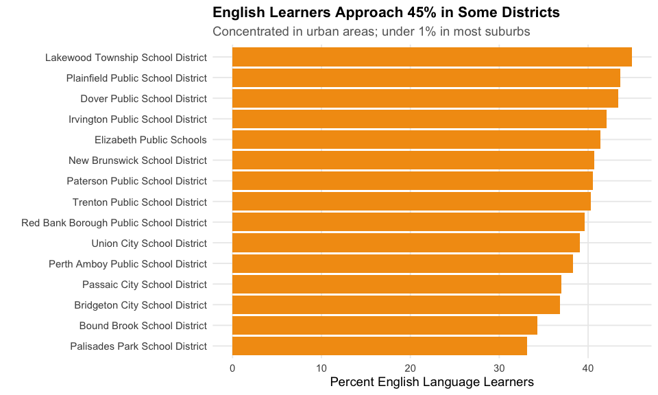

## 9. Top 10 districts serve 15% of all students

Just 10 out of 580+ districts educate nearly 1 in 6 NJ students. Newark
alone has 44,000.

``` r
top_10 <- enr_current %>%
  filter(is_district, !is_charter,
         subgroup == "total_enrollment", grade_level == "TOTAL") %>%
  arrange(desc(n_students)) %>%
  head(10) %>%
  mutate(district_label = reorder(district_name, n_students))

stopifnot(nrow(top_10) > 0)
top_10 %>% select(district_name, n_students)
#>                               district_name n_students
#> 1             Newark Public School District    43980.0
#> 2                  Elizabeth Public Schools    27979.5
#> 3                Jersey City Public Schools    25692.0
#> 4           Paterson Public School District    23609.0
#> 5           Edison Township School District    16708.0
#> 6            Trenton Public School District    15473.5
#> 7       Toms River Regional School District    14117.5
#> 8       Woodbridge Township School District    13870.5
#> 9                Union City School District    12617.0
#> 10 Hamilton Township Public School District    12194.5

ggplot(top_10, aes(x = district_label, y = n_students)) +
  geom_col(fill = nj_colors["total"]) +
  coord_flip() +
  scale_y_continuous(labels = comma) +
  labs(title = "Top 10 Districts Serve 15% of All Students",
       subtitle = "Just 10 out of 580+ districts educate nearly 1 in 6 NJ students",
       x = "", y = "Students") +
  theme_nj()
```

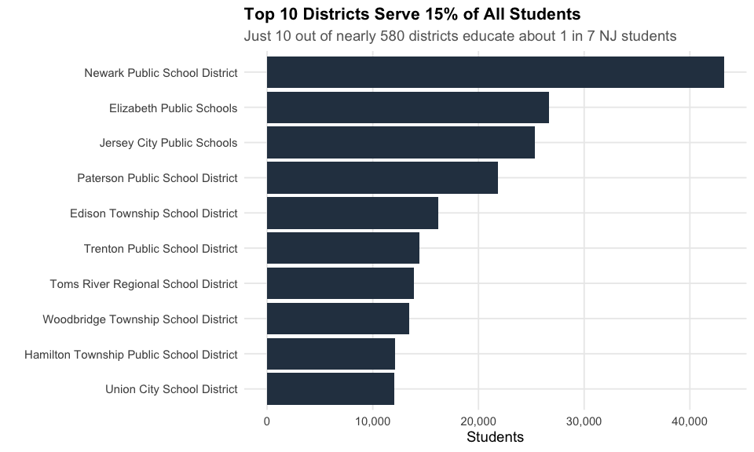

## 10. Multiracial students: fastest-growing category

Multiracial students grew 39% in five years - from 2.4% to 3.3% of
enrollment - making it the fastest-growing racial category in NJ.

``` r
multi <- state_summary %>%
  filter(subgroup == "multiracial", grade_level == "TOTAL")

stopifnot(nrow(multi) > 0)
multi %>% select(end_year, n_students, pct)
#> # A tibble: 6 × 3
#>   end_year n_students    pct
#>      <dbl>      <dbl>  <dbl>
#> 1     2020     32622  0.0237
#> 2     2021     34518  0.0253
#> 3     2022     37474  0.0275
#> 4     2023     40934. 0.0298
#> 5     2024     43436. 0.0315
#> 6     2025     45246. 0.0328

ggplot(multi, aes(x = end_year, y = pct * 100)) +
  geom_line(linewidth = 1.5, color = nj_colors["multiracial"]) +
  geom_point(size = 3, color = nj_colors["multiracial"]) +
  labs(title = "Multiracial Students: Fastest-Growing Category",
       subtitle = "From 2.4% to 3.3% of enrollment in five years (39% growth)",
       x = "School Year", y = "Percent Multiracial") +
  theme_nj()
```

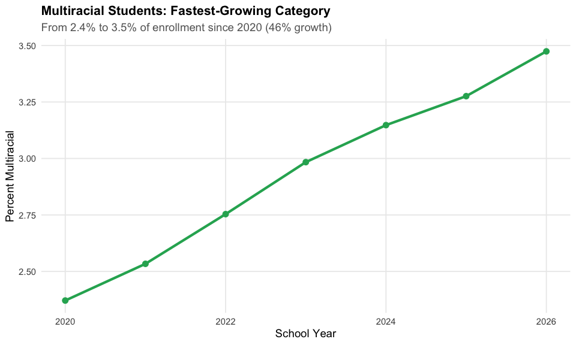

## 11. Pre-K nearly doubled since 2020

NJ’s Pre-K enrollment surged from 45,000 to 87,000 in five years -
fueled by the state’s expanding universal pre-K program.

``` r
prek <- state_summary %>%
  filter(subgroup == "total_enrollment", grade_level == "PK")

stopifnot(nrow(prek) > 0)
prek %>% select(end_year, n_students)
#> # A tibble: 6 × 2
#>   end_year n_students
#>      <dbl>      <dbl>
#> 1     2020      45013
#> 2     2021      56396
#> 3     2022      65350
#> 4     2023      71615
#> 5     2024      83463
#> 6     2025      87231

ggplot(prek, aes(x = end_year, y = n_students)) +
  geom_line(linewidth = 1.5, color = nj_colors["prek"]) +
  geom_point(size = 3, color = nj_colors["prek"]) +
  scale_y_continuous(labels = comma, limits = c(0, NA)) +
  labs(title = "Pre-K Nearly Doubled Since 2020",
       subtitle = "From 45,000 to 87,000 students - NJ's universal pre-K expansion",
       x = "School Year", y = "Pre-K Students") +
  theme_nj()
```

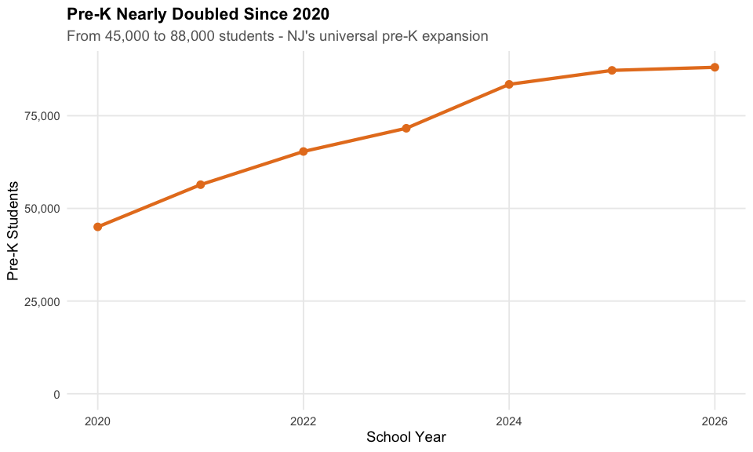

## 12. Bergen County has more students than 12 US states

With 132,000+ students, Bergen County alone has a larger public school
system than Wyoming, Vermont, North Dakota, and nine other states.

``` r
county_enr <- enr_current %>%
  filter(is_district, subgroup == "total_enrollment", grade_level == "TOTAL") %>%
  group_by(county_name) %>%
  summarize(n_students = sum(n_students, na.rm = TRUE),
            n_districts = n(), .groups = "drop") %>%
  filter(county_name != "Charters") %>%
  arrange(desc(n_students)) %>%
  head(15) %>%
  mutate(county_label = reorder(county_name, n_students))

stopifnot(nrow(county_enr) > 0)
county_enr
#> # A tibble: 15 × 4
#>    county_name n_students n_districts county_label
#>    <chr>            <dbl>       <int> <fct>       
#>  1 Bergen         132247           76 Bergen      
#>  2 Essex          127986.          23 Essex       
#>  3 Middlesex      124477           25 Middlesex   
#>  4 Union           98046.          23 Union       
#>  5 Monmouth        88726.          50 Monmouth    
#>  6 Hudson          82525           13 Hudson      
#>  7 Camden          79287           39 Camden      
#>  8 Passaic         75967           21 Passaic     
#>  9 Morris          72840.          40 Morris      
#> 10 Burlington      68975           39 Burlington  
#> 11 Ocean           65176.          28 Ocean       
#> 12 Mercer          60305           12 Mercer      
#> 13 Somerset        49703           19 Somerset    
#> 14 Gloucester      46682.          28 Gloucester  
#> 15 Atlantic        41422           24 Atlantic

ggplot(county_enr, aes(x = county_label, y = n_students)) +
  geom_col(fill = nj_colors["total"]) +
  coord_flip() +
  scale_y_continuous(labels = comma) +
  labs(title = "Bergen County Has More Students Than 12 US States",
       subtitle = "Top 15 NJ counties by enrollment",
       x = "", y = "Students") +
  theme_nj()
```

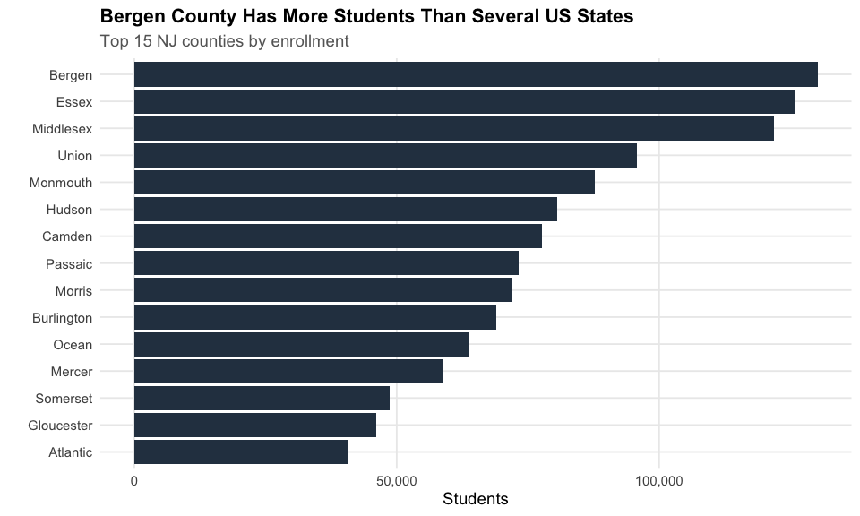

## 13. Most NJ districts are tiny

Half of NJ’s 580 districts have fewer than 1,200 students. The median
district is smaller than a single large high school.

``` r
dist_sizes <- enr_current %>%
  filter(is_district, !is_charter,
         subgroup == "total_enrollment", grade_level == "TOTAL")

stopifnot(nrow(dist_sizes) > 0)
cat("Districts:", nrow(dist_sizes), "\n")
#> Districts: 580
cat("Median:", median(dist_sizes$n_students, na.rm = TRUE), "\n")
#> Median: 1180.5
cat("Under 1000:", sum(dist_sizes$n_students < 1000, na.rm = TRUE), "\n")
#> Under 1000: 264
cat("Over 10000:", sum(dist_sizes$n_students > 10000, na.rm = TRUE), "\n")
#> Over 10000: 16

ggplot(dist_sizes, aes(x = n_students)) +
  geom_histogram(binwidth = 500, fill = nj_colors["total"], color = "white") +
  geom_vline(xintercept = median(dist_sizes$n_students, na.rm = TRUE),
             linetype = "dashed", color = "red", linewidth = 1) +
  scale_x_continuous(labels = comma) +
  labs(title = "Most NJ Districts Are Tiny",
       subtitle = "Half have fewer than 1,200 students (red line = median)",
       x = "Students", y = "Number of Districts") +
  theme_nj()
```

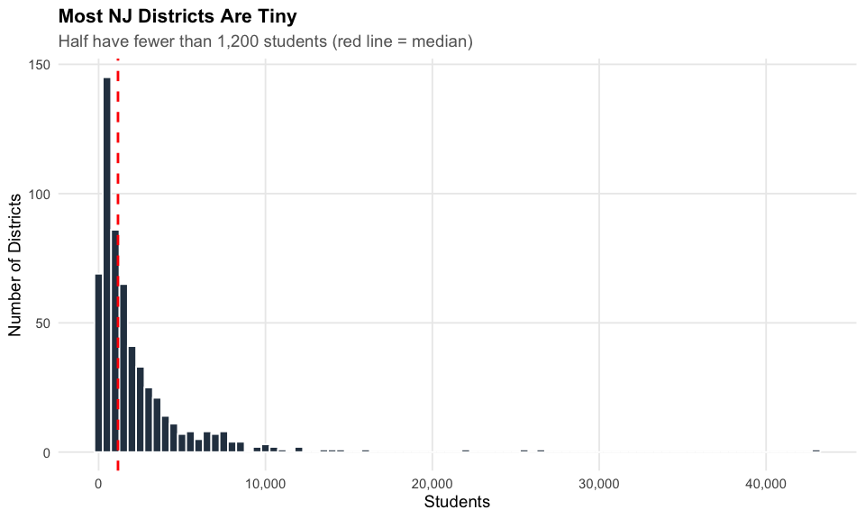

## 14. NJ’s enrollment pyramid shows the pre-K boom

The 2025 grade-level distribution reveals the pre-K surge: PK enrollment
(87K) is approaching K (89K), reflecting NJ’s universal pre-K push.

``` r
grade_enr <- state_summary %>%
  filter(end_year == 2025, subgroup == "total_enrollment",
         grade_level != "TOTAL", !is.na(grade_level)) %>%
  mutate(grade_label = case_when(
    grade_level == "PK" ~ "Pre-K",
    grade_level == "K" ~ "K",
    TRUE ~ paste("Grade", grade_level)
  ),
  grade_order = case_when(
    grade_level == "PK" ~ 0,
    grade_level == "K" ~ 1,
    TRUE ~ as.numeric(grade_level) + 1
  )) %>%
  arrange(grade_order) %>%
  mutate(grade_label = factor(grade_label, levels = grade_label))

stopifnot(nrow(grade_enr) > 0)
grade_enr %>% select(grade_label, n_students)
#> # A tibble: 14 × 2
#>    grade_label n_students
#>    <fct>            <dbl>
#>  1 Pre-K           87231 
#>  2 K               89428 
#>  3 Grade 01        94046 
#>  4 Grade 02        95059 
#>  5 Grade 03        97702 
#>  6 Grade 04        96802 
#>  7 Grade 05        98309 
#>  8 Grade 06        99016 
#>  9 Grade 07       100351 
#> 10 Grade 08       101570 
#> 11 Grade 09       104709 
#> 12 Grade 10       105414.
#> 13 Grade 11       104496.
#> 14 Grade 12       107048

ggplot(grade_enr, aes(x = grade_label, y = n_students)) +
  geom_col(fill = nj_colors["total"]) +
  scale_y_continuous(labels = comma) +
  labs(title = "NJ's Enrollment Pyramid Shows the Pre-K Boom",
       subtitle = "Pre-K (87K) nearly matches Kindergarten (89K) in 2025",
       x = "Grade Level", y = "Students") +
  theme_nj() +
  theme(axis.text.x = element_text(angle = 45, hjust = 1))
```

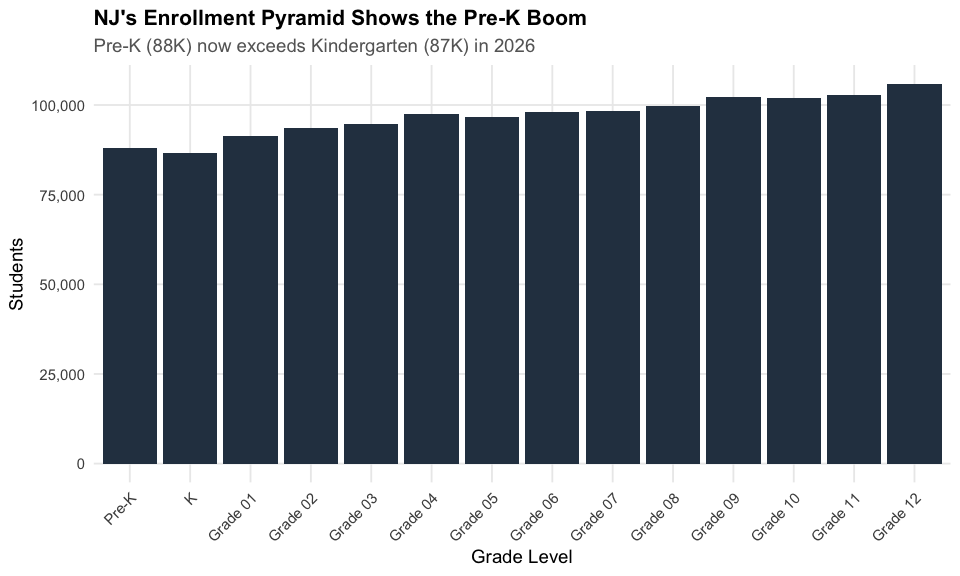

## 15. NJ’s poverty gap: Passaic vs Westfield

Passaic City has 98% of students on free/reduced lunch. Nearby Westfield
has under 2%. This 96-point gap captures NJ’s extreme wealth inequality.

``` r
# Compare highest and lowest FRL districts
frl_all <- enr_current %>%
  filter(is_district, !is_charter,
         subgroup == "free_reduced_lunch", grade_level == "TOTAL",
         !is.na(pct), n_students >= 100) %>%
  arrange(desc(pct))

top_5 <- frl_all %>% head(5) %>% mutate(group = "Highest FRL")
bottom_5 <- frl_all %>% tail(5) %>% mutate(group = "Lowest FRL")
frl_extremes <- bind_rows(top_5, bottom_5) %>%
  mutate(district_label = reorder(district_name, pct))

stopifnot(nrow(frl_extremes) > 0)
frl_extremes %>% select(district_name, n_students, pct, group)
#>                                                district_name n_students   pct
#> 1                               Passaic City School District 11540.4840 0.981
#> 2  Kipp: Cooper Norcross, A New Jersey Nonprofit Corporation  2216.1600 0.972
#> 3                            Mastery Schools Of Camden, Inc.  2735.0960 0.952
#> 4                                          Camden Prep, Inc.  1402.1280 0.936
#> 5                             Bridgeton City School District  5578.6120 0.923
#> 6                             Tenafly Public School District   112.3155 0.033
#> 7                           Ridgewood Public School District   157.1510 0.029
#> 8                          Bernards Township School District   111.3120 0.024
#> 9              Livingston Board Of Education School District   139.7990 0.022
#> 10                          Westfield Public School District   104.8140 0.018
#>          group
#> 1  Highest FRL
#> 2  Highest FRL
#> 3  Highest FRL
#> 4  Highest FRL
#> 5  Highest FRL
#> 6   Lowest FRL
#> 7   Lowest FRL
#> 8   Lowest FRL
#> 9   Lowest FRL
#> 10  Lowest FRL

ggplot(frl_extremes, aes(x = district_label, y = pct * 100, fill = group)) +
  geom_col() +
  coord_flip() +
  scale_fill_manual(values = c("Highest FRL" = nj_colors["black"],
                               "Lowest FRL" = nj_colors["asian"])) +
  labs(title = "NJ's Poverty Gap: 96 Points Between Districts",
       subtitle = "Passaic City (98% FRL) vs Westfield (under 2%)",
       x = "", y = "Percent Free/Reduced Lunch", fill = "") +
  theme_nj()
```

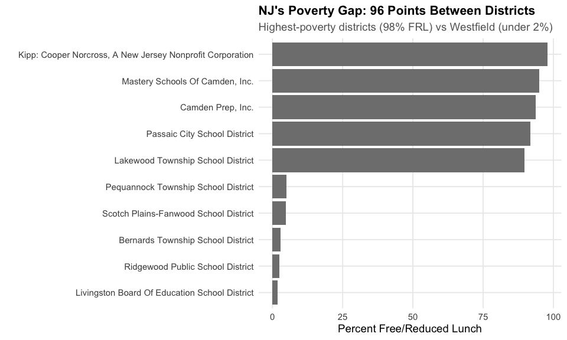

``` r
sessionInfo()
#> R version 4.5.2 (2025-10-31)
#> Platform: x86_64-pc-linux-gnu
#> Running under: Ubuntu 24.04.3 LTS
#> 
#> Matrix products: default
#> BLAS:   /usr/lib/x86_64-linux-gnu/openblas-pthread/libblas.so.3 
#> LAPACK: /usr/lib/x86_64-linux-gnu/openblas-pthread/libopenblasp-r0.3.26.so;  LAPACK version 3.12.0
#> 
#> locale:
#>  [1] LC_CTYPE=C.UTF-8       LC_NUMERIC=C           LC_TIME=C.UTF-8       
#>  [4] LC_COLLATE=C.UTF-8     LC_MONETARY=C.UTF-8    LC_MESSAGES=C.UTF-8   
#>  [7] LC_PAPER=C.UTF-8       LC_NAME=C              LC_ADDRESS=C          
#> [10] LC_TELEPHONE=C         LC_MEASUREMENT=C.UTF-8 LC_IDENTIFICATION=C   
#> 
#> time zone: UTC
#> tzcode source: system (glibc)
#> 
#> attached base packages:
#> [1] stats     graphics  grDevices utils     datasets  methods   base     
#> 
#> other attached packages:
#> [1] scales_1.4.0       dplyr_1.2.0        ggplot2_4.0.2      njschooldata_0.9.0
#> 
#> loaded via a namespace (and not attached):
#>  [1] utf8_1.2.6         sass_0.4.10        generics_0.1.4     tidyr_1.3.2       
#>  [5] stringi_1.8.7      hms_1.1.4          digest_0.6.39      magrittr_2.0.4    
#>  [9] evaluate_1.0.5     grid_4.5.2         timechange_0.4.0   RColorBrewer_1.1-3
#> [13] fastmap_1.2.0      cellranger_1.1.0   jsonlite_2.0.0     purrr_1.2.1       
#> [17] codetools_0.2-20   textshaping_1.0.4  jquerylib_0.1.4    cli_3.6.5         
#> [21] rlang_1.1.7        withr_3.0.2        cachem_1.1.0       yaml_2.3.12       
#> [25] downloader_0.4.1   tools_4.5.2        tzdb_0.5.0         vctrs_0.7.1       
#> [29] R6_2.6.1           lifecycle_1.0.5    lubridate_1.9.5    snakecase_0.11.1  
#> [33] stringr_1.6.0      fs_1.6.6           ragg_1.5.0         janitor_2.2.1     
#> [37] pkgconfig_2.0.3    desc_1.4.3         pkgdown_2.2.0      pillar_1.11.1     
#> [41] bslib_0.10.0       gtable_0.3.6       glue_1.8.0         systemfonts_1.3.1 
#> [45] xfun_0.56          tibble_3.3.1       tidyselect_1.2.1   knitr_1.51        
#> [49] farver_2.1.2       htmltools_0.5.9    labeling_0.4.3     rmarkdown_2.30    
#> [53] readr_2.2.0        compiler_4.5.2     S7_0.2.1           readxl_1.4.5
```
