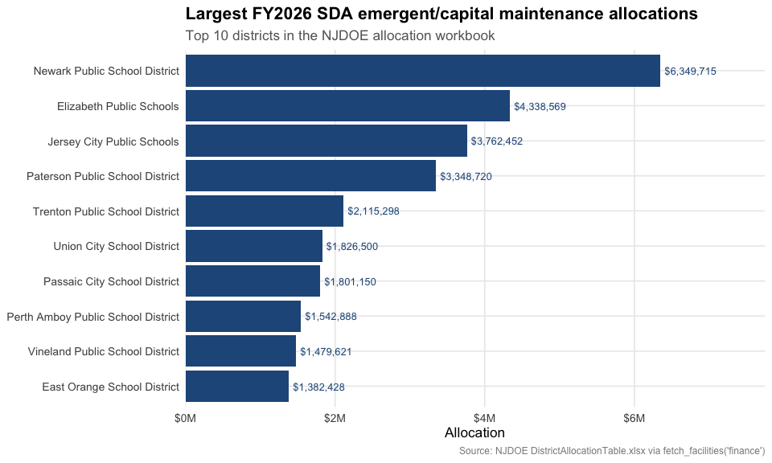
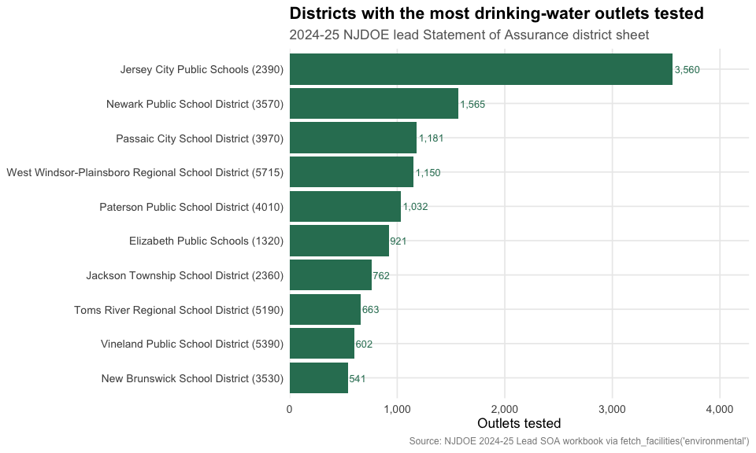
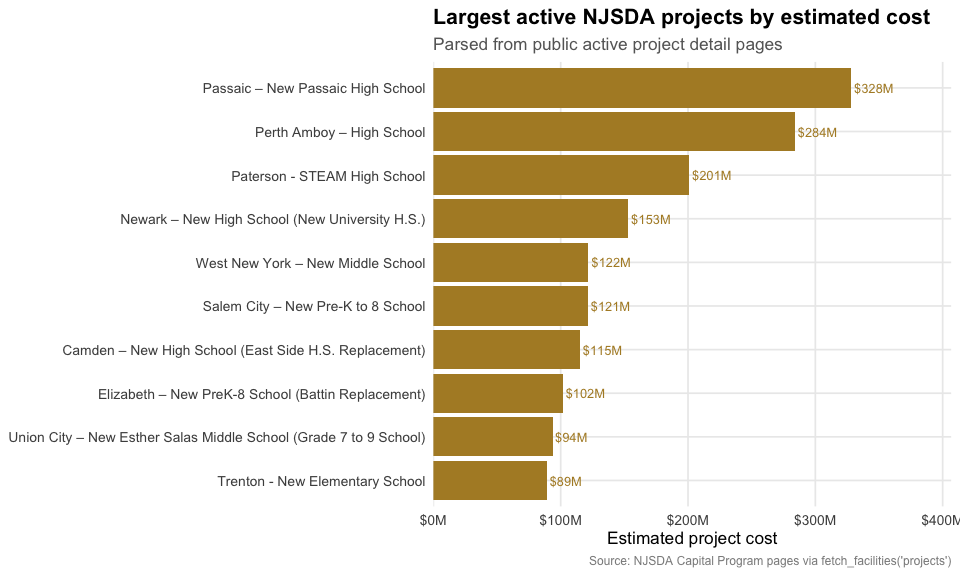
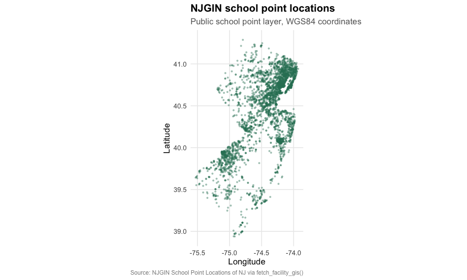

# New Jersey School Facilities Data

``` r

library(njschooldata)
library(ggplot2)
library(dplyr)
library(tidyr)
library(scales)

options(timeout = max(600, getOption("timeout")))
```

``` r

theme_nj_facilities <- function() {
  theme_minimal(base_size = 13) +
    theme(
      plot.title = element_text(face = "bold", size = 16),
      plot.subtitle = element_text(color = "gray40"),
      plot.caption = element_text(color = "gray55", size = 9),
      panel.grid.minor = element_blank(),
      legend.position = "bottom"
    )
}

nj_green <- "#2F7D62"
nj_blue <- "#235789"
nj_gold <- "#B08B2E"
```

New Jersey facilities data is spread across public NJDOE, NJGIN, and
NJSDA sources instead of one statewide facilities warehouse.
[`fetch_facilities()`](https://almartin82.github.io/njschooldata/reference/fetch_facilities.md)
keeps that fragmentation visible: every row carries a category, source
agency, source URL, source type, and vintage. Values stay character
until you cast them for a specific analysis, and missing source cells
are dropped rather than filled.

``` r

available_facilities <- get_available_facilities()
stopifnot(nrow(available_facilities) > 0)
print(available_facilities)
#>        category                source source_agency source_type
#> 1     inventory             njdoe_cds         NJDOE        xlsx
#> 2     inventory   njgin_school_points         NJGIN      arcgis
#> 3    attributes njsda_active_projects         NJSDA        html
#> 4      capacity njsda_active_projects         NJSDA        html
#> 5      projects njsda_active_projects         NJSDA        html
#> 6       finance  njdoe_sda_allocation         NJDOE        xlsx
#> 7 environmental        njdoe_lead_soa         NJDOE        xlsx
#> 8      closures             njdoe_cds         NJDOE        xlsx
#>                                                                                                              source_url
#> 1                                 https://www.nj.gov/education/sleds/keydocs/docs/County_District_School_Code_List.xlsx
#> 2 https://services2.arcgis.com/XVOqAjTOJ5P6ngMu/arcgis/rest/services/School_Point_Locations_of_NJ/FeatureServer/0/query
#> 3                                                                         https://www.njsda.gov/Projects/CapitalProgram
#> 4                                                                         https://www.njsda.gov/Projects/CapitalProgram
#> 5                                                                         https://www.njsda.gov/Projects/CapitalProgram
#> 6                                         https://www.nj.gov/education/facilities/docs/SDA/DistrictAllocationTable.xlsx
#> 7                                          https://www.nj.gov/education/lead/docs/24-25SOA_SubmissionsLeadDW102825.xlsx
#> 8                                 https://www.nj.gov/education/sleds/keydocs/docs/County_District_School_Code_List.xlsx
#>                                                 vintage
#> 1                     CDS list current as of 2026-06-15
#> 2               NJGIN school points modified 2023-05-10
#> 3   NJSDA active capital portfolio, accessed 2026-06-22
#> 4   NJSDA active capital portfolio, accessed 2026-06-22
#> 5   NJSDA active capital portfolio, accessed 2026-06-22
#> 6    FY2026 SDA Emergent/Capital Maintenance allocation
#> 7 2024-2025 Lead SOA submissions, file dated 2025-10-28
#> 8                     CDS list current as of 2026-06-15
```

## 1. The FY2026 SDA allocation table publishes 31 district grants

The NJDOE FY2026 SDA Emergent/Capital Maintenance allocation workbook
lists 31 district grants totaling \$50 million. Newark, Elizabeth,
Jersey City, and Paterson receive the largest allocations in this
source.

``` r

facilities_finance <- fetch_facilities("finance", use_cache = TRUE)
stopifnot(nrow(facilities_finance) > 0)

sda_allocations <- facilities_finance %>%
  filter(metric == "sda_grant_allocation") %>%
  mutate(amount = as.numeric(value)) %>%
  arrange(desc(amount))

sda_summary <- sda_allocations %>%
  summarize(
    districts = n_distinct(entity_id),
    total_allocation = sum(amount, na.rm = TRUE),
    largest_allocation = max(amount, na.rm = TRUE)
  )

sda_top <- sda_allocations %>%
  select(entity_id, entity_name, amount) %>%
  head(10)

stopifnot(nrow(sda_top) > 0)
print(sda_summary)
#>   districts total_allocation largest_allocation
#> 1        31            5e+07            6349715
print(sda_top)
#>    entity_id                        entity_name  amount
#> 1    13-3570      Newark Public School District 6349715
#> 2    39-1320           Elizabeth Public Schools 4338569
#> 3    17-2390         Jersey City Public Schools 3762452
#> 4    31-4010    Paterson Public School District 3348720
#> 5    21-5210     Trenton Public School District 2115298
#> 6    17-5240         Union City School District 1826500
#> 7    31-3970       Passaic City School District 1801150
#> 8    23-4090 Perth Amboy Public School District 1542888
#> 9    11-5390    Vineland Public School District 1479621
#> 10   13-1210        East Orange School District 1382428
```

``` r

stopifnot(nrow(sda_top) > 0)

ggplot(sda_top, aes(x = reorder(entity_name, amount), y = amount)) +
  geom_col(fill = nj_blue) +
  geom_text(aes(label = dollar(amount, accuracy = 1)),
            hjust = -0.08, size = 3.4, color = nj_blue) +
  coord_flip() +
  scale_y_continuous(labels = label_dollar(scale = 1e-6, suffix = "M"),
                     expand = expansion(mult = c(0, 0.22))) +
  labs(
    title = "Largest FY2026 SDA emergent/capital maintenance allocations",
    subtitle = "Top 10 districts in the NJDOE allocation workbook",
    x = NULL,
    y = "Allocation",
    caption = "Source: NJDOE DistrictAllocationTable.xlsx via fetch_facilities('finance')"
  ) +
  theme_nj_facilities()
```



## 2. The 2024-25 Lead SOA workbook reports 67,086 district outlets tested

The district sheet in NJDOE’s 2024-25 lead Statement of Assurance
workbook reports 67,086 outlets tested and 1,842 outlets exceeding the
action level. The source also contains one district row where exceeded
outlets are greater than tested outlets; the package preserves that
source value and documents the caveat instead of guessing a correction.

``` r

facilities_lead <- fetch_facilities("environmental", use_cache = TRUE)
stopifnot(nrow(facilities_lead) > 0)

lead_wide <- facilities_lead %>%
  filter(entity_level == "district",
         metric %in% c("n_outlets_tested", "n_outlets_exceeded")) %>%
  select(entity_id, entity_name, metric, value) %>%
  pivot_wider(names_from = metric, values_from = value) %>%
  mutate(
    n_outlets_tested = as.numeric(n_outlets_tested),
    n_outlets_exceeded = as.numeric(n_outlets_exceeded)
  )

lead_summary <- lead_wide %>%
  summarize(
    districts = n(),
    outlets_tested = sum(n_outlets_tested, na.rm = TRUE),
    outlets_exceeded = sum(n_outlets_exceeded, na.rm = TRUE),
    pct_exceeded = outlets_exceeded / outlets_tested
  )

lead_top_tested <- lead_wide %>%
  filter(!is.na(n_outlets_tested)) %>%
  arrange(desc(n_outlets_tested)) %>%
  select(entity_id, entity_name, n_outlets_tested, n_outlets_exceeded) %>%
  head(10)

lead_source_anomalies <- lead_wide %>%
  filter(!is.na(n_outlets_tested),
         !is.na(n_outlets_exceeded),
         n_outlets_exceeded > n_outlets_tested) %>%
  select(entity_id, entity_name, n_outlets_tested, n_outlets_exceeded)

stopifnot(nrow(lead_top_tested) > 0)
print(lead_summary)
#> # A tibble: 1 × 4
#>   districts outlets_tested outlets_exceeded pct_exceeded
#>       <int>          <dbl>            <dbl>        <dbl>
#> 1       582          67086             1842       0.0275
print(lead_top_tested)
#> # A tibble: 10 × 4
#>    entity_id entity_name                     n_outlets_tested n_outlets_exceeded
#>    <chr>     <chr>                                      <dbl>              <dbl>
#>  1 17-2390   Jersey City Public Schools (23…             3560                 42
#>  2 13-3570   Newark Public School District …             1565                  0
#>  3 31-3970   Passaic City School District (…             1181                  0
#>  4 21-5715   West Windsor-Plainsboro Region…             1150                 52
#>  5 31-4010   Paterson Public School Distric…             1032                 10
#>  6 39-1320   Elizabeth Public Schools (1320)              921                 24
#>  7 29-2360   Jackson Township School Distri…              762                 18
#>  8 29-5190   Toms River Regional School Dis…              663                 25
#>  9 11-5390   Vineland Public School Distric…              602                 15
#> 10 23-3530   New Brunswick School District …              541                 10
print(lead_source_anomalies)
#> # A tibble: 1 × 4
#>   entity_id entity_name                      n_outlets_tested n_outlets_exceeded
#>   <chr>     <chr>                                       <dbl>              <dbl>
#> 1 21-5510   Robbinsville Public School Dist…                3                169
```

``` r

stopifnot(nrow(lead_top_tested) > 0)

ggplot(lead_top_tested,
       aes(x = reorder(entity_name, n_outlets_tested), y = n_outlets_tested)) +
  geom_col(fill = nj_green) +
  geom_text(aes(label = comma(n_outlets_tested)),
            hjust = -0.08, size = 3.4, color = nj_green) +
  coord_flip() +
  scale_y_continuous(labels = comma,
                     expand = expansion(mult = c(0, 0.2))) +
  labs(
    title = "Districts with the most drinking-water outlets tested",
    subtitle = "2024-25 NJDOE lead Statement of Assurance district sheet",
    x = NULL,
    y = "Outlets tested",
    caption = "Source: NJDOE 2024-25 Lead SOA workbook via fetch_facilities('environmental')"
  ) +
  theme_nj_facilities()
```



## 3. NJSDA active project pages expose a \$1.89 billion capital portfolio

The NJSDA active capital program pages currently expose 14 project pages
with parsed cost fields totaling about \$1.89 billion. Project
attributes are reported only where the public page states them
explicitly; for example, added capacity is populated for Bridgeton
Senior High School and left missing elsewhere.

``` r

facility_projects <- fetch_facilities("projects", use_cache = TRUE)
facility_capacity <- fetch_facilities("capacity", use_cache = TRUE)
facility_attributes <- fetch_facilities("attributes", use_cache = TRUE)

project_costs <- facility_projects %>%
  filter(metric == "total_estimated_project_cost") %>%
  mutate(cost = as.numeric(value)) %>%
  select(entity_id, entity_name, cost)

project_capacity <- facility_capacity %>%
  filter(metric == "added_capacity") %>%
  mutate(added_capacity = as.numeric(value)) %>%
  select(entity_id, added_capacity)

project_attributes <- facility_attributes %>%
  filter(metric %in% c("new_construction_sq_ft",
                       "renovation_sq_ft",
                       "year_constructed")) %>%
  select(entity_id, metric, value) %>%
  pivot_wider(names_from = metric, values_from = value) %>%
  mutate(
    new_construction_sq_ft = as.numeric(new_construction_sq_ft),
    renovation_sq_ft = as.numeric(renovation_sq_ft),
    year_constructed = as.numeric(year_constructed)
  )

project_profile <- project_costs %>%
  left_join(project_capacity, by = "entity_id") %>%
  left_join(project_attributes, by = "entity_id") %>%
  arrange(desc(cost))

project_summary <- project_profile %>%
  summarize(
    active_projects = n(),
    total_estimated_cost = sum(cost, na.rm = TRUE),
    projects_with_added_capacity = sum(!is.na(added_capacity)),
    added_capacity = sum(added_capacity, na.rm = TRUE)
  )

project_top_costs <- project_profile %>%
  select(entity_id, entity_name, cost, added_capacity, year_constructed) %>%
  head(10)

stopifnot(nrow(project_top_costs) > 0)
print(project_summary)
#>   active_projects total_estimated_cost projects_with_added_capacity
#> 1              14           1893300000                            1
#>   added_capacity
#> 1            326
print(project_top_costs)
#>      entity_id
#> 1  31-3970-N12
#> 2  23-4090-N03
#> 3  31-4010-N12
#> 4  13-3570-057
#> 5  17-5670-N02
#> 6  33-4630-N01
#> 7  07-0680-040
#> 8  39-1320-N22
#> 9  17-5240-N10
#> 10 21-5210-N09
#>                                                          entity_name      cost
#> 1                                  Passaic – New Passaic High School 328100000
#> 2                                          Perth Amboy – High School 283800000
#> 3                                       Paterson - STEAM High School 200800000
#> 4                     Newark – New High School (New University H.S.) 153000000
#> 5                                  West New York – New Middle School 121800000
#> 6                                 Salem City – New Pre-K to 8 School 121300000
#> 7              Camden – New High School (East Side H.S. Replacement) 115000000
#> 8                 Elizabeth – New PreK-8 School (Battin Replacement) 101500000
#> 9  Union City – New Esther Salas Middle School (Grade 7 to 9 School)  93700000
#> 10                                   Trenton - New Elementary School  89400000
#>    added_capacity year_constructed
#> 1              NA               NA
#> 2              NA               NA
#> 3              NA               NA
#> 4              NA               NA
#> 5              NA               NA
#> 6              NA               NA
#> 7              NA               NA
#> 8              NA               NA
#> 9              NA               NA
#> 10             NA               NA
```

``` r

stopifnot(nrow(project_top_costs) > 0)

ggplot(project_top_costs, aes(x = reorder(entity_name, cost), y = cost)) +
  geom_col(fill = nj_gold) +
  geom_text(aes(label = dollar(cost, scale = 1e-6, suffix = "M", accuracy = 1)),
            hjust = -0.08, size = 3.4, color = nj_gold) +
  coord_flip() +
  scale_y_continuous(labels = label_dollar(scale = 1e-6, suffix = "M"),
                     expand = expansion(mult = c(0, 0.24))) +
  labs(
    title = "Largest active NJSDA projects by estimated cost",
    subtitle = "Parsed from public active project detail pages",
    x = NULL,
    y = "Estimated project cost",
    caption = "Source: NJSDA Capital Program pages via fetch_facilities('projects')"
  ) +
  theme_nj_facilities()
```



## 4. NJGIN publishes 3,736 school point locations

[`fetch_facility_gis()`](https://almartin82.github.io/njschooldata/reference/fetch_facility_gis.md)
is the spatial companion to
[`fetch_facilities()`](https://almartin82.github.io/njschooldata/reference/fetch_facilities.md).
It returns NJGIN school points as an `sf` object when `sf` is installed,
or a plain data frame with latitude, longitude, and WKT when
`sf = FALSE`.

``` r

facility_points <- fetch_facility_gis("school_points", sf = FALSE, use_cache = TRUE)
stopifnot(nrow(facility_points) > 0)

point_summary <- facility_points %>%
  summarize(
    points = n(),
    points_with_coordinates = sum(!is.na(latitude) & !is.na(longitude)),
    school_types = n_distinct(school_type, na.rm = TRUE)
  )

point_types <- facility_points %>%
  count(school_type, sort = TRUE) %>%
  head(8)

print(point_summary)
#>   points points_with_coordinates school_types
#> 1   3736                    3736          294
print(point_types)
#>                                       school_type    n
#> 1                               ELEMENTARY SCHOOL 1498
#> 2                                            <NA>  599
#> 3                                   MIDDLE SCHOOL  354
#> 4                           FOUR-YEAR HIGH SCHOOL  301
#> 5 COUNTY VOCATIONAL-TECHNICAL SCHOOL OR INSTITUTE   59
#> 6                             KINDERGARTEN SCHOOL   47
#> 7                                       PRESCHOOL   47
#> 8                                   PRE K-GRADE 8   45
```

``` r

stopifnot(nrow(facility_points) > 0)

ggplot(facility_points, aes(x = longitude, y = latitude)) +
  geom_point(color = nj_green, alpha = 0.35, size = 0.7) +
  coord_quickmap() +
  labs(
    title = "NJGIN school point locations",
    subtitle = "Public school point layer, WGS84 coordinates",
    x = "Longitude",
    y = "Latitude",
    caption = "Source: NJGIN School Point Locations of NJ via fetch_facility_gis()"
  ) +
  theme_nj_facilities()
```



## Data notes

- **Inventory and closures:** NJDOE County/District/School Code
  workbook, current as of June 15, 2026. Closures come from the
  workbook’s `Updates` sheet where `Action Taken` is `DELETED`.
- **GIS:** NJGIN School Point Locations of NJ ArcGIS FeatureServer.
  Geometry is returned separately by
  [`fetch_facility_gis()`](https://almartin82.github.io/njschooldata/reference/fetch_facility_gis.md);
  latitude and longitude are also available as inventory metrics.
- **Projects, capacity, and attributes:** NJSDA public active capital
  program pages, accessed June 22, 2026. Fields are populated only when
  the page text explicitly states the value.
- **Finance:** NJDOE FY2026 SDA Emergent/Capital Maintenance allocation
  workbook.
- **Environmental:** NJDOE 2024-25 Lead Statement of Assurance workbook.
  The source contains one district row where exceeded outlets are
  greater than tested outlets; the package preserves the reported
  exceeded value and drops only impossible negative count cells.
- **Not yet shipped:** `condition` and `capital_needs` are part of the
  standard facilities vocabulary, but New Jersey does not yet have a
  verified populated public statewide bulk source in this package for
  those categories.

``` r

sessionInfo()
#> R version 4.6.1 (2026-06-24)
#> Platform: x86_64-pc-linux-gnu
#> Running under: Ubuntu 24.04.4 LTS
#> 
#> Matrix products: default
#> BLAS:   /usr/lib/x86_64-linux-gnu/openblas-pthread/libblas.so.3 
#> LAPACK: /usr/lib/x86_64-linux-gnu/openblas-pthread/libopenblasp-r0.3.26.so;  LAPACK version 3.12.0
#> 
#> locale:
#>  [1] LC_CTYPE=C.UTF-8       LC_NUMERIC=C           LC_TIME=C.UTF-8       
#>  [4] LC_COLLATE=C.UTF-8     LC_MONETARY=C.UTF-8    LC_MESSAGES=C.UTF-8   
#>  [7] LC_PAPER=C.UTF-8       LC_NAME=C              LC_ADDRESS=C          
#> [10] LC_TELEPHONE=C         LC_MEASUREMENT=C.UTF-8 LC_IDENTIFICATION=C   
#> 
#> time zone: UTC
#> tzcode source: system (glibc)
#> 
#> attached base packages:
#> [1] stats     graphics  grDevices utils     datasets  methods   base     
#> 
#> other attached packages:
#> [1] scales_1.4.0        tidyr_1.3.2         dplyr_1.2.1        
#> [4] ggplot2_4.0.3       njschooldata_0.9.18
#> 
#> loaded via a namespace (and not attached):
#>  [1] utf8_1.2.6         sass_0.4.10        generics_0.1.4     stringi_1.8.7     
#>  [5] hms_1.1.4          digest_0.6.39      magrittr_2.0.5     evaluate_1.0.5    
#>  [9] grid_4.6.1         timechange_0.4.0   RColorBrewer_1.1-3 fastmap_1.2.0     
#> [13] cellranger_1.1.0   jsonlite_2.0.0     httr_1.4.8         purrr_1.2.2       
#> [17] codetools_0.2-20   textshaping_1.0.5  jquerylib_0.1.4    cli_3.6.6         
#> [21] rlang_1.2.0        withr_3.0.3        cachem_1.1.0       yaml_2.3.12       
#> [25] otel_0.2.0         tools_4.6.1        tzdb_0.5.0         curl_7.1.0        
#> [29] vctrs_0.7.3        R6_2.6.1           lifecycle_1.0.5    lubridate_1.9.5   
#> [33] snakecase_0.11.1   stringr_1.6.0      fs_2.1.0           ragg_1.5.2        
#> [37] janitor_2.2.1      pkgconfig_2.0.3    desc_1.4.3         pkgdown_2.2.0     
#> [41] pillar_1.11.1      bslib_0.11.0       gtable_0.3.6       glue_1.8.1        
#> [45] systemfonts_1.3.2  xfun_0.59          tibble_3.3.1       tidyselect_1.2.1  
#> [49] knitr_1.51         farver_2.1.2       htmltools_0.5.9    labeling_0.4.3    
#> [53] rmarkdown_2.31     readr_2.2.0        compiler_4.6.1     S7_0.2.2          
#> [57] readxl_1.5.0
```
