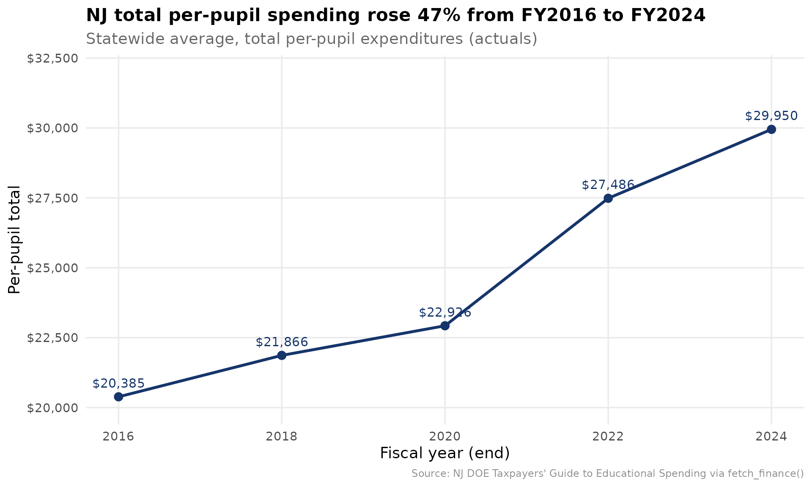
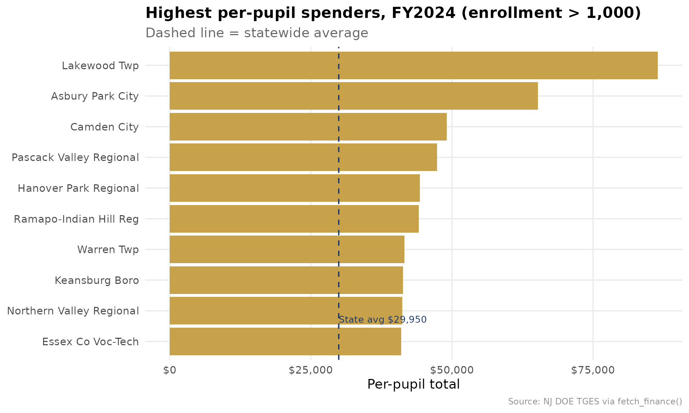
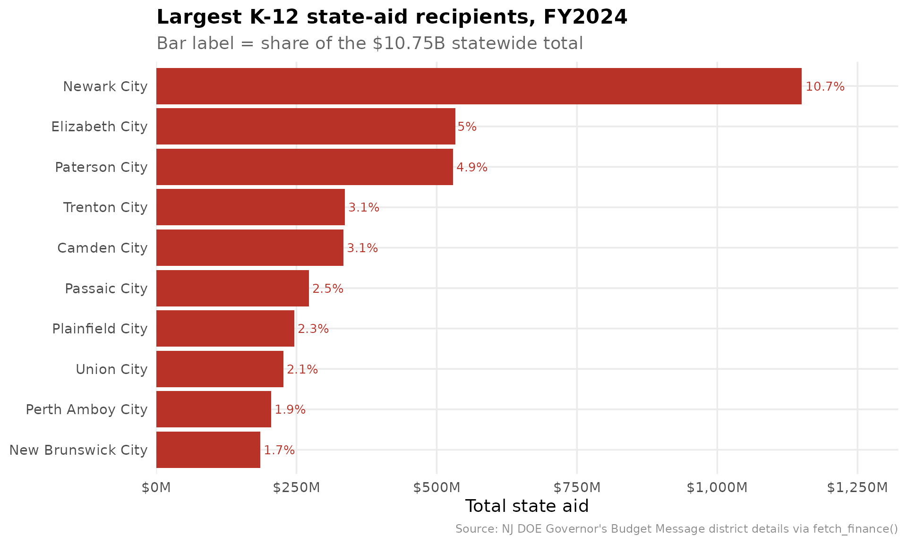

# New Jersey School Finance: A Uniform Front Door

``` r

library(njschooldata)
library(ggplot2)
library(dplyr)
library(tidyr)
library(scales)

options(timeout = max(600, getOption("timeout")))
```

``` r

theme_nj <- function() {
  theme_minimal(base_size = 14) +
    theme(
      plot.title = element_text(face = "bold", size = 16),
      plot.subtitle = element_text(color = "gray40"),
      plot.caption = element_text(color = "gray55", size = 9),
      panel.grid.minor = element_blank(),
      legend.position = "bottom"
    )
}

nj_navy <- "#16356B"
nj_gold <- "#C8A14B"
nj_red  <- "#B83227"
```

[`fetch_finance()`](https://almartin82.github.io/njschooldata/reference/fetch_finance.md)
is the uniform, cross-state finance front door for New Jersey. It
consolidates the two NJ DOE finance sources this package already pulls —
the [Taxpayers’ Guide to Educational
Spending](https://www.nj.gov/education/guide/) (per-pupil spending) and
the Governor’s Budget Message district details (K-12 state aid) — onto
one tidy schema with a standard `metric` vocabulary, so the same
analysis code runs unchanged across states.

`end_year` is the fiscal/school year END: `end_year = 2024` is FY2024,
school year 2023-24. Every value traces to a downloaded NJ DOE file; the
federal NCES identifier (`nces_dist`) is attached as a join key only.

``` r

# the spending side is published a year in arrears, so even years 2016-2024
# give a clean statewide actuals series; 2024 is the latest full cross-section.
fin_multi <- fetch_finance_multi(c(2016, 2018, 2020, 2022, 2024))
fin_2024  <- fetch_finance(2024)
```

## Story 1: New Jersey per-pupil spending climbed 47% in eight years

Statewide total per-pupil expenditures rose from \$20,385 in FY2016 to
\$29,950 in FY2024 — an eight-year jump of nearly half, well ahead of
general inflation over the same window.

``` r

state_trend <- fin_multi %>%
  filter(is_state, metric == "per_pupil_total") %>%
  arrange(end_year) %>%
  select(end_year, value)

state_trend %>%
  mutate(pct_change_since_2016 = round((value / value[1] - 1) * 100, 1))
#> # A tibble: 5 × 3
#>   end_year value pct_change_since_2016
#>      <int> <dbl>                 <dbl>
#> 1     2016 20385                   0  
#> 2     2018 21866                   7.3
#> 3     2020 22926                  12.5
#> 4     2022 27486                  34.8
#> 5     2024 29950                  46.9
```

``` r

stopifnot(nrow(state_trend) > 0)

ggplot(state_trend, aes(end_year, value)) +
  geom_line(color = nj_navy, linewidth = 1.2) +
  geom_point(color = nj_navy, size = 3) +
  geom_text(aes(label = dollar(value)), vjust = -1, size = 4, color = nj_navy) +
  scale_y_continuous(labels = dollar, limits = c(20000, 32000)) +
  scale_x_continuous(breaks = state_trend$end_year) +
  labs(
    title = "NJ total per-pupil spending rose 47% from FY2016 to FY2024",
    subtitle = "Statewide average, total per-pupil expenditures (actuals)",
    x = "Fiscal year (end)", y = "Per-pupil total",
    caption = "Source: NJ DOE Taxpayers' Guide to Educational Spending via fetch_finance()"
  ) +
  theme_nj()
```



## Story 2: Per-pupil spending varies enormously — Lakewood is the extreme

Within a single year, district per-pupil spending spans a huge range.
Lakewood Township reports \$86,480 per pupil in FY2024 — nearly three
times the statewide average — a figure driven by the district’s large
nonpublic-school transportation and special-education obligations, which
run through the public district budget.

``` r

top_spenders <- fin_2024 %>%
  filter(is_district, metric == "per_pupil_total",
         enrollment_denominator > 1000) %>%
  arrange(desc(value)) %>%
  select(entity_name, county, value, enrollment_denominator) %>%
  head(10)

top_spenders
#> # A tibble: 10 × 4
#>    entity_name              county   value enrollment_denominator
#>    <chr>                    <chr>    <dbl>                  <dbl>
#>  1 Lakewood Twp             Ocean    86480                   4720
#>  2 Asbury Park City         Monmouth 65256                   1504
#>  3 Camden City              Camden   49091                   7116
#>  4 Pascack Valley Regional  Bergen   47383                   1736
#>  5 Hanover Park Regional    Morris   44313                   1299
#>  6 Ramapo-Indian Hill Reg   Bergen   44094                   1919
#>  7 Warren Twp               Somerset 41615                   1666
#>  8 Keansburg Boro           Monmouth 41342                   1551
#>  9 Northern Valley Regional Bergen   41226                   2156
#> 10 Essex Co Voc-Tech        Essex    40987                   2061
```

``` r

stopifnot(nrow(top_spenders) > 0)

state_pp <- fin_2024 %>%
  filter(is_state, metric == "per_pupil_total") %>%
  pull(value)

ggplot(top_spenders, aes(reorder(entity_name, value), value)) +
  geom_col(fill = nj_gold) +
  geom_hline(yintercept = state_pp, linetype = "dashed", color = nj_navy) +
  annotate("text", x = 1.5, y = state_pp,
           label = paste0("State avg ", dollar(state_pp)),
           hjust = 0, vjust = -0.5, color = nj_navy, size = 3.5) +
  coord_flip() +
  scale_y_continuous(labels = dollar) +
  labs(
    title = "Highest per-pupil spenders, FY2024 (enrollment > 1,000)",
    subtitle = "Dashed line = statewide average",
    x = NULL, y = "Per-pupil total",
    caption = "Source: NJ DOE TGES via fetch_finance()"
  ) +
  theme_nj()
```



## Story 3: State aid is concentrated in the former Abbott cities

Of \$10.75 billion in total K-12 state aid in FY2024, the four largest
recipients — Newark, Elizabeth, Paterson, and Trenton, all former Abbott
districts — absorb a strikingly large share. Newark alone receives
nearly \$1.15 billion, about 10.7% of all state aid in New Jersey.

``` r

state_total_aid <- fin_2024 %>%
  filter(is_state, metric == "revenue_state") %>%
  pull(value)

top_aid <- fin_2024 %>%
  filter(is_district, metric == "revenue_state") %>%
  arrange(desc(value)) %>%
  mutate(share_of_state = round(value / state_total_aid * 100, 1)) %>%
  select(entity_name, value, share_of_state) %>%
  head(10)

top_aid
#> # A tibble: 10 × 3
#>    entity_name             value share_of_state
#>    <chr>                   <dbl>          <dbl>
#>  1 Newark City        1149975941           10.7
#>  2 Elizabeth City      532961132            5  
#>  3 Paterson City       529272462            4.9
#>  4 Trenton City        336330541            3.1
#>  5 Camden City         333950970            3.1
#>  6 Passaic City        272108020            2.5
#>  7 Plainfield City     246081549            2.3
#>  8 Union City          226682966            2.1
#>  9 Perth Amboy City    204876489            1.9
#> 10 New Brunswick City  185885120            1.7
```

``` r

stopifnot(nrow(top_aid) > 0)

ggplot(top_aid, aes(reorder(entity_name, value), value)) +
  geom_col(fill = nj_red) +
  geom_text(aes(label = paste0(share_of_state, "%")),
            hjust = -0.1, size = 3.5, color = nj_red) +
  coord_flip() +
  scale_y_continuous(labels = label_dollar(scale = 1e-6, suffix = "M"),
                     expand = expansion(mult = c(0, 0.15))) +
  labs(
    title = "Largest K-12 state-aid recipients, FY2024",
    subtitle = "Bar label = share of the $10.75B statewide total",
    x = NULL, y = "Total state aid",
    caption = "Source: NJ DOE Governor's Budget Message district details via fetch_finance()"
  ) +
  theme_nj()
```



## The canonical schema

Every row is one `end_year` × entity × `metric`. The standard
cross-state metrics (`per_pupil_total`, `per_pupil_instruction`,
`revenue_state`) sit alongside NJ-specific per-pupil category metrics,
and each row carries the federal `nces_dist` join key.

``` r

fin_2024 %>%
  filter(state_id == "3570") %>%
  select(end_year, entity_name, metric, value, is_per_pupil,
         enrollment_denominator, nces_dist)
#> # A tibble: 7 × 7
#>   end_year entity_name metric          value is_per_pupil enrollment_denominator
#>      <int> <chr>       <chr>           <dbl> <lgl>                         <dbl>
#> 1     2024 Newark City per_pupil_to…  3.44e4 TRUE                          43251
#> 2     2024 Newark City per_pupil_in…  1.06e4 TRUE                             NA
#> 3     2024 Newark City per_pupil_su…  4.24e3 TRUE                             NA
#> 4     2024 Newark City per_pupil_ad…  1.92e3 TRUE                             NA
#> 5     2024 Newark City per_pupil_op…  3.90e3 TRUE                             NA
#> 6     2024 Newark City per_pupil_fo… NA      TRUE                             NA
#> 7     2024 Newark City revenue_state  1.15e9 FALSE                            NA
#> # ℹ 1 more variable: nces_dist <chr>
```

``` r

sessionInfo()
#> R version 4.6.1 (2026-06-24)
#> Platform: x86_64-pc-linux-gnu
#> Running under: Ubuntu 24.04.4 LTS
#> 
#> Matrix products: default
#> BLAS:   /usr/lib/x86_64-linux-gnu/openblas-pthread/libblas.so.3 
#> LAPACK: /usr/lib/x86_64-linux-gnu/openblas-pthread/libopenblasp-r0.3.26.so;  LAPACK version 3.12.0
#> 
#> locale:
#>  [1] LC_CTYPE=C.UTF-8       LC_NUMERIC=C           LC_TIME=C.UTF-8       
#>  [4] LC_COLLATE=C.UTF-8     LC_MONETARY=C.UTF-8    LC_MESSAGES=C.UTF-8   
#>  [7] LC_PAPER=C.UTF-8       LC_NAME=C              LC_ADDRESS=C          
#> [10] LC_TELEPHONE=C         LC_MEASUREMENT=C.UTF-8 LC_IDENTIFICATION=C   
#> 
#> time zone: UTC
#> tzcode source: system (glibc)
#> 
#> attached base packages:
#> [1] stats     graphics  grDevices utils     datasets  methods   base     
#> 
#> other attached packages:
#> [1] scales_1.4.0        tidyr_1.3.2         dplyr_1.2.1        
#> [4] ggplot2_4.0.3       njschooldata_0.9.26
#> 
#> loaded via a namespace (and not attached):
#>  [1] utf8_1.2.6         sass_0.4.10        generics_0.1.4     stringi_1.8.7     
#>  [5] hms_1.1.4          digest_0.6.39      magrittr_2.0.5     evaluate_1.0.5    
#>  [9] grid_4.6.1         timechange_0.4.0   RColorBrewer_1.1-3 fastmap_1.2.0     
#> [13] cellranger_1.1.0   jsonlite_2.0.0     purrr_1.2.2        codetools_0.2-20  
#> [17] textshaping_1.0.5  jquerylib_0.1.4    cli_3.6.6          crayon_1.5.3      
#> [21] rlang_1.3.0        bit64_4.8.2        withr_3.0.3        cachem_1.1.0      
#> [25] yaml_2.3.12        otel_0.2.0         parallel_4.6.1     downloader_0.4.1  
#> [29] tools_4.6.1        tzdb_0.5.0         vctrs_0.7.3        R6_2.6.1          
#> [33] lifecycle_1.0.5    lubridate_1.9.5    snakecase_0.11.1   stringr_1.6.0     
#> [37] bit_4.6.0          fs_2.1.0           vroom_1.7.1        ragg_1.5.2        
#> [41] janitor_2.2.1      pkgconfig_2.0.3    desc_1.4.3         pkgdown_2.2.1     
#> [45] pillar_1.11.1      bslib_0.11.0       gtable_0.3.6       glue_1.8.1        
#> [49] systemfonts_1.3.2  xfun_0.60          tibble_3.3.1       tidyselect_1.2.1  
#> [53] knitr_1.51         farver_2.1.2       htmltools_0.5.9    labeling_0.4.3    
#> [57] rmarkdown_2.31     readr_2.2.0        compiler_4.6.1     S7_0.2.2          
#> [61] readxl_1.5.0
```
