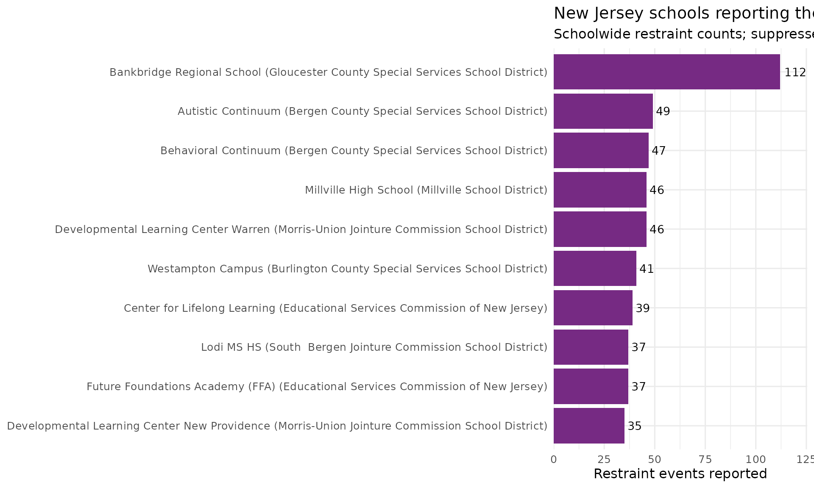
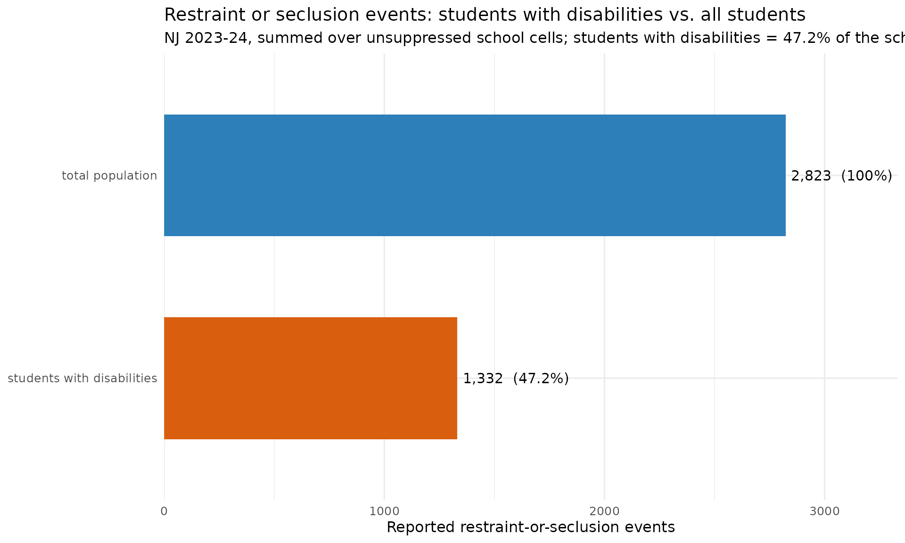

# Restraint & Seclusion: A Special-Education Liability Metric

``` r

library(njschooldata)
library(dplyr)
library(ggplot2)
```

Physical restraint and seclusion are among the most legally sensitive
events a school can record. New Jersey publishes them school-by-school
in standalone DARS (Discipline & Restraint) workbooks - separate from
the violence/vandalism/HIB data in
[`fetch_violence_vandalism_hib()`](https://almartin82.github.io/njschooldata/reference/fetch_violence_vandalism_hib.md).
[`fetch_restraint_seclusion()`](https://almartin82.github.io/njschooldata/reference/fetch_restraint_seclusion.md)
reads them for **end_year 2023 (SY2022-23) and 2024 (SY2023-24)**.

The source is **school-level only** (no state/district aggregate) and is
crossed by student group, so every row is one school for one group.
Small cells are masked: `"*"` hides a value entirely and `"<5"` is a
published range for 1-4 students. Both become `NA` here, never a guessed
number - so the statewide sums below are **floors** computed over
unsuppressed cells, not exact totals.

## Which schools report the most restraint events?

The schoolwide totals (`subgroup == "total population"`,
`grade_level == "TOTAL"`) show that reported restraint is overwhelmingly
concentrated in county special-services districts and out-of-district
placement schools that serve students with the most intensive needs.

``` r

sw24 <- fetch_restraint_seclusion(2024) %>%
  filter(subgroup == "total population", grade_level == "TOTAL",
         !is.na(restraint_count))

stopifnot(nrow(sw24) > 0)

top10 <- sw24 %>%
  arrange(desc(restraint_count)) %>%
  slice(1:10) %>%
  mutate(label = paste0(school_name, " (", district_name, ")"))

# Print-before-plot: confirm the data feeding the chart.
top10 %>% select(district_name, school_name, restraint_count, seclusion_count)
#> # A tibble: 10 × 4
#>    district_name                     school_name restraint_count seclusion_count
#>    <chr>                             <chr>                 <dbl>           <dbl>
#>  1 Gloucester County Special Servic… Bankbridge…             112              12
#>  2 Bergen County Special Services S… Autistic C…              49               5
#>  3 Bergen County Special Services S… Behavioral…              47               0
#>  4 Millville School District         Millville …              46               0
#>  5 Morris-Union Jointure Commission… Developmen…              46              12
#>  6 Burlington County Special Servic… Westampton…              41              20
#>  7 Educational Services Commission … Center for…              39              16
#>  8 South  Bergen Jointure Commissio… Lodi MS HS               37               0
#>  9 Educational Services Commission … Future Fou…              37              10
#> 10 Morris-Union Jointure Commission… Developmen…              35               9
```

``` r

ggplot(top10, aes(x = reorder(label, restraint_count), y = restraint_count)) +
  geom_col(fill = "#762a83") +
  geom_text(aes(label = restraint_count), hjust = -0.2, size = 3.6) +
  coord_flip() +
  scale_y_continuous(expand = expansion(mult = c(0, 0.12))) +
  labs(
    title = "New Jersey schools reporting the most restraint events, 2023-24",
    subtitle = "Schoolwide restraint counts; suppressed cells (<5, *) excluded",
    x = NULL,
    y = "Restraint events reported"
  ) +
  theme_minimal(base_size = 12)
```



## Restraint is concentrated among students with disabilities

The student-group breakdown lets us compare the schoolwide
restraint-and-seclusion total against the students-with-disabilities
subgroup. Summing the unsuppressed school cells statewide, students with
disabilities account for roughly **half** of all reported
restraint-or-seclusion events - far above their share of enrollment
(about one in six students). This is the disproportionality that makes
the metric a board-level concern.

``` r

rs24 <- fetch_restraint_seclusion(2024)

group_totals <- rs24 %>%
  filter(grade_level == "TOTAL",
         subgroup %in% c("total population", "students with disabilities")) %>%
  group_by(subgroup) %>%
  summarise(
    any_events = sum(any_restraint_seclusion_count, na.rm = TRUE),
    .groups = "drop"
  )

stopifnot(nrow(group_totals) == 2)

schoolwide_total <- group_totals$any_events[group_totals$subgroup == "total population"]
swd_total <- group_totals$any_events[group_totals$subgroup == "students with disabilities"]

share_tbl <- group_totals %>%
  mutate(pct_of_schoolwide = round(100 * any_events / schoolwide_total, 1))

# Print-before-plot.
share_tbl
#> # A tibble: 2 × 3
#>   subgroup                   any_events pct_of_schoolwide
#>   <chr>                           <dbl>             <dbl>
#> 1 students with disabilities       1332              47.2
#> 2 total population                 2823             100
```

``` r

ggplot(share_tbl, aes(x = reorder(subgroup, any_events), y = any_events,
                      fill = subgroup)) +
  geom_col(width = 0.6, show.legend = FALSE) +
  geom_text(aes(label = paste0(format(any_events, big.mark = ","),
                               "  (", pct_of_schoolwide, "%)")),
            hjust = -0.05, size = 4) +
  coord_flip() +
  scale_y_continuous(expand = expansion(mult = c(0, 0.18))) +
  scale_fill_manual(values = c("students with disabilities" = "#d95f0e",
                               "total population" = "#2c7fb8")) +
  labs(
    title = "Restraint or seclusion events: students with disabilities vs. all students",
    subtitle = paste0("NJ 2023-24, summed over unsuppressed school cells; ",
                      "students with disabilities = ",
                      share_tbl$pct_of_schoolwide[
                        share_tbl$subgroup == "students with disabilities"],
                      "% of the schoolwide total"),
    x = NULL,
    y = "Reported restraint-or-seclusion events"
  ) +
  theme_minimal(base_size = 12)
```



## Notes

- **School-level only.** The DARS workbook has no district/state/county
  aggregate; `level` must be `"school"`. Statewide figures here are sums
  of the per-school cells.
- **Suppression -\> `NA`.** `"*"` and `"<5"` both become `NA`; `"<5"` is
  never read as `5`. Statewide sums are therefore **floors** over
  unsuppressed cells - the true totals are higher, but the masked counts
  are 1-4 students each.
- **Student group.** The raw `Student Group` label is kept as
  `student_group` and split into normalized `subgroup` + `grade_level`.
  The schoolwide total is labelled `"Schoolwide"` in 2022-23 and
  `"School Total"` in 2023-24; both map to
  `subgroup == "total population"`.

``` r

sessionInfo()
#> R version 4.6.1 (2026-06-24)
#> Platform: x86_64-pc-linux-gnu
#> Running under: Ubuntu 24.04.4 LTS
#> 
#> Matrix products: default
#> BLAS:   /usr/lib/x86_64-linux-gnu/openblas-pthread/libblas.so.3 
#> LAPACK: /usr/lib/x86_64-linux-gnu/openblas-pthread/libopenblasp-r0.3.26.so;  LAPACK version 3.12.0
#> 
#> locale:
#>  [1] LC_CTYPE=C.UTF-8       LC_NUMERIC=C           LC_TIME=C.UTF-8       
#>  [4] LC_COLLATE=C.UTF-8     LC_MONETARY=C.UTF-8    LC_MESSAGES=C.UTF-8   
#>  [7] LC_PAPER=C.UTF-8       LC_NAME=C              LC_ADDRESS=C          
#> [10] LC_TELEPHONE=C         LC_MEASUREMENT=C.UTF-8 LC_IDENTIFICATION=C   
#> 
#> time zone: UTC
#> tzcode source: system (glibc)
#> 
#> attached base packages:
#> [1] stats     graphics  grDevices utils     datasets  methods   base     
#> 
#> other attached packages:
#> [1] ggplot2_4.0.3       dplyr_1.2.1         njschooldata_0.9.25
#> 
#> loaded via a namespace (and not attached):
#>  [1] utf8_1.2.6         sass_0.4.10        generics_0.1.4     tidyr_1.3.2       
#>  [5] stringi_1.8.7      hms_1.1.4          digest_0.6.39      magrittr_2.0.5    
#>  [9] evaluate_1.0.5     grid_4.6.1         timechange_0.4.0   RColorBrewer_1.1-3
#> [13] fastmap_1.2.0      cellranger_1.1.0   jsonlite_2.0.0     purrr_1.2.2       
#> [17] scales_1.4.0       textshaping_1.0.5  jquerylib_0.1.4    cli_3.6.6         
#> [21] rlang_1.3.0        withr_3.0.3        cachem_1.1.0       yaml_2.3.12       
#> [25] otel_0.2.0         downloader_0.4.1   tools_4.6.1        tzdb_0.5.0        
#> [29] vctrs_0.7.3        R6_2.6.1           lifecycle_1.0.5    lubridate_1.9.5   
#> [33] snakecase_0.11.1   stringr_1.6.0      fs_2.1.0           ragg_1.5.2        
#> [37] janitor_2.2.1      pkgconfig_2.0.3    desc_1.4.3         pkgdown_2.2.0     
#> [41] pillar_1.11.1      bslib_0.11.0       gtable_0.3.6       glue_1.8.1        
#> [45] systemfonts_1.3.2  xfun_0.59          tibble_3.3.1       tidyselect_1.2.1  
#> [49] knitr_1.51         farver_2.1.2       htmltools_0.5.9    labeling_0.4.3    
#> [53] rmarkdown_2.31     readr_2.2.0        compiler_4.6.1     S7_0.2.2          
#> [57] readxl_1.5.0
```
