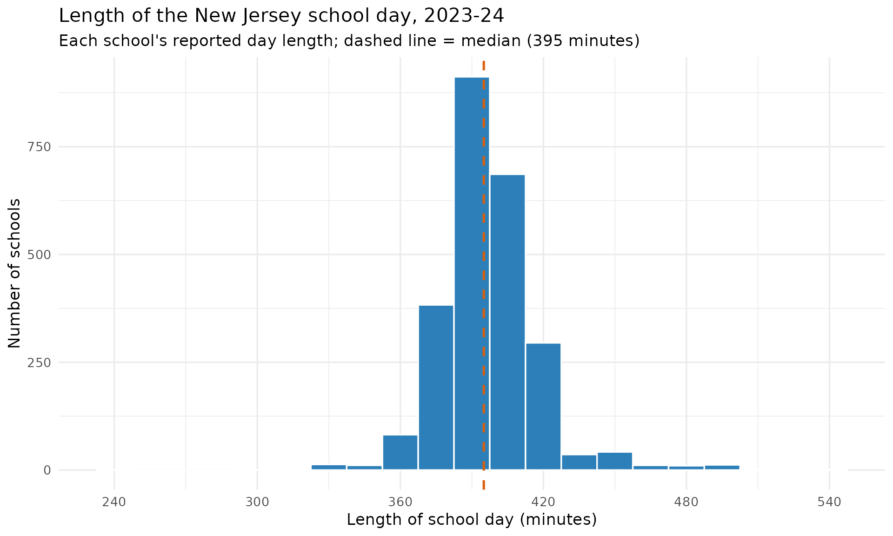
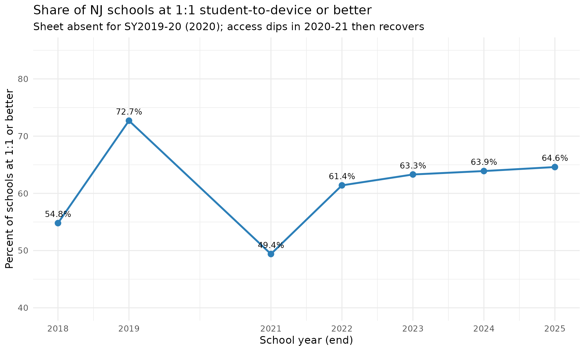

# School Environment: Instructional Time & Device Access

``` r

library(njschooldata)
library(dplyr)
library(ggplot2)
```

Two levers a building leader directly controls - **how much time**
students spend in school and **whether every student has a device** -
are reported school-by-school in the NJ School Performance Reports but
are rarely surfaced in a comparable way.
[`fetch_school_day()`](https://almartin82.github.io/njschooldata/reference/fetch_school_day.md)
and
[`fetch_device_ratios()`](https://almartin82.github.io/njschooldata/reference/fetch_device_ratios.md)
expose them. Both are school-level sheets (an attribute of a building,
with no district/state aggregate), so every example below filters to
`is_school`.

## How long is the New Jersey school day?

[`fetch_school_day()`](https://almartin82.github.io/njschooldata/reference/fetch_school_day.md)
returns the published `length_of_day` string (e.g. `"6 Hrs. 25 Mins."`)
alongside a derived numeric `length_of_day_minutes`. The typical NJ
school day in 2023-24 runs about six and a half hours, but the spread is
wide - from half-day programs near four hours to schools topping nine.

``` r

sd24 <- fetch_school_day(2024) %>%
  filter(is_school, !is.na(length_of_day_minutes))

# Print-before-plot: confirm the data feeding the chart.
nrow(sd24)
#> [1] 2503
summary(sd24$length_of_day_minutes)
#>    Min. 1st Qu.  Median    Mean 3rd Qu.    Max. 
#>   240.0   385.0   395.0   396.8   405.0   545.0
```

``` r

ggplot(sd24, aes(x = length_of_day_minutes)) +
  geom_histogram(binwidth = 15, fill = "#2c7fb8", colour = "white") +
  geom_vline(xintercept = median(sd24$length_of_day_minutes),
             linetype = "dashed", colour = "#d95f0e", linewidth = 0.9) +
  scale_x_continuous(breaks = seq(240, 600, 60)) +
  labs(
    title = "Length of the New Jersey school day, 2023-24",
    subtitle = paste0("Each school's reported day length; dashed line = median (",
                      median(sd24$length_of_day_minutes), " minutes)"),
    x = "Length of school day (minutes)",
    y = "Number of schools"
  ) +
  theme_minimal(base_size = 13)
```



The longest and shortest reported days:

``` r

sd24 %>%
  arrange(desc(length_of_day_minutes)) %>%
  slice(c(1:3, (n() - 2):n())) %>%
  select(district_name, school_name, length_of_day, length_of_day_minutes)
#> # A tibble: 6 × 4
#>   district_name                  school_name length_of_day length_of_day_minutes
#>   <chr>                          <chr>       <chr>                         <dbl>
#> 1 KIPP: Cooper Norcross, A New … KIPP: Coop… 9 Hrs. 5 Min…                   545
#> 2 TEAM Academy Charter School    TEAM Acade… 9 Hrs. 0 Min…                   540
#> 3 Northfield City School Distri… Northfield… 8 Hrs. 50 Mi…                   530
#> 4 Matawan-Aberdeen Regional Sch… Strathmore… 5 Hrs. 15 Mi…                   315
#> 5 Pennsauken Township Board of … A.E. Burli… 5 Hrs. 0 Min…                   300
#> 6 Bayonne School District        Bayonne Al… 4 Hrs. 0 Min…                   240
```

## Device scarcity peaked in the first pandemic year

[`fetch_device_ratios()`](https://almartin82.github.io/njschooldata/reference/fetch_device_ratios.md)
reports the student-to-computing-device ratio per school
(`students_per_device`; a value of 1 means 1:1). Tracking the share of
schools at 1:1-or-better across the years the sheet exists (it is absent
for SY2016-17 and SY2019-20) shows that access was actually **tightest
in 2020-21**, the first full remote-learning year, before recovering -
not the steady march to 1:1 one might expect.

``` r

device_years <- c(2018, 2019, 2021, 2022, 2023, 2024, 2025)

device_trend <- purrr::map_dfr(device_years, function(yr) {
  fetch_device_ratios(yr) %>%
    filter(is_school, !is.na(students_per_device)) %>%
    summarise(
      end_year   = yr,
      n_schools  = n(),
      pct_1to1   = round(100 * mean(students_per_device <= 1), 1),
      median_ratio = median(students_per_device)
    )
})

# Print-before-plot.
device_trend
#> # A tibble: 7 × 4
#>   end_year n_schools pct_1to1 median_ratio
#>      <dbl>     <int>    <dbl>        <dbl>
#> 1     2018      2095     54.8          1  
#> 2     2019      2148     72.7          1  
#> 3     2021      2147     49.4          1.1
#> 4     2022      2138     61.4          1  
#> 5     2023      2260     63.3          1  
#> 6     2024      2270     63.9          1  
#> 7     2025      2257     64.6          1
```

``` r

ggplot(device_trend, aes(x = end_year, y = pct_1to1)) +
  geom_line(colour = "#2c7fb8", linewidth = 1.1) +
  geom_point(size = 3, colour = "#2c7fb8") +
  geom_text(aes(label = paste0(pct_1to1, "%")), vjust = -1, size = 3.6) +
  scale_x_continuous(breaks = device_years) +
  scale_y_continuous(limits = c(40, 85)) +
  labs(
    title = "Share of NJ schools at 1:1 student-to-device or better",
    subtitle = "Sheet absent for SY2019-20 (2020); access dips in 2020-21 then recovers",
    x = "School year (end)",
    y = "Percent of schools at 1:1 or better"
  ) +
  theme_minimal(base_size = 13)
```



## Notes

- Both fetchers are **school-level only**. The `SchoolDay` sheet covers
  2017-2025 (the 2017 sheet omits entity names; CDS ids are present).
  The `DeviceRatios` sheet covers 2018-2025 **except SY2016-17 and
  SY2019-20**.
- Durations and ratios are published as strings; the numeric `*_minutes`
  and `students_per_device` columns are a deterministic re-expression of
  the published value. Non-values (`"n/a"`, `"No devices reported"`)
  become `NA`, never a fabricated number.

``` r

sessionInfo()
#> R version 4.6.1 (2026-06-24)
#> Platform: x86_64-pc-linux-gnu
#> Running under: Ubuntu 24.04.4 LTS
#> 
#> Matrix products: default
#> BLAS:   /usr/lib/x86_64-linux-gnu/openblas-pthread/libblas.so.3 
#> LAPACK: /usr/lib/x86_64-linux-gnu/openblas-pthread/libopenblasp-r0.3.26.so;  LAPACK version 3.12.0
#> 
#> locale:
#>  [1] LC_CTYPE=C.UTF-8       LC_NUMERIC=C           LC_TIME=C.UTF-8       
#>  [4] LC_COLLATE=C.UTF-8     LC_MONETARY=C.UTF-8    LC_MESSAGES=C.UTF-8   
#>  [7] LC_PAPER=C.UTF-8       LC_NAME=C              LC_ADDRESS=C          
#> [10] LC_TELEPHONE=C         LC_MEASUREMENT=C.UTF-8 LC_IDENTIFICATION=C   
#> 
#> time zone: UTC
#> tzcode source: system (glibc)
#> 
#> attached base packages:
#> [1] stats     graphics  grDevices utils     datasets  methods   base     
#> 
#> other attached packages:
#> [1] ggplot2_4.0.3       dplyr_1.2.1         njschooldata_0.9.26
#> 
#> loaded via a namespace (and not attached):
#>  [1] utf8_1.2.6         sass_0.4.10        generics_0.1.4     tidyr_1.3.2       
#>  [5] stringi_1.8.7      hms_1.1.4          digest_0.6.39      magrittr_2.0.5    
#>  [9] evaluate_1.0.5     grid_4.6.1         timechange_0.4.0   RColorBrewer_1.1-3
#> [13] fastmap_1.2.0      cellranger_1.1.0   jsonlite_2.0.0     purrr_1.2.2       
#> [17] scales_1.4.0       textshaping_1.0.5  jquerylib_0.1.4    cli_3.6.6         
#> [21] rlang_1.3.0        withr_3.0.3        cachem_1.1.0       yaml_2.3.12       
#> [25] otel_0.2.0         downloader_0.4.1   tools_4.6.1        tzdb_0.5.0        
#> [29] vctrs_0.7.3        R6_2.6.1           lifecycle_1.0.5    lubridate_1.9.5   
#> [33] snakecase_0.11.1   stringr_1.6.0      fs_2.1.0           ragg_1.5.2        
#> [37] janitor_2.2.1      pkgconfig_2.0.3    desc_1.4.3         pkgdown_2.2.1     
#> [41] pillar_1.11.1      bslib_0.11.0       gtable_0.3.6       glue_1.8.1        
#> [45] systemfonts_1.3.2  xfun_0.60          tibble_3.3.1       tidyselect_1.2.1  
#> [49] knitr_1.51         farver_2.1.2       htmltools_0.5.9    labeling_0.4.3    
#> [53] rmarkdown_2.31     readr_2.2.0        compiler_4.6.1     S7_0.2.2          
#> [57] readxl_1.5.0
```
