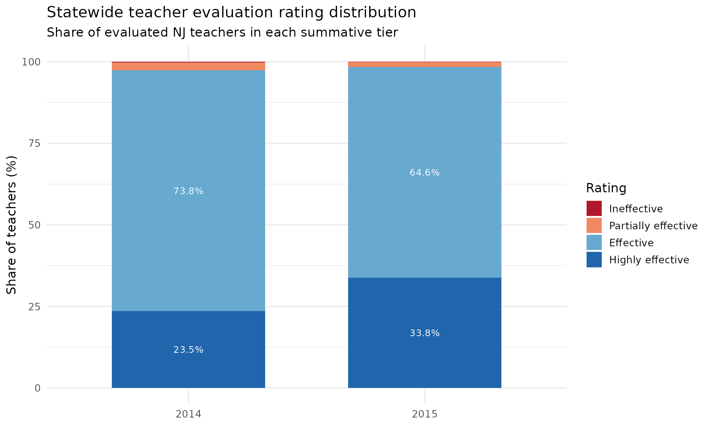
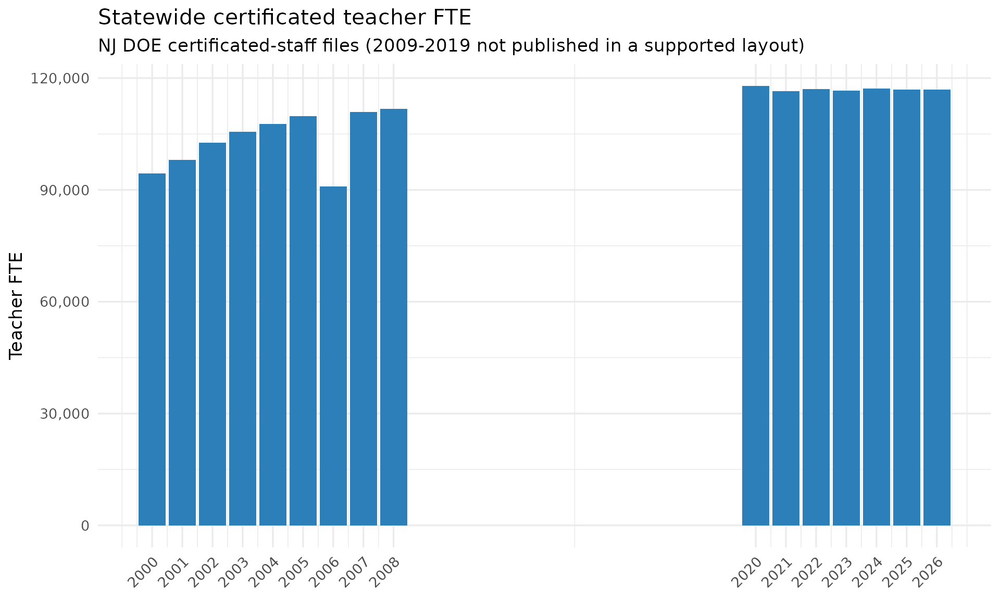
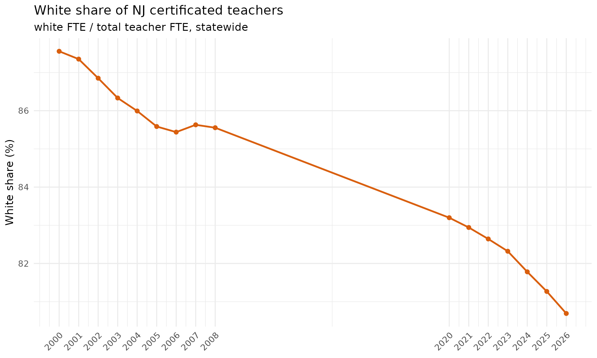

# Staff History: Educator Evaluations & the Certificated Workforce

``` r

library(njschooldata)
library(dplyr)
library(tidyr)
library(ggplot2)
```

Two NJ DOE “doedata” staff sources sit outside the School Performance
Reports and reach back well before them.
[`fetch_staff_evaluations()`](https://almartin82.github.io/njschooldata/reference/fetch_staff_evaluations.md)
returns the summative educator **evaluation rating distributions** NJ
published for the three years it ran the file (2014-2016), and
[`fetch_certificated_staff()`](https://almartin82.github.io/njschooldata/reference/fetch_certificated_staff.md)
returns the deep **certificated-staff FTE** series by position, race,
and gender (2000-2008 and 2020-2026; the 2009-2019 intermediate files
use a non-uniform layout and are not supported). Every number below
traces to a downloaded NJ DOE file: a `"*"` suppression mask is `NA`,
and a race column an era did not report is `NA`, never zero.

## Where do teacher evaluation ratings land?

NJ’s summative evaluation places each educator in one of four tiers. The
statewide teacher distribution (the published `is_state` row, available
2014 and 2015) clusters heavily at the top two tiers, and the **highly
effective** share jumped sharply between the two years.

``` r

eval_state <- bind_rows(
  fetch_staff_evaluations(2014, level = "district"),
  fetch_staff_evaluations(2015, level = "district")
) %>%
  filter(is_state, staff_category == "teachers")
```

``` r

tiers <- c("ineffective", "partially_effective", "effective", "highly_effective")

eval_long <- eval_state %>%
  select(end_year, all_of(tiers)) %>%
  pivot_longer(all_of(tiers), names_to = "rating", values_to = "n") %>%
  group_by(end_year) %>%
  mutate(share = 100 * n / sum(n, na.rm = TRUE)) %>%
  ungroup() %>%
  mutate(rating = factor(rating, levels = tiers))

# Print-before-plot: confirm the data feeding the chart.
stopifnot(nrow(eval_long) > 0)
eval_long %>% arrange(end_year, rating) %>% as.data.frame()
#>   end_year              rating     n      share
#> 1     2014         ineffective   205  0.1938369
#> 2     2014 partially_effective  2558  2.4187067
#> 3     2014           effective 78099 73.8461975
#> 4     2014    highly_effective 24897 23.5412589
#> 5     2015         ineffective   169  0.1586229
#> 6     2015 partially_effective  1490  1.3985095
#> 7     2015           effective 68845 64.6177094
#> 8     2015    highly_effective 36038 33.8251582
```

``` r

ggplot(eval_long, aes(x = factor(end_year), y = share, fill = rating)) +
  geom_col(width = 0.65) +
  geom_text(aes(label = ifelse(share >= 3, sprintf("%.1f%%", share), "")),
            position = position_stack(vjust = 0.5), colour = "white", size = 3.4) +
  scale_fill_manual(
    values = c(ineffective = "#b2182b", partially_effective = "#ef8a62",
               effective = "#67a9cf", highly_effective = "#2166ac"),
    labels = c("Ineffective", "Partially effective", "Effective",
               "Highly effective")
  ) +
  labs(
    title = "Statewide teacher evaluation rating distribution",
    subtitle = "Share of evaluated NJ teachers in each summative tier",
    x = NULL, y = "Share of teachers (%)", fill = "Rating"
  ) +
  theme_minimal(base_size = 13)
```



Effective and highly effective together account for more than 97% of
teachers in both years, and highly effective alone climbs from about 24%
to about 34% in a single year. (The 2016 workbook publishes no statewide
aggregate row, so the clean statewide comparison runs 2014-2015.)

## The certificated teacher workforce, across two eras

[`fetch_certificated_staff()`](https://almartin82.github.io/njschooldata/reference/fetch_certificated_staff.md)
reports staff full-time-equivalents (FTE), so counts are fractional.
Pulling the statewide teacher total across both covered eras shows a
workforce that grew through the 2000s and has held roughly flat in the
2020s.

``` r

years <- c(2000:2008, 2020:2026)
teachers_state <- bind_rows(lapply(years, function(y) {
  fetch_certificated_staff(y, level = "state") %>%
    filter(position == "teachers", gender == "total") %>%
    transmute(end_year, white, total)
}))
```

``` r

stopifnot(nrow(teachers_state) > 0)
teachers_state %>% as.data.frame()
#>    end_year   white    total
#> 1      2000 82666.0  94415.0
#> 2      2001 85667.0  98072.0
#> 3      2002 89216.0 102723.0
#> 4      2003 91134.0 105561.0
#> 5      2004 92568.0 107646.0
#> 6      2005 94001.0 109832.0
#> 7      2006 77668.0  90904.0
#> 8      2007 95019.0 110964.0
#> 9      2008 95638.0 111786.0
#> 10     2020 98078.4 117885.1
#> 11     2021 96624.5 116495.7
#> 12     2022 96674.4 116979.8
#> 13     2023 96066.6 116698.3
#> 14     2024 95794.3 117134.7
#> 15     2025 94984.6 116878.6
#> 16     2026 94336.4 116910.8
```

``` r

ggplot(teachers_state, aes(x = end_year, y = total)) +
  geom_col(fill = "#2c7fb8") +
  scale_x_continuous(breaks = years) +
  scale_y_continuous(labels = scales::comma) +
  labs(
    title = "Statewide certificated teacher FTE",
    subtitle = "NJ DOE certificated-staff files (2009-2019 not published in a supported layout)",
    x = NULL, y = "Teacher FTE"
  ) +
  theme_minimal(base_size = 13) +
  theme(axis.text.x = element_text(angle = 45, hjust = 1))
```



The gap from 2009 to 2019 is a coverage gap, not a workforce collapse:
those years exist but in a drifting layout the fetcher refuses to parse
rather than risk misaligned values. The single low bar at 2006 is the
value NJ published in that year’s file and is passed through as-is.

## The teaching workforce got less white

The same series carries race, so the white share of the teacher
workforce is directly computable across both eras. It has drifted down
from roughly 88% at the start of the 2000s toward about 81% in the
mid-2020s.

``` r

white_share <- teachers_state %>%
  mutate(pct_white = 100 * white / total)

stopifnot(nrow(white_share) > 0)
white_share %>%
  filter(end_year %in% c(2000, 2008, 2020, 2026)) %>%
  as.data.frame()
#>   end_year   white    total pct_white
#> 1     2000 82666.0  94415.0  87.55600
#> 2     2008 95638.0 111786.0  85.55454
#> 3     2020 98078.4 117885.1  83.19830
#> 4     2026 94336.4 116910.8  80.69092
```

``` r

ggplot(white_share, aes(x = end_year, y = pct_white)) +
  geom_line(colour = "#d95f0e", linewidth = 1) +
  geom_point(colour = "#d95f0e", size = 2) +
  scale_x_continuous(breaks = years) +
  labs(
    title = "White share of NJ certificated teachers",
    subtitle = "white FTE / total teacher FTE, statewide",
    x = NULL, y = "White share (%)"
  ) +
  theme_minimal(base_size = 13) +
  theme(axis.text.x = element_text(angle = 45, hjust = 1))
```



Note that the legacy era (2000-2008) reported a single combined
Asian/Pacific Islander group, so
[`fetch_certificated_staff()`](https://almartin82.github.io/njschooldata/reference/fetch_certificated_staff.md)
carries that combined count in `asian` and leaves `pacific_islander` and
`two_or_more` as `NA` for those years; the white share above is
unaffected by that distinction.

``` r

sessionInfo()
#> R version 4.6.1 (2026-06-24)
#> Platform: x86_64-pc-linux-gnu
#> Running under: Ubuntu 24.04.4 LTS
#> 
#> Matrix products: default
#> BLAS:   /usr/lib/x86_64-linux-gnu/openblas-pthread/libblas.so.3 
#> LAPACK: /usr/lib/x86_64-linux-gnu/openblas-pthread/libopenblasp-r0.3.26.so;  LAPACK version 3.12.0
#> 
#> locale:
#>  [1] LC_CTYPE=C.UTF-8       LC_NUMERIC=C           LC_TIME=C.UTF-8       
#>  [4] LC_COLLATE=C.UTF-8     LC_MONETARY=C.UTF-8    LC_MESSAGES=C.UTF-8   
#>  [7] LC_PAPER=C.UTF-8       LC_NAME=C              LC_ADDRESS=C          
#> [10] LC_TELEPHONE=C         LC_MEASUREMENT=C.UTF-8 LC_IDENTIFICATION=C   
#> 
#> time zone: UTC
#> tzcode source: system (glibc)
#> 
#> attached base packages:
#> [1] stats     graphics  grDevices utils     datasets  methods   base     
#> 
#> other attached packages:
#> [1] ggplot2_4.0.3       tidyr_1.3.2         dplyr_1.2.1        
#> [4] njschooldata_0.9.25
#> 
#> loaded via a namespace (and not attached):
#>  [1] sass_0.4.10        generics_0.1.4     stringi_1.8.7      hms_1.1.4         
#>  [5] digest_0.6.39      magrittr_2.0.5     evaluate_1.0.5     grid_4.6.1        
#>  [9] timechange_0.4.0   RColorBrewer_1.1-3 fastmap_1.2.0      cellranger_1.1.0  
#> [13] jsonlite_2.0.0     purrr_1.2.2        scales_1.4.0       codetools_0.2-20  
#> [17] textshaping_1.0.5  jquerylib_0.1.4    cli_3.6.6          crayon_1.5.3      
#> [21] rlang_1.3.0        bit64_4.8.2        withr_3.0.3        cachem_1.1.0      
#> [25] yaml_2.3.12        otel_0.2.0         parallel_4.6.1     downloader_0.4.1  
#> [29] tools_4.6.1        tzdb_0.5.0         vctrs_0.7.3        R6_2.6.1          
#> [33] lifecycle_1.0.5    lubridate_1.9.5    snakecase_0.11.1   stringr_1.6.0     
#> [37] bit_4.6.0          fs_2.1.0           vroom_1.7.1        ragg_1.5.2        
#> [41] janitor_2.2.1      pkgconfig_2.0.3    desc_1.4.3         pkgdown_2.2.0     
#> [45] pillar_1.11.1      bslib_0.11.0       gtable_0.3.6       glue_1.8.1        
#> [49] systemfonts_1.3.2  xfun_0.59          tibble_3.3.1       tidyselect_1.2.1  
#> [53] knitr_1.51         farver_2.1.2       htmltools_0.5.9    labeling_0.4.3    
#> [57] rmarkdown_2.31     readr_2.2.0        compiler_4.6.1     S7_0.2.2          
#> [61] readxl_1.5.0
```
