# Following the Money: 25 Years of Spending in South Orange-Maplewood

``` r

library(njschooldata)
library(ggplot2)
library(dplyr)
library(scales)
library(purrr)
library(tibble)

# The arts section reads a School Performance Report workbook (~100 MB), so give
# the download more than R's stingy 60-second default.
options(timeout = max(600, getOption("timeout")))
```

``` r

theme_nj <- function() {
  theme_minimal(base_size = 14) +
    theme(
      plot.title = element_text(face = "bold", size = 16),
      plot.subtitle = element_text(color = "gray40"),
      plot.caption = element_text(color = "gray55", size = 9),
      panel.grid.minor = element_blank(),
      legend.position = "bottom"
    )
}

somsd_navy   <- "#1F3A5F"
somsd_orange <- "#E67E22"
somsd_teal   <- "#16A085"
somsd_red    <- "#C0392B"
somsd_purple <- "#8E44AD"
```

The [Taxpayers’ Guide to Educational
Spending](https://www.nj.gov/education/guide/) (TGES) is the New Jersey
Department of Education’s annual report on what every district spends,
broken down per pupil into classroom instruction, support services,
administration, plant operations, and more. `njschooldata` pulls it
straight from the state for every year back to 2001 (the pre-2011
editions were branded the “Comparative Spending Guide”).

This article follows one district, **South Orange-Maplewood (SOMSD)**,
over a quarter century. It’s a single mid-sized K-12 district in Essex
County, but the patterns are the kind every NJ taxpayer eventually asks
about: where the money goes, why the benefits line keeps climbing, and
who actually pays the bill.

`fetch_tges(year)` returns one tidy data frame per spending indicator:

``` r

spending_2025 <- fetch_tges(2025)

# one tidy table per TGES indicator (CSG1 = total budgetary cost per pupil)
names(spending_2025)
#>  [1] "CSG1"              "CSG10"             "CSG11"            
#>  [4] "CSG12"             "CSG13"             "CSG14"            
#>  [7] "CSG15"             "CSG16"             "CSG17"            
#> [10] "CSG18"             "CSG19"             "CSG1AA_AVGS"      
#> [13] "CSG2"              "CSG20"             "CSG21"            
#> [16] "CSG3"              "CSG4"              "CSG5"             
#> [19] "CSG6"              "CSG7"              "CSG8"             
#> [22] "CSG8A"             "CSG9"              "SUMMARY"          
#> [25] "SUMYR3"            "SUMYR3C"           "SUMYR4"           
#> [28] "SUMYR4C"           "SUMYR5"            "SUMYR5C"          
#> [31] "VITSTAT_TOTAL"     "DETAIL_FY23"       "DETAIL_FY24"      
#> [34] "OCTOBER2024_DRTRS"
```

Each table is district-level and long, with a three-year window per
report: two finalized `Actuals` years plus the current `Budgeted` year.
SOMSD is district code `4900`.

``` r

spending_2025[["CSG1"]] %>%
  filter(district_id == "4900") %>%
  select(district_name, end_year, calc_type, `Per Pupil costs`, `District rank`)
#> # A tibble: 3 × 5
#>   district_name          end_year calc_type `Per Pupil costs` `District rank`
#>   <chr>                     <dbl> <chr>                 <dbl>           <int>
#> 1 South Orange-Maplewood     2023 Actuals               18321              52
#> 2 South Orange-Maplewood     2024 Actuals               18952              49
#> 3 South Orange-Maplewood     2025 Budgeted              20066              41
```

``` r

# Pull every published guide, 2001-2025. fetch_tges(2025) was already fetched
# above, so reuse it and download the rest. Drop (with a visible warning) any
# year that fails rather than letting one network hiccup kill the whole build.
reports <- list("2025" = spending_2025)
for (y in 2001:2024) {
  reports[[as.character(y)]] <- tryCatch(
    fetch_tges(y),
    error = function(e) {
      warning(paste("TGES", y, "failed:", conditionMessage(e)))
      NULL
    }
  )
}
reports <- reports[!vapply(reports, is.null, logical(1))]
reports <- reports[order(as.integer(names(reports)))]
```

``` r

SOMSD <- "4900"

# Pull one SOMSD value column across every report and keep one row per school
# year. Each actual recurs in consecutive guides; we keep the most recent
# (most finalized) report's figure. VITSTAT/CSG16 carry no calc_type, so the
# calc filter is skipped for them.
somsd_series <- function(table, value_col, calc = "Actuals") {
  map_dfr(names(reports), function(y) {
    d <- reports[[y]][[table]]
    if (is.null(d) || !value_col %in% names(d)) return(NULL)
    r <- filter(d, !is.na(district_id), district_id == SOMSD)
    if ("calc_type" %in% names(r)) r <- filter(r, calc_type == calc)
    if (nrow(r) == 0) return(NULL)
    tibble(report_year = as.integer(y), end_year = r$end_year, value = r[[value_col]])
  }) %>%
    group_by(end_year) %>%
    slice_max(report_year, n = 1, with_ties = FALSE) %>%
    ungroup() %>%
    arrange(end_year)
}
```

## 1. A decade of flat spending, then a sharp surge

For most of the 2010s, SOMSD’s actual budgetary cost per pupil barely
moved: about \$14,300 in 2010 and \$14,700 in 2019, a real-terms decline
once you account for inflation. Then it broke loose. Actuals jumped from
\$14,660 (2020) to \$18,952 (2024), and the 2025 budget sets it at
\$20,066.

``` r

pp <- somsd_series("CSG1", "Per Pupil costs", "Actuals")
pp_budget_2025 <- somsd_series("CSG1", "Per Pupil costs", "Budgeted") %>%
  filter(end_year == 2025)

stopifnot(nrow(pp) > 0, nrow(pp_budget_2025) == 1)
pp
#> # A tibble: 26 × 3
#>    report_year end_year value
#>          <int>    <dbl> <dbl>
#>  1        2001     1999  7946
#>  2        2002     2000  8260
#>  3        2003     2001  8691
#>  4        2004     2002  9219
#>  5        2005     2003  9626
#>  6        2006     2004 10271
#>  7        2007     2005 11101
#>  8        2008     2006 11366
#>  9        2009     2007 12594
#> 10        2010     2008 12983
#> # ℹ 16 more rows
```

``` r

ggplot(pp, aes(end_year, value)) +
  annotate("rect", xmin = 2010, xmax = 2019, ymin = -Inf, ymax = Inf,
           fill = "gray85", alpha = 0.5) +
  annotate("text", x = 2014.5, y = 19500, label = "flat decade",
           color = "gray45", fontface = "italic") +
  geom_line(color = somsd_navy, linewidth = 1.2) +
  geom_point(color = somsd_navy, size = 2) +
  geom_point(data = pp_budget_2025, aes(end_year, value),
             color = somsd_orange, size = 3, shape = 17) +
  annotate("text", x = 2024.7, y = pp_budget_2025$value + 900,
           label = "2025\nbudgeted", color = somsd_orange, size = 3.3) +
  scale_y_continuous(labels = dollar) +
  scale_x_continuous(breaks = seq(2000, 2025, 5)) +
  labs(title = "SOMSD per-pupil spending: flat, then a post-2020 surge",
       subtitle = "Budgetary cost per pupil, actuals (2025 is budgeted)",
       x = NULL, y = "Cost per pupil",
       caption = "Source: NJ DOE Taxpayers' Guide to Educational Spending") +
  theme_nj()
```

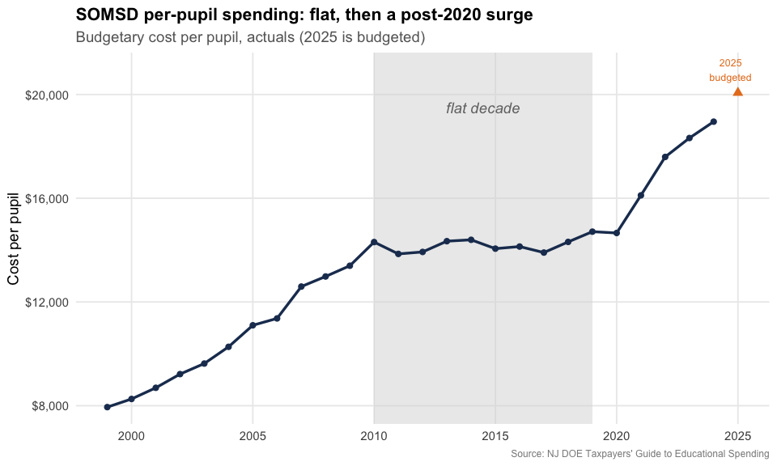

## 2. Benefits ate the salary line

Here’s the trend that drives every contentious school budget meeting:
employee benefits as a share of salaries. In SOMSD it has **more than
doubled**, from 11.8% in 1999 to 24.4% in 2024. Health-plan premiums
(SEHBP) are the main driver, and they keep climbing faster than pay.

``` r

benefits <- somsd_series("CSG14", "% of Total Salaries", "Actuals")
stopifnot(nrow(benefits) > 0)
benefits
#> # A tibble: 26 × 3
#>    report_year end_year value
#>          <int>    <dbl> <dbl>
#>  1        2001     1999 0.118
#>  2        2002     2000 0.13 
#>  3        2003     2001 0.142
#>  4        2004     2002 0.142
#>  5        2005     2003 0.164
#>  6        2006     2004 0.186
#>  7        2007     2005 0.195
#>  8        2008     2006 0.214
#>  9        2009     2007 0.211
#> 10        2010     2008 0.214
#> # ℹ 16 more rows
```

``` r

ggplot(benefits, aes(end_year, value)) +
  geom_area(fill = somsd_orange, alpha = 0.25) +
  geom_line(color = somsd_orange, linewidth = 1.2) +
  geom_point(color = somsd_orange, size = 2) +
  scale_y_continuous(labels = percent_format(accuracy = 1),
                     limits = c(0, NA)) +
  scale_x_continuous(breaks = seq(2000, 2025, 5)) +
  labs(title = "Employee benefits as a share of salaries doubled",
       subtitle = "SOMSD benefit costs divided by total salaries, 1999-2024",
       x = NULL, y = "Benefits / salaries",
       caption = "Source: NJ DOE TGES (CSG14)") +
  theme_nj()
```

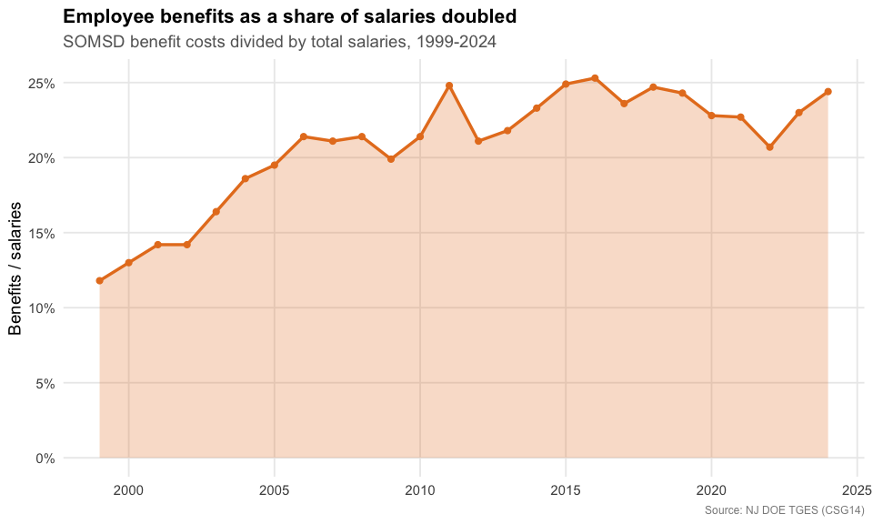

## 3. Who pays the bill is shifting

SOMSD is a property-tax town: local taxpayers funded about **85%** of
the budget in 2010. But the state’s share has roughly doubled since then
(from 12% to 26%), while the local share fell to 70%. Federal money
never tops a few percent.

``` r

revenue <- bind_rows(
  somsd_series("VITSTAT_TOTAL", "Revenue: Local %") %>% mutate(source = "Local taxes"),
  somsd_series("VITSTAT_TOTAL", "Revenue: State %")  %>% mutate(source = "State aid")
)
stopifnot(nrow(revenue) > 0)

revenue %>%
  tidyr::pivot_wider(id_cols = end_year, names_from = source, values_from = value)
#> # A tibble: 15 × 3
#>    end_year `Local taxes` `State aid`
#>       <dbl>         <dbl>       <dbl>
#>  1     2010         0.845       0.121
#>  2     2011         0.891       0.086
#>  3     2012         0.857       0.116
#>  4     2013         0.845       0.134
#>  5     2014         0.852       0.124
#>  6     2015         0.861       0.136
#>  7     2016         0.842       0.139
#>  8     2017         0.831       0.148
#>  9     2018         0.825       0.159
#> 10     2019         0.813       0.169
#> 11     2020         0.801       0.183
#> 12     2021         0.761       0.221
#> 13     2022         0.718       0.248
#> 14     2023         0.696       0.244
#> 15     2024         0.704       0.255
```

``` r

ggplot(revenue, aes(end_year, value, color = source)) +
  geom_line(linewidth = 1.2) +
  geom_point(size = 2) +
  scale_color_manual(values = c("Local taxes" = somsd_navy, "State aid" = somsd_teal)) +
  scale_y_continuous(labels = percent_format(accuracy = 1)) +
  scale_x_continuous(breaks = seq(2010, 2024, 4)) +
  labs(title = "Local taxpayers still carry SOMSD, but state aid is rising",
       subtitle = "Share of revenue by source",
       x = NULL, y = "Share of revenue", color = NULL,
       caption = "Source: NJ DOE TGES Vital Statistics") +
  theme_nj()
```

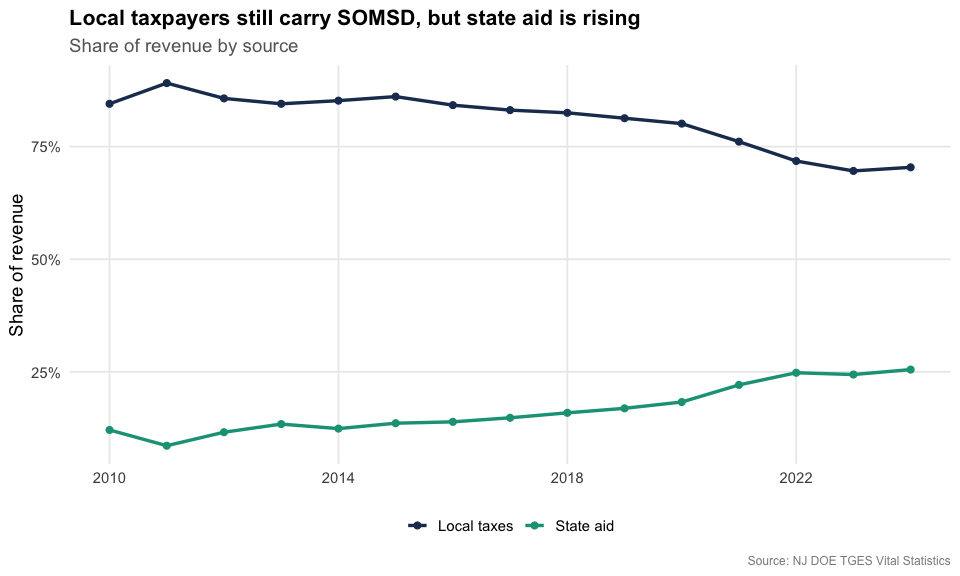

## 4. Teacher pay up, class sizes down

The median teacher salary nearly doubled over the period, from about
\$45,000 to roughly \$84,000. Over the same stretch the
student-to-teacher ratio drifted down from 14:1 toward 11:1, so the
district is paying more teachers, more.

``` r

salary <- somsd_series("CSG16", "Teacher Salary")
ratio  <- somsd_series("CSG16", "Student/Teacher ratio")
stopifnot(nrow(salary) > 0, nrow(ratio) > 0)
salary %>%
  inner_join(ratio, by = "end_year", suffix = c("_salary", "_ratio")) %>%
  transmute(end_year, median_salary = value_salary, students_per_teacher = value_ratio)
#> # A tibble: 26 × 3
#>    end_year median_salary students_per_teacher
#>       <dbl>         <dbl>                <dbl>
#>  1     2000         48624                 14.2
#>  2     2001         44696                 14  
#>  3     2002         50000                 14.2
#>  4     2003         49720                 13.8
#>  5     2004         54897                 13.8
#>  6     2005         58122                 13.4
#>  7     2006         58122                 13.4
#>  8     2007         54369                 12.8
#>  9     2008         67365                 12.8
#> 10     2009         69677                 12.7
#> # ℹ 16 more rows
```

``` r

ggplot(salary, aes(end_year, value)) +
  geom_line(color = somsd_purple, linewidth = 1.2) +
  geom_point(color = somsd_purple, size = 2) +
  scale_y_continuous(labels = dollar) +
  scale_x_continuous(breaks = seq(2000, 2025, 5)) +
  labs(title = "Median teacher salary nearly doubled",
       subtitle = "SOMSD median classroom-teacher salary",
       x = NULL, y = "Median salary",
       caption = "Source: NJ DOE TGES (CSG16)") +
  theme_nj()
```

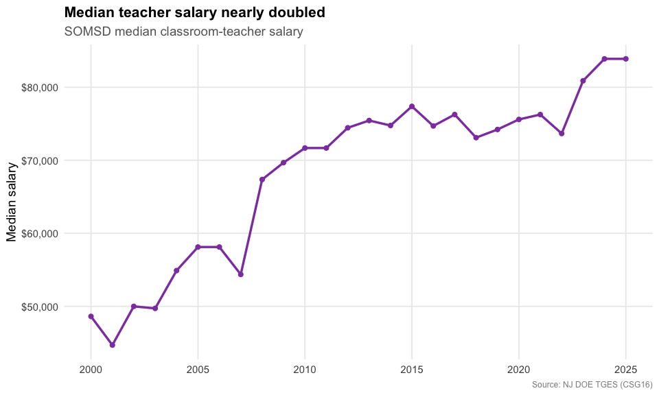

``` r

ggplot(ratio, aes(end_year, value)) +
  geom_line(color = somsd_teal, linewidth = 1.2) +
  geom_point(color = somsd_teal, size = 2) +
  scale_x_continuous(breaks = seq(2000, 2025, 5)) +
  labs(title = "...while the student-to-teacher ratio fell",
       subtitle = "Students per teacher",
       x = NULL, y = "Students per teacher",
       caption = "Source: NJ DOE TGES (CSG16)") +
  theme_nj()
```

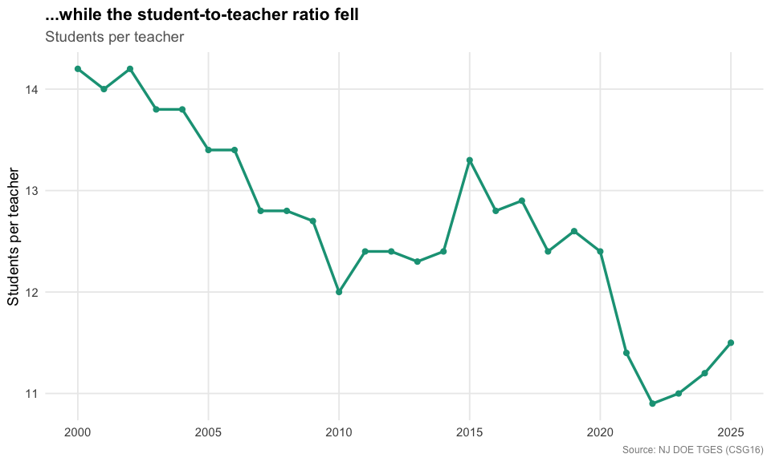

## 5. Where each dollar goes

TGES breaks the budgetary cost per pupil into its components. In the
2025 budget, classroom instruction is by far the biggest slice (about 61
cents of every dollar), followed by support services, plant operations,
and administration.

``` r

category_tables <- tribble(
  ~category,                  ~table,
  "Classroom instruction",    "CSG2",
  "Support services",         "CSG6",
  "Plant ops & maintenance",  "CSG10",
  "Administration",           "CSG8",
  "Extracurricular",          "CSG13"
)

categories <- map_dfr(seq_len(nrow(category_tables)), function(i) {
  d <- reports[["2025"]][[category_tables$table[i]]]
  r <- filter(d, district_id == SOMSD, end_year == 2025)
  tibble(category = category_tables$category[i],
         per_pupil = r[["Per Pupil costs"]][1])
})

stopifnot(nrow(categories) > 0, all(!is.na(categories$per_pupil)))
categories %>% arrange(desc(per_pupil))
#> # A tibble: 5 × 2
#>   category                per_pupil
#>   <chr>                       <dbl>
#> 1 Classroom instruction       12338
#> 2 Support services             3195
#> 3 Plant ops & maintenance      2394
#> 4 Administration               1874
#> 5 Extracurricular               242
```

``` r

ggplot(categories, aes(reorder(category, per_pupil), per_pupil)) +
  geom_col(fill = somsd_navy) +
  geom_text(aes(label = dollar(per_pupil)), hjust = -0.1, size = 3.5) +
  coord_flip() +
  scale_y_continuous(labels = dollar, expand = expansion(mult = c(0, 0.15))) +
  labs(title = "Where SOMSD spends, per pupil (2025 budget)",
       subtitle = "Classroom instruction dominates the budgetary cost per pupil",
       x = NULL, y = "Cost per pupil",
       caption = "Source: NJ DOE TGES (CSG2, CSG6, CSG8, CSG10, CSG13)") +
  theme_nj()
```

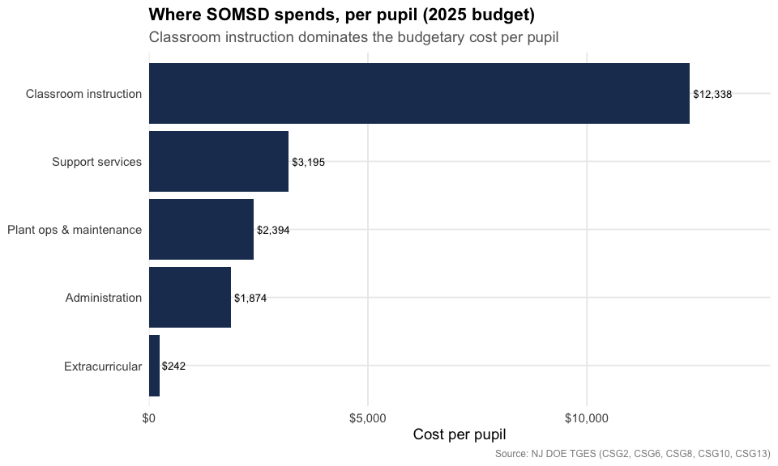

## 6. Drifting through the pack of big districts

TGES ranks each district against its peer group. SOMSD sits with the
large K-12 districts (3,500+ students). In this ranking, **1 = the
lowest spender**, so a higher number means spending more than peers.
SOMSD climbed toward the top of the pack by 2010, slid to near the
bottom during its flat decade as peers kept growing, then recovered to
mid-pack after the post-2020 surge.

``` r

rank <- somsd_series("CSG1", "District rank", "Actuals")
stopifnot(nrow(rank) > 0)

# size of the peer group in the most recent guide, for context
n_peers <- reports[["2025"]][["CSG1"]] %>%
  filter(group == "G. K-12 / 3501 +", end_year == 2025,
         !is.na(district_id), district_id != "00NA") %>%
  nrow()
n_peers
#> [1] 100

rank
#> # A tibble: 26 × 3
#>    report_year end_year value
#>          <int>    <dbl> <int>
#>  1        2001     1999    43
#>  2        2002     2000    46
#>  3        2003     2001    51
#>  4        2004     2002    56
#>  5        2005     2003    56
#>  6        2006     2004    59
#>  7        2007     2005    64
#>  8        2008     2006    64
#>  9        2009     2007    72
#> 10        2010     2008    70
#> # ℹ 16 more rows
```

``` r

ggplot(rank, aes(end_year, value)) +
  geom_line(color = somsd_red, linewidth = 1.2) +
  geom_point(color = somsd_red, size = 2) +
  scale_x_continuous(breaks = seq(2000, 2024, 4)) +
  labs(title = "SOMSD's spending rank among large K-12 districts",
       subtitle = paste0("Rank within the ", n_peers,
                          "-district peer group (1 = lowest spender)"),
       x = NULL, y = "Spending rank",
       caption = "Source: NJ DOE TGES (CSG1). Peer-group composition shifts modestly year to year.") +
  theme_nj()
```

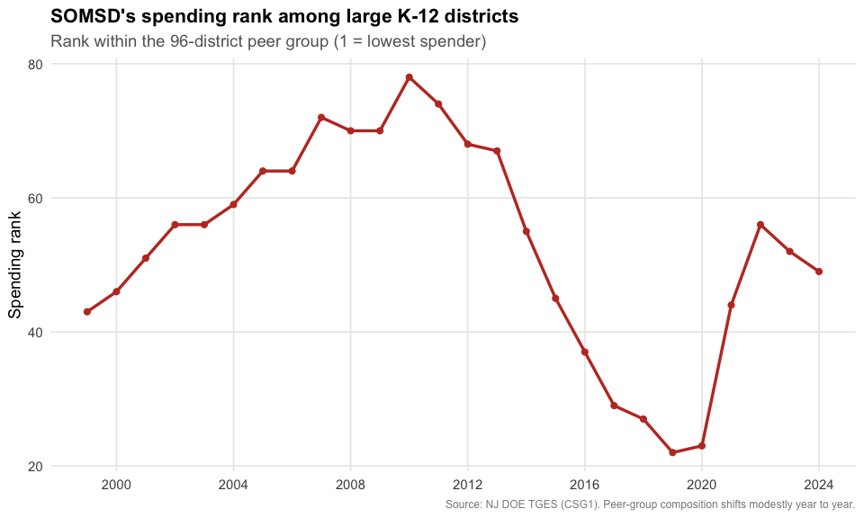

## 7. A closer look at the classroom dollar

TGES splits classroom instruction into three pieces: salaries and
benefits, supplies and textbooks, and “purchased services and other.”
Two things jump out. Spending on books and supplies has been frozen near
\$200 per pupil for 25 years, a steep real-terms cut. Meanwhile
purchased services, contracted and out-of-district instruction, went
from a rounding error (\$7 per pupil in 1999) to \$1,804 in 2024, about
15 cents of every classroom dollar.

``` r

classroom_parts <- bind_rows(
  somsd_series("CSG3", "Per Pupil costs") %>% mutate(part = "Salaries & benefits"),
  somsd_series("CSG4", "Per Pupil costs") %>% mutate(part = "Supplies & textbooks"),
  somsd_series("CSG5", "Per Pupil costs") %>% mutate(part = "Purchased services & other")
) %>%
  mutate(part = factor(part, levels = c("Salaries & benefits",
                                        "Supplies & textbooks",
                                        "Purchased services & other")))
stopifnot(nrow(classroom_parts) > 0)

classroom_parts %>%
  filter(end_year %in% c(1999, 2008, 2016, 2024)) %>%
  select(end_year, part, value) %>%
  arrange(end_year, part)
#> # A tibble: 12 × 3
#>    end_year part                       value
#>       <dbl> <fct>                      <dbl>
#>  1     1999 Salaries & benefits         4316
#>  2     1999 Supplies & textbooks         161
#>  3     1999 Purchased services & other     7
#>  4     2008 Salaries & benefits         7065
#>  5     2008 Supplies & textbooks         198
#>  6     2008 Purchased services & other    35
#>  7     2016 Salaries & benefits         7646
#>  8     2016 Supplies & textbooks         195
#>  9     2016 Purchased services & other   736
#> 10     2024 Salaries & benefits         9753
#> 11     2024 Supplies & textbooks         229
#> 12     2024 Purchased services & other  1804
```

``` r

ggplot(classroom_parts, aes(end_year, value, fill = part)) +
  geom_area(alpha = 0.9) +
  scale_fill_manual(values = c("Salaries & benefits" = somsd_navy,
                               "Supplies & textbooks" = somsd_teal,
                               "Purchased services & other" = somsd_orange)) +
  scale_y_continuous(labels = dollar) +
  scale_x_continuous(breaks = seq(2000, 2024, 6)) +
  labs(title = "The classroom dollar: contracted services moved in",
       subtitle = "SOMSD classroom cost per pupil by component",
       x = NULL, y = "Cost per pupil", fill = NULL,
       caption = "Source: NJ DOE TGES (CSG3, CSG4, CSG5)") +
  theme_nj()
```

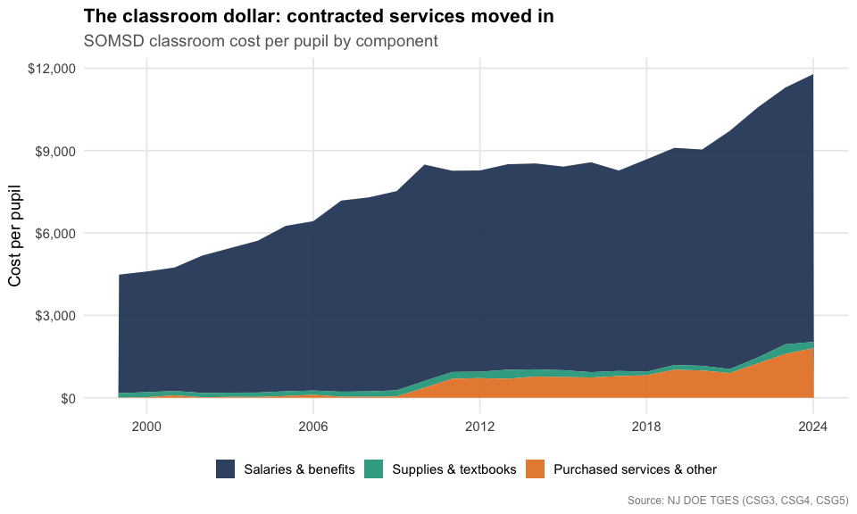

## 8. Facilities: a frozen line on aging buildings

Plant operations and maintenance, the cost of heating, cleaning, and
repairing school buildings, barely budged for over a decade. It hovered
around \$1,800 to \$2,000 per pupil from 2008 through 2022 even as total
spending climbed, so its **share of the budget fell from about 16% to
12%**. That is the kind of deferred upkeep that eventually shows up as a
capital referendum. (TGES tracks operating cost, not the separate
capital bonds districts float to rebuild.)

``` r

facilities <- somsd_series("CSG10", "Per Pupil costs") %>%
  select(end_year, facilities = value) %>%
  inner_join(somsd_series("CSG1", "Per Pupil costs") %>% select(end_year, total = value),
             by = "end_year") %>%
  mutate(share = facilities / total)
stopifnot(nrow(facilities) > 0)
facilities
#> # A tibble: 26 × 4
#>    end_year facilities total share
#>       <dbl>      <dbl> <dbl> <dbl>
#>  1     1999       1110  7946 0.140
#>  2     2000       1127  8260 0.136
#>  3     2001       1123  8691 0.129
#>  4     2002       1289  9219 0.140
#>  5     2003       1413  9626 0.147
#>  6     2004       1693 10271 0.165
#>  7     2005       1750 11101 0.158
#>  8     2006       1831 11366 0.161
#>  9     2007       1806 12594 0.143
#> 10     2008       2062 12983 0.159
#> # ℹ 16 more rows
```

``` r

ggplot(facilities, aes(end_year, share)) +
  geom_line(color = somsd_red, linewidth = 1.2) +
  geom_point(color = somsd_red, size = 2) +
  scale_y_continuous(labels = percent_format(accuracy = 1), limits = c(0, NA)) +
  scale_x_continuous(breaks = seq(2000, 2024, 6)) +
  labs(title = "Facilities' slice of the budget shrank",
       subtitle = "Plant operations & maintenance as a share of budgetary cost per pupil",
       x = NULL, y = "Facilities share of budget",
       caption = "Source: NJ DOE TGES (CSG10 / CSG1)") +
  theme_nj()
```

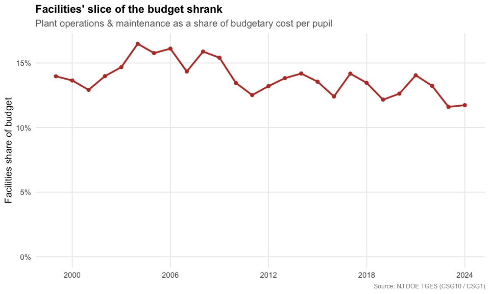

## 9. What the spending buys: the arts

TGES tells you what a district spends; the School Performance Report
tells you what students actually take. In a town known for its arts
scene, that second question matters.
[`fetch_arts_enrollment()`](https://almartin82.github.io/njschooldata/reference/fetch_arts_enrollment.md)
pulls visual and performing arts participation, and SOMSD runs well
ahead of the state at every grade level. The gap is widest in middle
school: nearly every 6th-8th grader takes an arts course, 86% take music
(vs 64% statewide), and **30% take dance against a state rate of just
4%**.

``` r

arts_raw <- fetch_arts_enrollment(2024, level = "district") %>%
  filter(district_id == "4900")
stopifnot(nrow(arts_raw) > 0)
```

``` r

arts_any <- arts_raw %>%
  transmute(grades,
            SOMSD = as.numeric(any_visual_perf_art_district),
            `New Jersey` = as.numeric(any_visual_perf_art_state)) %>%
  tidyr::pivot_longer(c(SOMSD, `New Jersey`), names_to = "geo", values_to = "pct")
stopifnot(nrow(arts_any) > 0)
arts_any
#> # A tibble: 6 × 3
#>   grades      geo          pct
#>   <chr>       <chr>      <dbl>
#> 1 Grades 6-8  SOMSD       99.7
#> 2 Grades 6-8  New Jersey  90  
#> 3 Grades 9-12 SOMSD       63.4
#> 4 Grades 9-12 New Jersey  51.3
#> 5 Grades KG-5 SOMSD       99.4
#> 6 Grades KG-5 New Jersey  93.6
```

``` r

ggplot(arts_any, aes(grades, pct, fill = geo)) +
  geom_col(position = position_dodge(width = 0.75), width = 0.7) +
  geom_text(aes(label = paste0(round(pct), "%")),
            position = position_dodge(width = 0.75), vjust = -0.4, size = 3.3) +
  scale_fill_manual(values = c("SOMSD" = somsd_navy, "New Jersey" = "gray65")) +
  scale_y_continuous(labels = percent_format(scale = 1), limits = c(0, 108)) +
  labs(title = "SOMSD students take the arts at above-state rates",
       subtitle = "Share taking any visual or performing arts course, 2023-24",
       x = NULL, y = "Students taking an arts course", fill = NULL,
       caption = "Source: NJ DOE School Performance Report (Visual & Performing Arts)") +
  theme_nj()
```

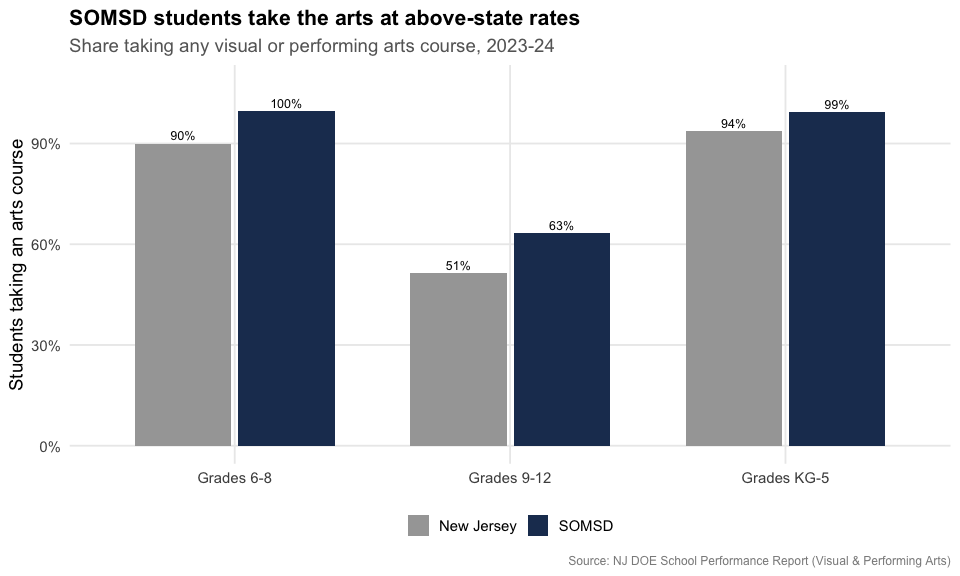

``` r

arts_disc <- arts_raw %>%
  filter(grades == "Grades 6-8") %>%
  select(music_district, music_state, dance_district, dance_state,
         drama_district, drama_state, vis_arts_district, vis_arts_state) %>%
  mutate(across(everything(), as.numeric)) %>%
  tidyr::pivot_longer(everything(),
                      names_to = c("discipline", "geo"),
                      names_pattern = "(.*)_(district|state)",
                      values_to = "pct") %>%
  mutate(geo = recode(geo, district = "SOMSD", state = "New Jersey"),
         discipline = recode(discipline, music = "Music", dance = "Dance",
                             drama = "Drama/Theater", vis_arts = "Visual arts"))
stopifnot(nrow(arts_disc) > 0)
arts_disc
#> # A tibble: 8 × 3
#>   discipline    geo          pct
#>   <chr>         <chr>      <dbl>
#> 1 Music         SOMSD       85.6
#> 2 Music         New Jersey  64.3
#> 3 Dance         SOMSD       29.5
#> 4 Dance         New Jersey   4.3
#> 5 Drama/Theater SOMSD       15.3
#> 6 Drama/Theater New Jersey   7.7
#> 7 Visual arts   SOMSD       78.3
#> 8 Visual arts   New Jersey  68.9
```

``` r

ggplot(arts_disc, aes(reorder(discipline, -pct), pct, fill = geo)) +
  geom_col(position = position_dodge(width = 0.75), width = 0.7) +
  geom_text(aes(label = paste0(round(pct), "%")),
            position = position_dodge(width = 0.75), vjust = -0.4, size = 3.3) +
  scale_fill_manual(values = c("SOMSD" = somsd_navy, "New Jersey" = "gray65")) +
  scale_y_continuous(labels = percent_format(scale = 1), limits = c(0, 100)) +
  labs(title = "Middle-school arts: SOMSD vs New Jersey",
       subtitle = "Share of grade 6-8 students taking each art form, 2023-24",
       x = NULL, y = "Students participating", fill = NULL,
       caption = "Source: NJ DOE School Performance Report (Visual & Performing Arts)") +
  theme_nj()
```

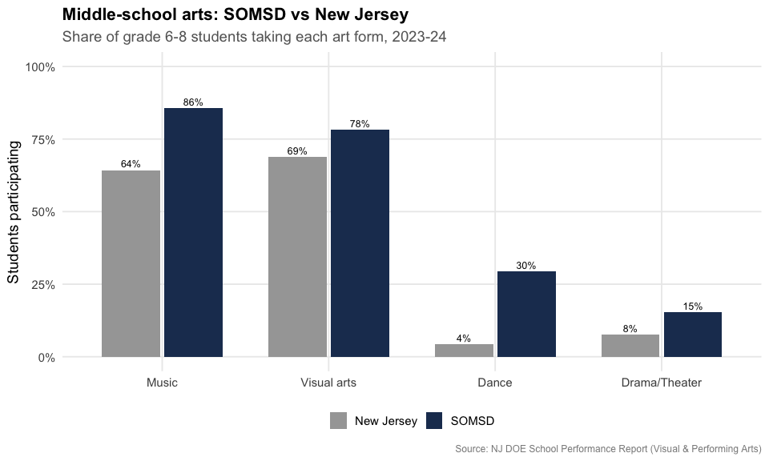

## Reproduce this yourself

Every chart above comes from
[`fetch_tges()`](https://almartin82.github.io/njschooldata/reference/fetch_tges.md).
Once you have a year’s tables (`spending_2025 <- fetch_tges(2025)`),
pulling SOMSD’s benefits trend is two lines:

``` r

spending_2025[["CSG14"]] %>%
  filter(district_id == "4900", calc_type == "Actuals") %>%
  select(district_name, end_year, `% of Total Salaries`)
#> # A tibble: 2 × 3
#>   district_name          end_year `% of Total Salaries`
#>   <chr>                     <dbl>                 <dbl>
#> 1 South Orange-Maplewood     2023                 0.23 
#> 2 South Orange-Maplewood     2024                 0.244
```

Swap the district code for any NJ district, or loop
`fetch_many_tges(2001:2025)` for the full history.

``` r

sessionInfo()
#> R version 4.6.0 (2026-04-24)
#> Platform: x86_64-pc-linux-gnu
#> Running under: Ubuntu 24.04.4 LTS
#> 
#> Matrix products: default
#> BLAS:   /usr/lib/x86_64-linux-gnu/openblas-pthread/libblas.so.3 
#> LAPACK: /usr/lib/x86_64-linux-gnu/openblas-pthread/libopenblasp-r0.3.26.so;  LAPACK version 3.12.0
#> 
#> locale:
#>  [1] LC_CTYPE=C.UTF-8       LC_NUMERIC=C           LC_TIME=C.UTF-8       
#>  [4] LC_COLLATE=C.UTF-8     LC_MONETARY=C.UTF-8    LC_MESSAGES=C.UTF-8   
#>  [7] LC_PAPER=C.UTF-8       LC_NAME=C              LC_ADDRESS=C          
#> [10] LC_TELEPHONE=C         LC_MEASUREMENT=C.UTF-8 LC_IDENTIFICATION=C   
#> 
#> time zone: UTC
#> tzcode source: system (glibc)
#> 
#> attached base packages:
#> [1] stats     graphics  grDevices utils     datasets  methods   base     
#> 
#> other attached packages:
#> [1] tibble_3.3.1        purrr_1.2.2         scales_1.4.0       
#> [4] dplyr_1.2.1         ggplot2_4.0.3       njschooldata_0.9.12
#> 
#> loaded via a namespace (and not attached):
#>  [1] utf8_1.2.6         sass_0.4.10        generics_0.1.4     tidyr_1.3.2       
#>  [5] stringi_1.8.7      hms_1.1.4          digest_0.6.39      magrittr_2.0.5    
#>  [9] evaluate_1.0.5     grid_4.6.0         timechange_0.4.0   RColorBrewer_1.1-3
#> [13] fastmap_1.2.0      cellranger_1.1.0   jsonlite_2.0.0     codetools_0.2-20  
#> [17] textshaping_1.0.5  jquerylib_0.1.4    cli_3.6.6          crayon_1.5.3      
#> [21] rlang_1.2.0        bit64_4.8.2        withr_3.0.2        cachem_1.1.0      
#> [25] yaml_2.3.12        parallel_4.6.0     downloader_0.4.1   tools_4.6.0       
#> [29] tzdb_0.5.0         vctrs_0.7.3        R6_2.6.1           lifecycle_1.0.5   
#> [33] lubridate_1.9.5    snakecase_0.11.1   stringr_1.6.0      bit_4.6.0         
#> [37] fs_2.1.0           vroom_1.7.1        foreign_0.8-91     ragg_1.5.2        
#> [41] janitor_2.2.1      pkgconfig_2.0.3    desc_1.4.3         pkgdown_2.2.0     
#> [45] pillar_1.11.1      bslib_0.11.0       gtable_0.3.6       glue_1.8.1        
#> [49] systemfonts_1.3.2  xfun_0.57          tidyselect_1.2.1   knitr_1.51        
#> [53] farver_2.1.2       htmltools_0.5.9    labeling_0.4.3     rmarkdown_2.31    
#> [57] readr_2.2.0        compiler_4.6.0     S7_0.2.2           readxl_1.5.0
```
