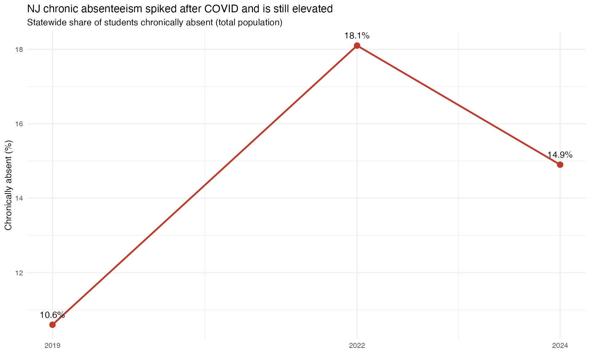

# SPR Data Dictionary

``` r

library(njschooldata)
library(dplyr)
library(purrr)
library(ggplot2)
```

## School Performance Reports (SPR) Database

The New Jersey Department of Education’s School Performance Reports
(SPR) databases contain **63 sheets of data** per year (2017-18 to
2023-24), covering comprehensive school performance metrics.

This document provides a dictionary of available sheets and examples of
how to use them.

## Quick Start

### Using the Generic Extractor

``` r

# The generic extractor pulls any sheet by its NJ DOE name.
# level = "district" returns district + state aggregates from one ~30 MB
# workbook; level = "school" returns school-level rows (a much larger download).
ca        <- fetch_spr_data("ChronicAbsenteeism", 2024, level = "district")
teachers  <- fetch_spr_data("TeachersExperience", 2024, level = "district")
grad_dist <- fetch_spr_data("6YrGraduationCohortProfile", 2024, level = "district")
```

``` r

# Every sheet comes back as a tidy data frame with cleaned snake_case columns
dim(ca)
#> [1] 11050    19
head(names(ca), 9)
#> [1] "county_id"         "county_name"       "district_id"      
#> [4] "district_name"     "subgroup"          "chronic_abs_count"
#> [7] "chronic_abs_pct"   "target"            "met_target"
```

### Using Convenience Functions

``` r

# Convenience wrappers track the sheet renames NJ DOE makes across years,
# so you do not have to remember which name a given year uses.
ca       <- fetch_chronic_absenteeism(2024, level = "district")
ca_grade <- fetch_absenteeism_by_grade(2024, level = "district")
days     <- fetch_days_absent(2024, level = "district")
```

``` r

# fetch_absenteeism_by_grade() adds a grade_level column (PK, KG, 1-12)
sort(unique(ca_grade$grade_level))
#>  [1] "1"  "10" "11" "12" "2"  "3"  "4"  "5"  "6"  "7"  "8"  "9"  "KG" "PK"
```

## Available SPR Sheets

### Attendance & Discipline

| Sheet Name | Description | Years |
|----|----|----|
| `ChronicAbsenteeism` | Overall chronic absenteeism rates | 2017-2024 |
| `ChronicAbsenteeismByGrade` | Chronic absenteeism by grade level | 2017-2024 |
| `DaysAbsent` | Days absent statistics (avg, median) | 2017-2024 |
| `ViolenceVandalismHIBSubstanceOf` | Incident counts | 2017-2024 |
| `HIBInvestigations` | HIB investigation details | 2017-2024 |
| `DisciplinaryRemovals` | Suspension/expulsion data | 2017-2024 |

### Staffing & Human Resources

| Sheet Name                       | Description                 | Years     |
|----------------------------------|-----------------------------|-----------|
| `TeachersExperience`             | Teacher experience levels   | 2017-2024 |
| `AdministratorsExperience`       | Administrator experience    | 2017-2024 |
| `StaffCounts`                    | Staff counts by category    | 2017-2024 |
| `StudentToStaffRatios`           | Student-to-staff ratios     | 2017-2024 |
| `TeachersAdminsDemographics`     | Demographics (race, gender) | 2017-2024 |
| `TeachersAdminsLevelOfEducation` | Educational attainment      | 2017-2024 |
| `TeachersAdminsOneYearRetention` | Staff retention rates       | 2017-2024 |
| `TeachersBySubjectArea`          | Teachers by subject         | 2017-2024 |

### College & Career Readiness

| Sheet Name | Description | Years |
|----|----|----|
| `PSAT-SAT-ACTParticipation` | SAT/ACT/PSAT participation rates | 2017-2024 |
| `PSAT-SAT-ACTPerformance` | SAT/ACT/PSAT score distributions | 2017-2024 |
| `APIBCourseworkPartPerf` | AP/IB performance (detailed) | 2017-2024 |
| `APIBDualEnrPartByStudentGrp` | AP/IB dual enrollment by subgroup | 2017-2024 |
| `APIBCoursesOffered` | AP/IB course offerings | 2017-2024 |
| `CTE_SLEParticipation` | Career/Technical Ed data | 2017-2024 |
| `CTEParticipationByStudentGroup` | CTE by subgroup | 2017-2024 |
| `IndustryValuedCredentialsEarned` | Industry credentials | 2017-2024 |
| `WorkbasedLearningByCareerClust` | Work-based learning | 2017-2024 |
| `Apprenticeship` | Apprenticeship data | 2017-2024 |
| `SealofBiliteracy` | Biliteracy seal earners | 2017-2024 |

### Course Enrollment

| Sheet Name                        | Description               | Years     |
|-----------------------------------|---------------------------|-----------|
| `MathCourseParticipation`         | Math course enrollment    | 2017-2024 |
| `ScienceCourseParticipation`      | Science course enrollment | 2017-2024 |
| `SocStudiesHistoryCourseParticip` | Social studies enrollment | 2017-2024 |
| `WorldLanguagesCourseParticipati` | World language enrollment | 2017-2024 |
| `ComputerScienceCourseParticipat` | CS enrollment             | 2017-2024 |
| `VisualAndPerformingArts`         | Arts enrollment           | 2017-2024 |

### Graduation & Dropout

| Sheet Name                      | Description                   | Years     |
|---------------------------------|-------------------------------|-----------|
| `GraduatonRateTrendsProgress`   | Graduation rate trends        | 2017-2024 |
| `5YrGraduationCohortProfile`    | 5-year graduation detailed    | 2017-2024 |
| `6YrGraduationCohortProfile`    | 6-year graduation detailed    | 2021-2024 |
| `FederalGraduationRates`        | Federal graduation rates      | 2017-2024 |
| `AccountabilityGraduationRates` | ESSA graduation rates         | 2017-2024 |
| `GraduationPathways`            | Alternate graduation pathways | 2017-2024 |
| `DropoutRateTrends`             | Dropout trends                | 2017-2024 |

### Accountability

| Sheet Name                   | Description              | Years     |
|------------------------------|--------------------------|-----------|
| `ESSAAccountabilityStatus`   | ESSA status ratings      | 2017-2024 |
| `ESSAAccountabilityProgress` | ESSA progress indicators | 2017-2024 |

### Enrollment & Demographics

| Sheet Name | Description | Years |
|----|----|----|
| `EnrollmentTrendsbyGrade` | Grade-level enrollment trends | 2017-2024 |
| `EnrollmentTrendsByStudentGroup` | Enrollment by subgroup trends | 2017-2024 |
| `EnrollmentByRacialEthnicGroup` | Detailed racial/ethnic breakdowns | 2017-2024 |
| `PreKAndK-FullDayHalfDay` | Pre-K and K program detail | 2017-2024 |
| `EnrollmentTrendsFullSharedTime` | Full vs shared time | 2017-2024 |
| `EnrollmentByHomeLanguage` | Home language data | 2017-2024 |

### Assessment Performance

| Sheet Name                        | Description                   | Years     |
|-----------------------------------|-------------------------------|-----------|
| `StudentGrowthTrends`             | Student growth percentiles    | 2017-2024 |
| `ELAMathPerformanceTrends`        | Historical ELA/Math trends    | 2017-2024 |
| `NJSLAELAPerformanceTrends`       | NJSLA ELA detailed trends     | 2017-2024 |
| `NJSLAMathPerformanceTrends`      | NJSLA Math detailed trends    | 2017-2024 |
| `NJSLAScience`                    | Science assessment results    | 2017-2024 |
| `AlternateAssessmentParticipatio` | Alternate assessment data     | 2017-2024 |
| `EnglishLangParticipationPerform` | ELL participation/performance | 2017-2024 |

### Postsecondary

| Sheet Name                    | Description               | Years     |
|-------------------------------|---------------------------|-----------|
| `PostSecondaryEnrRateSummary` | Postsecondary summary     | 2017-2024 |
| `PostsecondaryEnrRatesFall`   | Fall enrollment rates     | 2017-2024 |
| `PostsecondaryEnrRates16mos`  | 16-month enrollment rates | 2017-2024 |

### School Resources

| Sheet Name     | Description                | Years     |
|----------------|----------------------------|-----------|
| `SchoolDay`    | School day length/schedule | 2017-2024 |
| `DeviceRatios` | Technology/device ratios   | 2017-2024 |

### Other

| Sheet Name                  | Description                       | Years     |
|-----------------------------|-----------------------------------|-----------|
| `Header and Contact`        | School contact info               | 2017-2024 |
| `Important 2020-2021 Notes` | Data quality notes (2020-21 only) | 2020-2021 |
| `Narrative`                 | School narrative information      | 2017-2024 |

## Usage Examples

### Chronic Absenteeism Analysis

Which districts have the highest chronic absenteeism, and how has the
statewide rate moved since COVID?

``` r

ca <- fetch_chronic_absenteeism(2024, level = "district")
```

``` r

# Districts where more than 30% of students are chronically absent
high_absent <- ca %>%
  filter(is_district,
         subgroup == "total population",
         chronically_absent_rate > 30) %>%
  arrange(desc(chronically_absent_rate)) %>%
  select(district_name, chronically_absent_rate)

stopifnot(nrow(high_absent) > 0)
head(high_absent, 8)
#> # A tibble: 8 × 2
#>   district_name                                           chronically_absent_r…¹
#>   <chr>                                                                    <dbl>
#> 1 LEAD Charter School                                                       71.4
#> 2 Camden Prep, Inc.                                                         50.2
#> 3 Camden City School District                                               46.9
#> 4 KIPP: Cooper Norcross, A New Jersey Nonprofit Corporat…                   45.5
#> 5 Ocean Gate School District                                                43  
#> 6 Roseville Community Charter School                                        39.4
#> 7 Seaside Heights School District                                           39.1
#> 8 TEAM Academy Charter School                                               37.7
#> # ℹ abbreviated name: ¹​chronically_absent_rate
```

Compare the statewide rate before and after the pandemic. Wrapping each
year’s fetch means a missing year surfaces as a warning, not a silent
gap.

``` r

ca_trend <- map_dfr(c(2019, 2022, 2024), function(yr) {
  tryCatch(
    fetch_chronic_absenteeism(yr, level = "district") %>%
      filter(is_state, subgroup == "total population") %>%
      transmute(end_year, chronically_absent_rate),
    error = function(e) {
      warning("chronic absenteeism ", yr, " failed: ", conditionMessage(e))
      NULL
    }
  )
})
```

``` r

stopifnot(nrow(ca_trend) == 3)
ca_trend
#> # A tibble: 3 × 2
#>   end_year chronically_absent_rate
#>      <dbl>                   <dbl>
#> 1     2019                    10.6
#> 2     2022                    18.1
#> 3     2024                    14.9
```

``` r

ggplot(ca_trend, aes(end_year, chronically_absent_rate)) +
  geom_line(color = "#c0392b", linewidth = 1) +
  geom_point(color = "#c0392b", size = 3) +
  geom_text(aes(label = paste0(chronically_absent_rate, "%")), vjust = -1.1) +
  scale_x_continuous(breaks = c(2019, 2022, 2024)) +
  labs(
    title = "NJ chronic absenteeism spiked after COVID and is still elevated",
    subtitle = "Statewide share of students chronically absent (total population)",
    x = NULL, y = "Chronically absent (%)"
  ) +
  theme_minimal()
```



### Teacher Experience Analysis

Which districts rely most on out-of-field teachers? Several SPR numeric
columns arrive as character text, so coerce them before sorting.

``` r

teachers <- fetch_spr_data("TeachersExperience", 2024, level = "district")
```

``` r

out_of_field <- teachers %>%
  filter(is_district) %>%
  transmute(
    district_name,
    avg_years_exp    = as.numeric(teacher_avg_years_exp_school),
    pct_out_of_field = as.numeric(percentage_of_out_of_field_teachers)
  ) %>%
  arrange(desc(pct_out_of_field))

stopifnot(nrow(out_of_field) > 0)
head(out_of_field, 8)
#> # A tibble: 8 × 3
#>   district_name                                   avg_years_exp pct_out_of_field
#>   <chr>                                                   <dbl>            <dbl>
#> 1 Kindle Education Public Charter School                    6.3             58.3
#> 2 Achievers Early College Prep Charter School               1.5             50  
#> 3 Great Oaks Legacy Charter School                          7.4             40.7
#> 4 Sussex County Educational Services Commission             2.4             35.7
#> 5 Pride Academy Charter School District                    10               34.8
#> 6 Northern Region Educational Services Commission           4.6             34  
#> 7 People's Achieve Community Charter School                 4.6             33.3
#> 8 Community Charter School of Paterson                     11.4             30.6
```

### Course Access Analysis

`APIBCoursesOffered` lists one row per course with enrollment counts.
The counts are stored as character, so coerce before ranking.

``` r

ap <- fetch_spr_data("APIBCoursesOffered", 2024, level = "district")
```

``` r

# Most-enrolled AP/IB courses statewide
top_ap <- ap %>%
  filter(is_state) %>%
  transmute(course_name, enrolled = as.numeric(student_enroll_count)) %>%
  arrange(desc(enrolled))

stopifnot(nrow(top_ap) > 0)
head(top_ap, 8)
#> # A tibble: 8 × 2
#>   course_name                           enrolled
#>   <chr>                                    <dbl>
#> 1 AP U.S. History                          20003
#> 2 AP English Language and Composition      19956
#> 3 AP English Literature and Composition    15717
#> 4 AP Psychology                            13709
#> 5 AP Statistics                            11029
#> 6 AP Calculus AB                            9988
#> 7 AP Biology                                9044
#> 8 AP Environmental Science                  8337
```

### Discipline Analysis

For 2024 the discipline sheet is `DisciplinaryRemovalsByStudgroup`;
[`fetch_disciplinary_removals()`](https://almartin82.github.io/njschooldata/reference/fetch_disciplinary_removals.md)
picks the right sheet name for each year. The grouping column is
`student_group_grade`, and the sheet reports suspension and expulsion
percentages directly (no enrollment denominator).

``` r

discipline <- fetch_disciplinary_removals(2024, level = "district")
```

``` r

# Suspension and expulsion rates by student group, statewide
susp_by_group <- discipline %>%
  filter(
    is_state,
    student_group_grade %in% c(
      "Statewide", "Black or African American", "Hispanic", "White",
      "Students with disabilities", "Economically Disadvantaged Students"
    )
  ) %>%
  transmute(
    student_group_grade,
    pct_any_suspension = as.numeric(percent_students_any_suspension),
    pct_expulsions     = as.numeric(percent_students_expulsions)
  ) %>%
  arrange(desc(pct_any_suspension))

stopifnot(nrow(susp_by_group) > 0)
susp_by_group
#> # A tibble: 6 × 3
#>   student_group_grade                 pct_any_suspension pct_expulsions
#>   <chr>                                            <dbl>          <dbl>
#> 1 Black or African American                         9.02           0.01
#> 2 Students with disabilities                        6.56           0   
#> 3 Economically Disadvantaged Students               6.24           0   
#> 4 Hispanic                                          4.56           0   
#> 5 Statewide                                         4.26           0   
#> 6 White                                             2.78           0
```

## Data Structure

All SPR data returned by
[`fetch_spr_data()`](https://almartin82.github.io/njschooldata/reference/fetch_spr_data.md)
includes:

### Standard Identifier Columns

- `end_year` - School year end (e.g., 2024 for 2023-24 school year)
- `county_id`, `county_name` - County code and name
- `district_id`, `district_name` - District code and name
- `school_id`, `school_name` - School code and name (school-level only)

### Aggregation Flags

- `is_state` - State-level aggregation
- `is_county` - County-level aggregation
- `is_district` - District-level aggregation
- `is_school` - School-level aggregation
- `is_charter` - Charter school flag
- `is_charter_sector` - Charter sector aggregation
- `is_allpublic` - All public aggregation

### Sheet-Specific Columns

Each sheet contains additional columns relevant to that data type.
Column names are automatically cleaned to snake_case.

## Data Quality Notes

- **2020-2021 Data**: Some data not available due to COVID-19 pandemic
  disruptions
- **Small Cell Suppression**: Values may be suppressed (NA) for small
  subgroups to protect privacy
- **Data Validation**: Always check for NA values and data completeness
  before analysis

## See Also

- [Package documentation](https://almartin82.github.io/njschooldata/)
- [Function
  reference](https://almartin82.github.io/njschooldata/reference/index.html)
- [Getting started
  guide](https://almartin82.github.io/njschooldata/articles/getting-started.html)

``` r

sessionInfo()
#> R version 4.6.0 (2026-04-24)
#> Platform: x86_64-pc-linux-gnu
#> Running under: Ubuntu 24.04.4 LTS
#> 
#> Matrix products: default
#> BLAS:   /usr/lib/x86_64-linux-gnu/openblas-pthread/libblas.so.3 
#> LAPACK: /usr/lib/x86_64-linux-gnu/openblas-pthread/libopenblasp-r0.3.26.so;  LAPACK version 3.12.0
#> 
#> locale:
#>  [1] LC_CTYPE=C.UTF-8       LC_NUMERIC=C           LC_TIME=C.UTF-8       
#>  [4] LC_COLLATE=C.UTF-8     LC_MONETARY=C.UTF-8    LC_MESSAGES=C.UTF-8   
#>  [7] LC_PAPER=C.UTF-8       LC_NAME=C              LC_ADDRESS=C          
#> [10] LC_TELEPHONE=C         LC_MEASUREMENT=C.UTF-8 LC_IDENTIFICATION=C   
#> 
#> time zone: UTC
#> tzcode source: system (glibc)
#> 
#> attached base packages:
#> [1] stats     graphics  grDevices utils     datasets  methods   base     
#> 
#> other attached packages:
#> [1] ggplot2_4.0.3       purrr_1.2.2         dplyr_1.2.1        
#> [4] njschooldata_0.9.17
#> 
#> loaded via a namespace (and not attached):
#>  [1] utf8_1.2.6         sass_0.4.10        generics_0.1.4     tidyr_1.3.2       
#>  [5] stringi_1.8.7      hms_1.1.4          digest_0.6.39      magrittr_2.0.5    
#>  [9] evaluate_1.0.5     grid_4.6.0         timechange_0.4.0   RColorBrewer_1.1-3
#> [13] fastmap_1.2.0      cellranger_1.1.0   jsonlite_2.0.0     scales_1.4.0      
#> [17] codetools_0.2-20   textshaping_1.0.5  jquerylib_0.1.4    cli_3.6.6         
#> [21] rlang_1.2.0        withr_3.0.2        cachem_1.1.0       yaml_2.3.12       
#> [25] otel_0.2.0         downloader_0.4.1   tools_4.6.0        tzdb_0.5.0        
#> [29] vctrs_0.7.3        R6_2.6.1           lifecycle_1.0.5    lubridate_1.9.5   
#> [33] snakecase_0.11.1   stringr_1.6.0      fs_2.1.0           ragg_1.5.2        
#> [37] janitor_2.2.1      pkgconfig_2.0.3    desc_1.4.3         pkgdown_2.2.0     
#> [41] pillar_1.11.1      bslib_0.11.0       gtable_0.3.6       glue_1.8.1        
#> [45] systemfonts_1.3.2  xfun_0.58          tibble_3.3.1       tidyselect_1.2.1  
#> [49] knitr_1.51         farver_2.1.2       htmltools_0.5.9    labeling_0.4.3    
#> [53] rmarkdown_2.31     readr_2.2.0        compiler_4.6.0     S7_0.2.2          
#> [57] readxl_1.5.0
```
